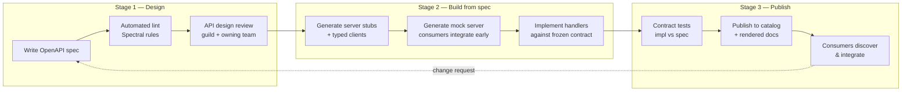

# REST Design at Scale — Staff

At junior-through-senior tiers, REST design is a craft: name resources well, pick the right verb and status code, paginate consistently, version deliberately. At the staff tier the unit of concern changes. You are no longer designing *an* API — you are shaping how *dozens of teams* design *hundreds* of APIs, and how thousands of internal and external consumers experience the surface area of your company. The technical decisions barely move; the leverage moves to policy, consistency, and governance.

The organizing insight of this tier: **an API is a product and a long-lived contract, and you cannot un-ship a public one.** Once a partner integrates against `GET /v1/orders`, that shape is load-bearing for years. A single team's sloppy pagination becomes a support burden that outlives the team. Your job is to make the *right* design the *easy* design across the org, and to defend that consistency to leadership as a business asset rather than an engineering vanity project.

---

## Table of Contents

1. [The API as a product and a contract](#1-the-api-as-a-product-and-a-contract)
2. [Design-first / API-first as the org workflow](#2-design-first--api-first-as-the-org-workflow)
3. [Governance: style guide, review, and linting](#3-governance-style-guide-review-and-linting)
4. [Backward compatibility as an org-wide policy](#4-backward-compatibility-as-an-org-wide-policy)
5. [Standardizing the cross-cutting concerns](#5-standardizing-the-cross-cutting-concerns)
6. [Developer experience as a product metric](#6-developer-experience-as-a-product-metric)
7. [API catalog and discoverability](#7-api-catalog-and-discoverability)
8. [Centralized standards vs team autonomy](#8-centralized-standards-vs-team-autonomy)
9. [Framing API governance to leadership](#9-framing-api-governance-to-leadership)
10. [Staff-tier takeaways](#10-staff-tier-takeaways)

---

## 1. The API as a product and a contract

A public API is the most expensive commitment your organization makes casually. Internal code can be refactored on a whim; a published contract cannot. The moment a customer, partner, or even a sibling team writes `client.orders.list()`, you have signed a support agreement measured in years.

Three consequences follow, and every staff-level decision traces back to them:

- **You can't un-ship.** Deprecation is a multi-quarter migration program with comms, dashboards, and holdouts — not a `git revert`. The cost of a mistake is paid on every future release, forever, until every consumer migrates.
- **The contract is the product.** For a payments API, developer-facing companies, or any platform play, the API *is* the thing customers buy. Its ergonomics are your conversion funnel. A confusing error response is a lost integration.
- **Consistency is a feature.** When every endpoint across every team paginates, authenticates, and errors the same way, a developer who learns one API has learned all of them. Inconsistency taxes every integration your customers ever build.

Treating the API as a product means it gets what products get: an owner accountable for its lifecycle, a roadmap, a deprecation policy, usage analytics, and a feedback loop with its consumers. The absence of these is the single clearest signal that an org is under-investing in its API surface.

---

## 2. Design-first / API-first as the org workflow

The default failure mode is **code-first**: a team writes handlers, then generates (or hand-waves) documentation from whatever the code happens to do. The contract is an accident of the implementation. Two teams solving the same problem produce two different shapes, and neither is reviewed until it's already in production and impossible to change.

**Design-first** (a.k.a. API-first) inverts this. The **OpenAPI specification is the source of truth**, written and reviewed *before* implementation. The spec is the artifact that gets designed, linted, reviewed, and versioned. Code — server stubs, typed clients, mock servers, docs — is *generated from* the spec, not the other way around.

The strategic payoffs are organizational, not technical:

- **Consumers integrate before the backend exists.** A mock server generated from the spec lets client teams build in parallel — the spec decouples producer and consumer schedules.
- **Review happens when change is cheap.** Redesigning a JSON shape in a spec is a comment thread; redesigning it after launch is a migration program.
- **The contract can't drift.** Contract tests assert the implementation still matches the spec, so the docs never lie.

The hard part is not tooling — it's discipline. Design-first only works if the org genuinely refuses to write handlers before the spec is approved. That refusal is a cultural commitment leadership must back.

---

## 3. Governance: style guide, review, and linting

At three teams, consistency is a Slack conversation. At thirty, it requires machinery. The three-layer model:

**Layer 1 — The written style guide.** A single authoritative document: resource naming (plural nouns, kebab vs snake case), verb/status-code conventions, the standard error envelope, the standard pagination scheme, auth patterns, date/time formats (always RFC 3339, always UTC), versioning rules. It must be opinionated. "Prefer consistency" is not a rule; "collections are plural lowercase nouns" is.

**Layer 2 — Automated linting.** Encode as much of the style guide as possible into a machine-checkable ruleset — **Spectral** is the de facto standard for OpenAPI. Naming, required fields, error-schema conformance, forbidden patterns, and pagination shape all become CI checks. The rule of thumb: *anything a linter can catch, a human should never review.* This frees human reviewers for judgment and reserves their attention for design, not style nits.

**Layer 3 — Human design review.** For the questions a linter can't answer: Is this the right resource model? Does this endpoint belong on this service? Is this abstraction going to age well? A lightweight **API design review** — an API guild plus the owning team — catches modeling mistakes early. Keep it fast and advisory-by-default so it accelerates rather than blocks; make it blocking only for public/partner surfaces.

The governance body itself is usually a **guild or center of excellence**: a cross-team group that owns the style guide, maintains the linter, and staffs reviews — *not* a gatekeeping bureaucracy that every PR must pass through. The distinction is everything (see §8).

---

## 4. Backward compatibility as an org-wide policy

Breaking changes are the most expensive events in an API's life, and their cost is *externalized* — the producing team ships the break in an afternoon; every consuming team pays the migration cost. Left ungoverned, this is a tragedy of the commons. Org-wide policy internalizes the cost by making breaking changes *hard and visible*.

A workable policy states, in writing and enforced in CI:

- **What counts as breaking** — removing a field, renaming a field, tightening a type, adding a required request field, changing an error code, changing pagination semantics. The linter can diff two spec versions and flag these automatically.
- **Additive changes are always safe** — new optional fields, new endpoints, new optional query params. Consumers must tolerate unknown fields (the *tolerant reader* principle), which itself is a style-guide rule.
- **Versioning strategy** — how a genuinely breaking change is shipped (new major version path or media-type version), and the commitment to run N and N-1 in parallel.
- **Deprecation timeline** — minimum support window (often 6–12 months for public APIs), `Deprecation`/`Sunset` headers, dashboards tracking remaining callers, and a comms plan.

The staff-level point is that **the policy exists to make the org feel the cost before shipping.** A CI check that fails on a breaking diff — forcing an explicit, reviewed, versioned decision — is worth more than any amount of after-the-fact discipline.

---

## 5. Standardizing the cross-cutting concerns

Three things should look *identical* across every API in the org, because inconsistency here is what makes a multi-team platform feel like a patchwork:

| Concern | Standardize | Why it matters at scale |
|---|---|---|
| **Errors** | One envelope for all APIs (e.g. RFC 9457 `application/problem+json`: `type`, `title`, `status`, `detail`, `instance`). Machine-readable code + human message. | Consumers write *one* error handler for the whole platform. Support can triage by error code across every service. |
| **Pagination** | One scheme org-wide — cursor-based for large/mutating collections; consistent param and response-envelope naming. | Mixing offset and cursor across teams means every integration re-learns paging. Cursor scales; offset breaks on live data. |
| **Auth** | One scheme (OAuth2 / OIDC bearer tokens), one scopes model, one token-handling story. | A single auth integration unlocks the whole platform. Divergent auth per team multiplies onboarding cost. |
| **Filtering / sorting** | One query-param grammar (`?sort=`, `?filter=`, field selection). | Predictability. A developer guesses correctly on API #40 because #1–#39 taught the pattern. |

The governing principle: **every team's API should feel like it was written by one team.** Achieve this by *providing the standard as a shared library or template*, not just a document — a shared error-response middleware, a pagination helper, a spec template with the envelope baked in. Standards that require re-implementation get re-implemented wrong; standards that come as a drop-in dependency get adopted for free.

---

## 6. Developer experience as a product metric

If the API is a product, DX is its quality score — and staff engineers make it *measurable* rather than aspirational. The headline metric is **time to first successful call (TTFSC)**: from a developer landing on the docs to a working `200` response. A platform where that takes ten minutes wins integrations that a functionally-identical platform with a two-day TTFSC loses.

Other tracked signals:

- **Integration success rate** — what fraction of developers who start an integration finish one.
- **Support-ticket volume per endpoint** — a hot spot names your worst-designed or worst-documented surface directly.
- **Docs engagement and search-miss rate** — what developers look for and fail to find.
- **SDK vs raw-HTTP adoption** — reveals where the raw API is too sharp to use directly.

The staff move is to route these back into governance. A spike in tickets on one API becomes a design-review action item. A high TTFSC becomes a docs-and-onboarding investment. DX stops being "nice docs" and becomes a managed number with an owner.

---

## 7. API catalog and discoverability

At scale, the most common failure is not a *bad* API — it's a *duplicate* one, built because a team couldn't find the API that already did the job. Undiscoverable APIs get reinvented, and now you maintain two.

An **API catalog** is the org-wide registry — every API, its OpenAPI spec, owner, status (active/deprecated), version, and rendered docs, searchable in one place. It is the counterpart to design-first: if specs are the source of truth, the catalog is where those specs *live and get found*. Practically it enables:

- **Reuse over reinvention** — search before you build; find the order service before writing a second one.
- **Impact analysis** — "who consumes this endpoint?" is answerable before you deprecate it.
- **Governance visibility** — leadership can see coverage: how many APIs conform to the style guide, how many have current specs, how many are undocumented.

The catalog only stays honest if publishing to it is *part of the shipping pipeline*, not a manual afterthought. Wire it into the design-first flow (§2): the same spec that gets linted and reviewed is the spec that gets published. A catalog maintained by hand is a catalog that is already stale.

---

## 8. Centralized standards vs team autonomy

The defining tension of API governance. Too centralized and you create a bottleneck that teams route around, breeding shadow APIs and resentment. Too autonomous and you get the patchwork the whole effort was meant to prevent. Staff judgment is knowing *which* decisions to centralize and which to delegate.

| Signal | Lean **centralized standards** | Lean **team autonomy** |
|---|---|---|
| Surface visibility | Public / partner-facing APIs | Internal-only, single-consumer APIs |
| Blast radius of divergence | High — inconsistency hits customers | Low — one team, one consumer |
| Cross-cutting concern | Errors, auth, pagination, versioning | Domain-specific resource modeling |
| Number of consumers | Many, external | Few, known, co-located |
| Org maturity | Many teams, drift already visible | Small org, high-trust, fast-moving |
| Reversibility | Hard to change once shipped | Easy to refactor internally |

The durable resolution is **"paved road," not gate.** Centralize the *cross-cutting* concerns non-negotiably — errors, auth, pagination, versioning, the style guide — and enforce them with automation so compliance is cheap. Delegate *domain modeling* to the teams who own the domain, because they hold the context a central body can't. Make the standard the path of least resistance (shared libraries, templates, generators, mock servers) so teams adopt it because it's *faster*, not because they're forced. Governance that only forbids gets circumvented; governance that *enables* gets adopted.

Reserve human review as a hard gate only where the blast radius justifies it — public and partner surfaces. Everywhere else, lint-and-advise.

---

## 9. Framing API governance to leadership

Governance costs headcount and adds process, so it must be justified in business terms, not aesthetic ones. "Our APIs should be consistent" loses every budget conversation. Translate to outcomes leadership already cares about:

- **Speed of integration → revenue.** Lower time-to-first-call means partners integrate faster, which means deals close faster. Cite TTFSC and integration success rate as leading indicators.
- **Consistency → lower support cost.** One error format, one auth scheme, and one pagination style measurably cut support-ticket volume. Show tickets-per-endpoint before and after.
- **Compatibility policy → avoided outages and lost trust.** Every un-governed breaking change is a partner escalation, an emergency migration, and eroded trust. Frame the compatibility CI check as outage insurance.
- **Catalog → avoided duplicate work.** Quantify engineer-months spent rebuilding APIs that already existed; the catalog is the fix.
- **Design-first → cheaper change.** Fixing a contract in a spec review costs a comment; fixing it post-launch costs a migration program. This is a shift-left argument leadership already understands from testing.

Anchor every ask to a metric you already track (§6, §7) and pitch governance as **de-risking the API as a strategic asset** — not as engineering hygiene. The winning frame: *the API surface is a product line, and this is how we keep it from decaying into an untrackable liability.*

---

## 10. Staff-tier takeaways

- The unit of concern is the **whole org's API surface**, not one endpoint. Your leverage is policy and consistency, not more HTTP depth.
- An API is a **product and a long-lived contract** — you can't un-ship a public one, so design review must happen when change is still cheap.
- **Design-first** with OpenAPI as source of truth decouples teams, catches mistakes early, and keeps docs honest via contract tests.
- **Governance = style guide + Spectral linting + human design review.** Automate everything a machine can check; reserve humans for judgment.
- **Backward-compatibility policy** internalizes the externalized cost of breaking changes — enforce breaking-diff detection in CI.
- **Standardize errors, pagination, auth, and filtering** — and ship the standard as a library, not just a document.
- **DX is a measured product metric** (TTFSC, integration success, tickets-per-endpoint) that feeds back into governance.
- An **API catalog** kills duplicate builds and makes impact analysis and coverage visible.
- Centralize cross-cutting concerns; delegate domain modeling. Build a **paved road**, not a gate.
- Sell governance to leadership as **revenue speed, lower support cost, and outage insurance** — never as consistency for its own sake.

*Next step:* [REST Design at Scale — Interview](interview.md)
