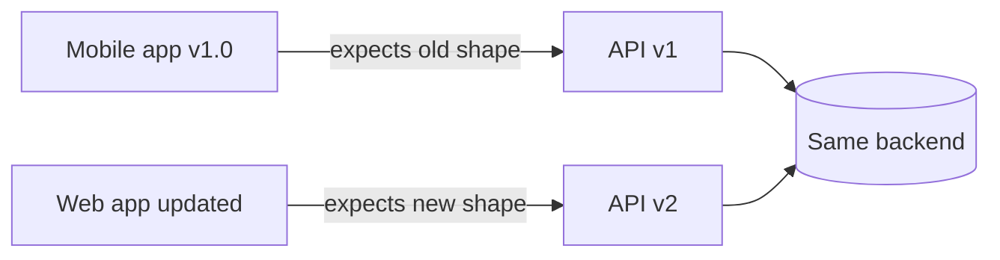
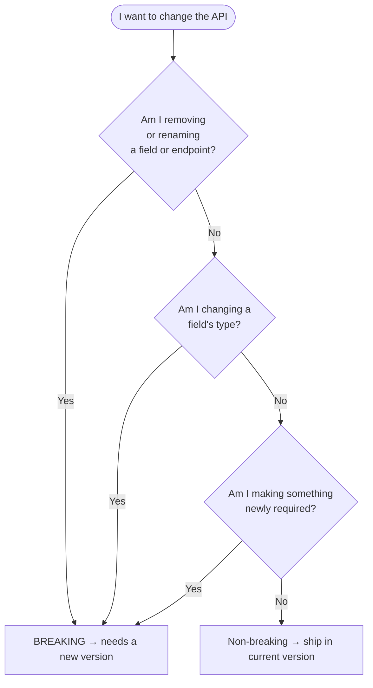
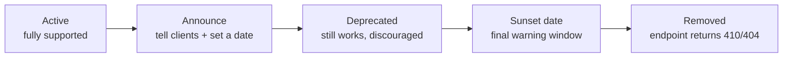

# Versioning and Deprecation — Junior

<!-- level-focus -->
At junior level, focus on this question:

> How can I apply **Versioning and Deprecation** in one small example and prove the result?

Use the smallest realistic scenario that exposes the decision and its failure behavior.
## 1. Why versioning exists

Your API has a **contract**: the fields it accepts, the fields it returns, the types of those fields, and the meaning behind them. Clients — a web front-end, a mobile app, a partner's backend — write code that assumes this contract holds.

The problem: you cannot see or control all those clients.

- A mobile app is installed on phones you can't update. Old versions keep calling your API for months or years.
- A partner integrated once and moved on. They will not re-check your API weekly.
- Even your own front-end may lag behind the backend during a rollout.

If you change the contract in place — rename a field, drop an endpoint, change a type — every client still expecting the old shape **breaks**. Screens go blank, integrations 500, support tickets pile up.

Versioning solves this by letting the **old contract and the new contract exist at the same time**. Old clients keep hitting `v1`; new clients adopt `v2`. Nobody is forced to change on your schedule.



> The core idea: **you don't break clients — you give them a new version and time to move.**

---

## 2. Breaking vs non-breaking changes

The single most important skill in API evolution is telling these two apart *before* you ship.

A change is **breaking** if a client written against the old contract could stop working. A change is **non-breaking** (also called *backward-compatible*) if every existing client keeps working unchanged.

| Change | Breaking? | Why |
|--------|-----------|-----|
| Adding a new **optional** field to a response | No | Old clients simply ignore fields they don't know about. |
| Adding a new endpoint | No | Nobody was calling it yet. |
| Adding a new **optional** query parameter | No | Old requests that omit it still work. |
| Making a **required** request field optional | No | Old clients still send it; that's still allowed. |
| Removing a field from a response | **Yes** | A client reading that field now gets nothing. |
| Renaming a field (`user_name` → `username`) | **Yes** | This is a remove + add; old readers break. |
| Changing a field's type (`"123"` → `123`) | **Yes** | Parsing code expecting a string fails on a number. |
| Adding a new **required** request field | **Yes** | Old clients don't send it; the request is now rejected. |
| Removing or renaming an endpoint | **Yes** | Calls to the old path 404. |
| Making response errors stricter / changing status codes | **Yes** | Client error-handling logic may misbehave. |

A simple mental model: **adding optional things is safe; removing, renaming, retyping, or newly-requiring things is breaking.**



When a change is breaking, you have two honest options: **make it non-breaking instead** (e.g. add a new field alongside the old one rather than renaming), or **cut a new version**.

---

## 3. The main versioning styles

When you do need a new version, where does the version number live? There are three common approaches. As a junior, you should recognise all three and understand their trade-offs at a high level.

### URI path versioning — `/v1/users`

The version is part of the URL path.

```
GET /v1/users/42
GET /v2/users/42
```

This is the most common and the easiest to understand. You can see the version by looking at the URL, test it in a browser, and route different versions to different code paths trivially.

### Header versioning — a custom or standard header

The version travels in an HTTP header, so the URL stays clean.

```
GET /users/42
API-Version: 2
```

The path never changes, but the version is now invisible in a plain URL, which makes it a little harder to debug or share a link.

### Media-type versioning — via the `Accept` header

The client asks for a specific version of the *representation* through content negotiation, using the `Accept` header (see [MDN's guide to content negotiation](https://developer.mozilla.org/en-US/docs/Web/HTTP/Content_negotiation)).

```
GET /users/42
Accept: application/vnd.example.v2+json
```

This is the most "RESTful" in spirit but the least beginner-friendly, and it's easy to get the header wrong.

| Style | Where the version lives | Easy to test in a browser? | Clean URLs? | Beginner-friendly? |
|-------|-------------------------|----------------------------|-------------|--------------------|
| URI path (`/v1/`) | In the path | Yes | No (version in URL) | Yes — very |
| Header (`API-Version: 2`) | In a request header | No | Yes | Medium |
| Media-type (`Accept: …+json`) | In the `Accept` header | No | Yes | Harder |

> For most teams starting out, **URI path versioning** wins on clarity. You'll meet the others in real systems, so know what they look like.

A related idea you'll hear about is **semantic versioning** (`MAJOR.MINOR.PATCH`, from [semver.org](https://semver.org/)). The key takeaway for APIs: a **breaking** change bumps the MAJOR number (`v1` → `v2`), while additive, non-breaking changes don't require clients to do anything.

---

## 4. What deprecation means

Versioning lets old and new coexist — but you don't want to run `v1` forever. Every extra version is more code to maintain, more bugs to fix twice, and more surface to secure. Eventually you want old versions gone.

**Deprecation** is the polite, structured way to retire something. It is *not* the same as deleting. Deprecation is a three-part promise:

1. **Announce** — tell clients clearly that a version or endpoint is going away, and by when.
2. **Give time** — leave the old version running for a defined window so clients can migrate at their own pace.
3. **Remove** — only after the window closes, actually turn it off.

The opposite — silently deleting an endpoint — is how you lose trust and break production for people who trusted you. Deprecation trades a little of your convenience for a lot of your clients' safety.

Two terms you'll see:

- **Deprecated**: still works, but officially discouraged. New clients should not adopt it.
- **Sunset**: the announced date after which it stops working. (There's even a standard `Sunset` HTTP header defined in [RFC 8594](https://www.rfc-editor.org/rfc/rfc8594) for signalling this to clients.)

---

## 5. The deprecation lifecycle

A healthy retirement moves through clear stages. Nothing is a surprise; each step is communicated.



Stage by stage:

1. **Active** — the version is fully supported and recommended.
2. **Announce** — you publish that this version will be retired, ideally with a specific sunset date and a migration guide showing how to move to the new version.
3. **Deprecated** — the old version still responds normally, but you flag it (in docs, and often via a header or a log message) so clients know to move.
4. **Sunset window** — a countdown period. You may add louder warnings as the date nears, and monitor who is still calling the old version.
5. **Removed** — after the sunset date, the old endpoint stops serving. A good practice is returning `410 Gone` (the resource is intentionally gone) rather than a bare `404`, so it's clear this was deliberate.

The length of each window depends on who your clients are. Internal services might migrate in weeks; public APIs with mobile apps often give **6–12 months** or more.

---

## 6. Rules of thumb for a junior

- **Assume you can't update your clients.** Design as if every old app version lives forever.
- **Prefer non-breaking changes.** Add an optional field instead of renaming; extend instead of replacing.
- **Never silently break the contract.** Removing, renaming, and retyping fields all break clients — treat them as version-worthy events.
- **Only bump the version for truly breaking changes.** Not every improvement needs a `v2`.
- **Pick one versioning style and be consistent.** URI path versioning is the clearest starting point.
- **Deprecate, don't delete.** Announce → give time → remove. Always tell clients before turning something off.
- **Document the migration path.** When you ship `v2`, ship the guide that gets people from `v1` to `v2`.

---

*Next step:* [Versioning and Deprecation — Middle](middle.md)

---

## Apply it

1. Choose one small, known input for **Versioning and Deprecation**.
2. Predict the output or observable behavior.
3. Run the smallest example or probe that exercises the concept.
4. Change one input to trigger a failure or boundary case.
5. Explain the evidence using the guide's vocabulary.

## Verify your work

- Record the exact input, command or code path, and output.
- Repeat the probe and confirm the result is consistent.
- Show one expected success and one expected failure.
- Resolve any difference between the prediction and the evidence.

## Review questions

- What problem does Versioning and Deprecation solve in the example?
- Which input changes the observed result, and why?
- What is the smallest useful success check?
- Which beginner mistake would your evidence catch?
