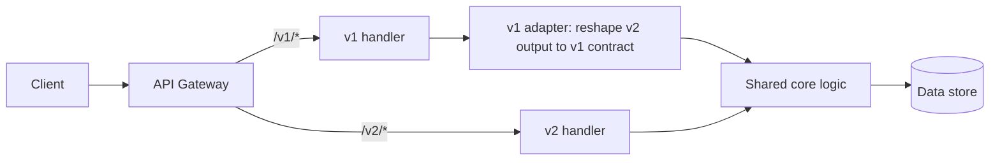

# Versioning and Deprecation — Middle

<!-- level-focus -->
At middle level, focus on this question:

> Where does **Versioning and Deprecation** belong in a maintainable component, and which trade-off selects the design?

Use the smallest realistic scenario that exposes the decision and its failure behavior.
## 1. What actually breaks a client

Before choosing a mechanism, be precise about what constitutes a *breaking* change, because that is the only thing that forces a new major version. A change breaks a client when a previously valid request stops working, or a previously parsed response can no longer be parsed by code written against the old contract.

**Breaking** (needs a new major version):

- Removing or renaming a field, endpoint, or query parameter.
- Changing a field's type (`string` → `object`) or its semantics (`amount` in dollars → cents).
- Adding a new *required* request field or tightening validation.
- Changing default values, status codes, or error shapes clients branch on.
- Changing pagination, ordering, or authentication requirements.

**Non-breaking** (ship without a version bump):

- Adding a new *optional* request field.
- Adding a new field to a response (clients must ignore unknown fields — the "tolerant reader" rule).
- Adding a new endpoint or a new enum value clients already treat as opaque.
- Relaxing validation.

The tolerant-reader expectation is a contract you publish: *clients must ignore fields they do not recognize.* Without it, every additive change becomes breaking and versioning collapses under its own weight.

---

## 2. Semantic versioning applied to APIs

[Semantic Versioning](https://semver.org/) defines `MAJOR.MINOR.PATCH`:

- **MAJOR** — incompatible, breaking changes.
- **MINOR** — backward-compatible additions.
- **PATCH** — backward-compatible bug fixes.

For a public HTTP API the practical rule is: **only the MAJOR number appears in the API surface**. Clients pin to `v1` or `v2`, never to `v2.4.1`. Minor and patch changes are, by definition, backward compatible, so they must roll out transparently under the same major — a client on `v2` silently receives new optional fields and fixes with no action required.

```
v1  →  v2      client action required, coexists during migration
v2.3 → v2.4    additive, transparent, no client action
v2.4.0 → v2.4.1  fix, transparent
```

You still track the full semver internally (in changelogs, release notes, and an `X-API-Version` response header for observability), but the routable identifier is the major alone. This keeps the URL/header space small and the migration story binary: you are on the old major or the new one.

---

## 3. The four versioning strategies

All four answer one question — *how does the client tell the server which version it wants?* — and all four are demonstrated below fetching the same order resource.

### 3.1 URI path versioning

The version is a path segment.

```http
GET /v1/orders/42 HTTP/1.1
Host: api.example.com
```

```http
HTTP/1.1 200 OK
Content-Type: application/json

{ "id": 42, "total": 1999 }
```

The most visible and the most common. A version is a distinct URL, so it is trivially routable at the gateway, cacheable by any intermediary keyed on URL, and copy-pasteable into a browser or `curl`. The purist objection is that `/v1/orders/42` and `/v2/orders/42` are two URLs for what is arguably one resource. In practice, that objection loses to operability.

### 3.2 Custom header versioning

The version travels in a request header, keeping the URL version-free.

```http
GET /orders/42 HTTP/1.1
Host: api.example.com
X-API-Version: 2
```

```http
HTTP/1.1 200 OK
Content-Type: application/json
X-API-Version: 2

{ "id": 42, "total": 1999, "currency": "USD" }
```

The URL stays clean and stable. The cost is invisibility — you cannot see the version in a browser address bar or a naive access log, and caches must be told to vary on the header (`Vary: X-API-Version`) or they will serve a v1 body to a v2 request.

### 3.3 Accept media-type versioning (content negotiation)

The version is a parameter of the `Accept` media type — the approach HTTP purists prefer because it uses the protocol's built-in negotiation.

```http
GET /orders/42 HTTP/1.1
Host: api.example.com
Accept: application/vnd.example.order.v2+json
```

```http
HTTP/1.1 200 OK
Content-Type: application/vnd.example.order.v2+json
Vary: Accept

{ "id": 42, "total": 1999, "currency": "USD" }
```

This is the most RESTful: the client negotiates a *representation* of one resource at one URL, and the server echoes the chosen type in `Content-Type`. It is also the least approachable — building the vendor media-type string is fiddly, tooling support is uneven, and you must set `Vary: Accept` for caches.

### 3.4 Query-parameter versioning

The version is a query-string parameter.

```http
GET /orders/42?version=2 HTTP/1.1
Host: api.example.com
```

Easy to add and easy to default (omitting `version` picks a server-chosen default). But it muddies the resource identity — the version is now part of the cache key alongside real filters, it is easy to drop when clients build URLs, and choosing a sensible default silently pins un-versioned callers to whatever "latest" means today, which itself becomes a breaking surface.

---

## 4. Strategy comparison

| Dimension | URI path (`/v2/orders`) | Custom header (`X-API-Version: 2`) | Media type (`Accept: …v2+json`) | Query param (`?version=2`) |
|---|---|---|---|---|
| **Visibility** | High — in the URL | Low — hidden in headers | Low — hidden in headers | Medium — in the URL |
| **Cacheability** | Simple — URL is the key | Needs `Vary: X-API-Version` | Needs `Vary: Accept` | URL-keyed but pollutes key |
| **Gateway routing** | Trivial (path match) | Requires header inspection | Requires header parsing | Requires query parsing |
| **REST purity** | Low — many URLs per resource | Medium | High — one URL, negotiated | Low |
| **URL cleanliness** | Version in every path | Clean, stable URLs | Clean, stable URLs | Cluttered with `version` |
| **Ease for consumers** | Highest — obvious | Medium | Lowest — fiddly media type | High |
| **Default-version risk** | None (explicit) | Possible | Possible | High (easy to omit) |

**Practical guidance.** For most public HTTP APIs, **URI path versioning wins on operability**: it is self-evident, trivially routable, and cache-friendly with no extra configuration. Reach for media-type negotiation only when you have a genuinely REST-mature audience and want one stable URL per resource. Whatever you pick, be consistent across the whole surface — mixing strategies is its own breaking change.

---

## 5. Signaling deprecation on the wire

Deprecation is a *state*, not an event: an endpoint still works but is scheduled for removal. The client learns this from response headers on every call, so an operator watching traffic — not just someone who reads the changelog — gets the signal.

| Header | Purpose | Example value |
|---|---|---|
| `Deprecation` | Marks the resource as deprecated; value is `true` or an HTTP-date when it became deprecated. | `Deprecation: true` |
| `Sunset` | The date/time after which the resource may stop responding. Defined by [RFC 8594](https://www.rfc-editor.org/rfc/rfc8594). | `Sunset: Sat, 31 Oct 2026 23:59:59 GMT` |
| `Link` | Points to migration docs or the successor resource, using relation types like `sunset` and `successor-version`. | `Link: <https://api.example.com/docs/v2-migration>; rel="sunset"` |
| `Warning` | Human-readable advisory (code `299` = "Miscellaneous persistent warning"). | `Warning: 299 - "Deprecated API; migrate to v2 by 2026-10-31"` |

A deprecated endpoint returns a normal **`200 OK`** — deprecation must never change the status code, or you break the very clients you are trying to guide. The signal lives entirely in headers:

```http
GET /v1/orders/42 HTTP/1.1
Host: api.example.com
```

```http
HTTP/1.1 200 OK
Content-Type: application/json
Deprecation: true
Sunset: Sat, 31 Oct 2026 23:59:59 GMT
Link: <https://api.example.com/docs/v2-migration>; rel="sunset"
Warning: 299 - "Deprecated API; migrate to /v2/orders by 2026-10-31"

{ "id": 42, "total": 1999 }
```

Key point: **`Sunset` is a promise, not a hope.** Publish the date, then enforce it. After the sunset date a request to the retired endpoint should return `410 Gone` (the resource is intentionally, permanently removed) rather than a bare `404`, so clients can distinguish "retired" from "typo."

`Sunset` and `Deprecation` follow the HTTP-date format (`RFC 1123`), e.g. `Sat, 31 Oct 2026 23:59:59 GMT` — always in GMT.

---

## 6. Rollout and coexistence of v1 and v2

During a migration window, **v1 and v2 run side by side**. The gateway routes each request to the version the client asked for; both versions serve production traffic until v1 sunsets.

Two common topologies:

- **Version-aware routing at the gateway.** The gateway inspects the version signal (path segment, header, or media type) and forwards to the matching backend or handler. Path versioning makes this a plain prefix match: `/v1/*` → v1 service, `/v2/*` → v2 service.
- **Dual-running within one service.** A single service registers both `/v1` and `/v2` handlers. Where the change is a response reshape rather than new logic, the `/v1` handler often calls the same core code and then *adapts* the output back to the old shape (an anti-corruption layer at the edge), so business logic exists once and only the serialization differs per version.



Operational discipline during coexistence:

- **Track per-version traffic.** Emit a metric tagged by version; you cannot sunset v1 until its call volume approaches zero (or you know exactly which named clients remain).
- **Identify laggard clients.** Correlate v1 calls with API keys / client IDs so you can reach the specific teams that have not migrated.
- **Keep the sunset date honest.** Extend it only with a public announcement, never silently — a moved deadline that no one hears about is as bad as a broken contract.

---

## 7. Traced flow: deprecated call to migration

This is the full lifecycle: a client hits the deprecated v1 endpoint, keeps getting valid `200`s while receiving the deprecation and sunset signals, then switches to v2.

```mermaid
sequenceDiagram
    autonumber
    participant C as Client
    participant G as API Gateway
    participant V1 as v1 Service
    participant V2 as v2 Service

    Note over C,V1: Phase 1 — client still on deprecated v1
    C->>G: GET /v1/orders/42
    G->>V1: route /v1/*
    V1-->>G: 200 OK + Deprecation: true<br/>Sunset: Sat, 31 Oct 2026 ...<br/>Link: rel="sunset"<br/>Warning: 299 "migrate to /v2"
    G-->>C: 200 OK (+ deprecation headers)
    Note over C: Client library logs the Warning<br/>and reads the Sunset date

    Note over C,V2: Phase 2 — developer reads migration docs, updates client
    C->>G: GET /v2/orders/42
    G->>V2: route /v2/*
    V2-->>G: 200 OK + X-API-Version: 2<br/>{ ..., "currency": "USD" }
    G-->>C: 200 OK (v2 contract)
    Note over C,V2: Client fully migrated; v1 calls drop to zero

    Note over C,V1: Phase 3 — after the Sunset date
    C->>G: GET /v1/orders/42 (a straggler)
    G->>V1: route /v1/*
    V1-->>G: 410 Gone
    G-->>C: 410 Gone (v1 retired)
```

Walking the numbers:

1. The client calls the old endpoint and gets a fully valid `200` — nothing has broken.
2. The gateway routes on the `/v1` path prefix.
3. v1 responds with the body *and* the four deprecation signals; a well-behaved client library surfaces the `Warning` in logs and the `Sunset` date to its operators.
4. A developer, prompted by the signal, follows the `Link` to migration docs and points the client at `/v2`.
5. v2 returns the new contract (here, an added `currency` field), echoing `X-API-Version: 2` for observability.
6. Once traffic has moved, v1 volume falls to zero and the sunset can proceed.
7. After the published sunset date, any remaining v1 caller gets `410 Gone` — an intentional, permanent removal, distinct from a `404`.

---

## 8. Communicating change to consumers

On-the-wire signals reach machines and operators; a migration also needs to reach humans, and no single channel is enough:

- **Changelog / release notes** — the canonical, dated record of what changed and when. Every breaking change and every sunset date lands here first.
- **Response headers** — the `Deprecation`/`Sunset`/`Link`/`Warning` set, so the signal travels with the traffic even to teams who never read the changelog.
- **Direct outreach** — email or ticket to the specific API-key owners still calling v1, especially as the sunset date nears.
- **Migration guide** — a focused document (the `Link` target) showing the v1→v2 diff field by field, with before/after request and response examples.
- **Runtime warnings in SDKs** — if you ship client libraries, emit a deprecation warning at call time so it surfaces in the consumer's own logs.

The order of operations for a breaking change is fixed: **announce → mark deprecated (headers live) → run in parallel through the sunset window → enforce sunset (`410`)**. Never remove before you announce, and never let the announced date pass without either enforcing it or publicly extending it.

---

## 9. Checklist

- Only the **MAJOR** version is routable (`v1`, `v2`); minor/patch roll out transparently under the same major.
- Additive changes ship without a version bump; clients follow the **tolerant-reader** rule and ignore unknown fields.
- Pick **one** versioning strategy and apply it consistently — URI path is the safe default for public HTTP APIs.
- A deprecated endpoint still returns `200`; the signal is in `Deprecation`, `Sunset` (RFC 8594), `Link`, and `Warning` headers.
- Caches must `Vary` on any header carrying the version (`Vary: X-API-Version` or `Vary: Accept`).
- v1 and v2 **coexist** during the migration window; route by version at the gateway and track per-version traffic.
- After the published `Sunset` date, return `410 Gone`, not `404`.
- Communicate through multiple channels; never remove before announcing or move a date silently.

---

*Next step:* [Versioning and Deprecation — Senior](senior.md)

---

## Apply it

1. Find a real component where **Versioning and Deprecation** affects an interface or dependency.
2. Write two plausible choices and the constraint that favors each one.
3. Make the smallest reversible change at that boundary.
4. Exercise the component alone, then exercise the integrated flow.
5. Keep the decision note with the evidence that selected the option.

## Verify your work

- A focused check proves the local behavior.
- An integrated check proves callers and dependencies still agree.
- Logs, traces, compiler output, or benchmarks expose the boundary.
- Reverting the change restores the previous behavior without unrelated edits.

## Review questions

- Which boundary is most affected by Versioning and Deprecation?
- What constraint would make you choose the alternative design?
- How would you isolate a local defect from an integration defect?
- What evidence shows that the change remains maintainable?
