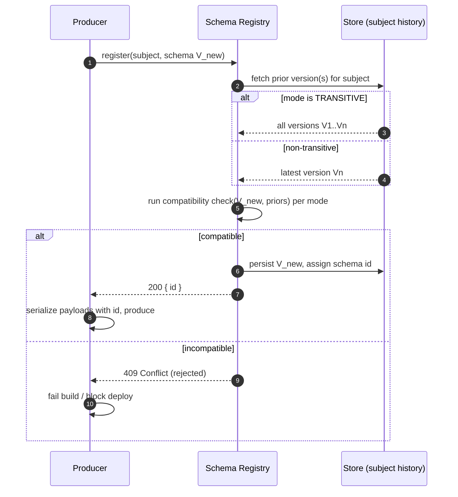
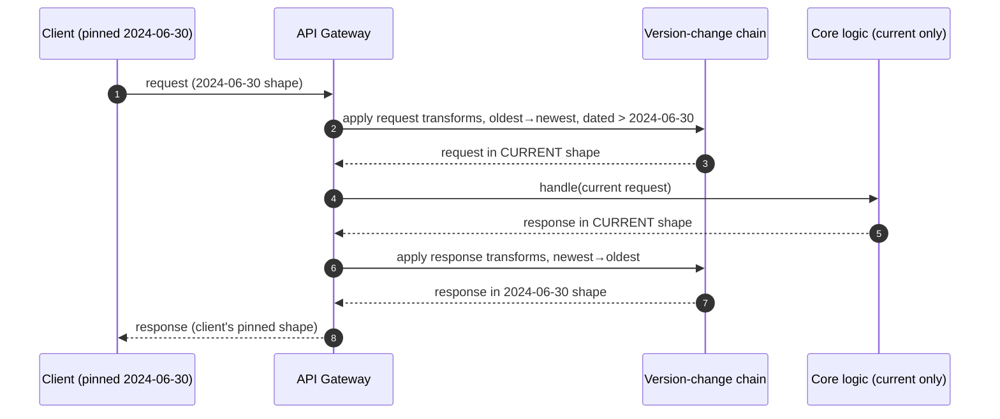

# Versioning and Deprecation — Professional

<!-- level-focus -->
At professional level, focus on this question:

> How should teams adopt and operate **Versioning and Deprecation** with measurable outcomes and limited coordination?

Use the smallest realistic scenario that exposes the decision and its failure behavior.
## 1. Compatibility, formally

Compatibility is a relation between a *producer* of data and a *consumer* of it. Fix a message format (a schema, a wire encoding, a JSON shape). Two directions matter, and they are not symmetric.

- **Backward compatibility.** New code can read data written by old code. Formally: a message valid under schema version `V_old` remains acceptable to a reader built for `V_new`. This is what a *server upgrade* needs — the fleet rolls forward while old clients keep sending old-shaped requests. Backward-compatible changes to *responses*: adding a field, widening an enum you never require the client to exhaustively match, relaxing a validation constraint.

- **Forward compatibility.** Old code can read data written by new code. Formally: a message valid under `V_new` is still acceptable to a reader built for `V_old`, which must *tolerate* what it does not understand. This is what a *client that upgrades late* needs — the server has already moved forward. Forward compatibility depends on the reader being written to **ignore unknown fields** rather than reject them.

- **Full compatibility.** Both directions hold simultaneously. The intersection of the two rule sets is narrow: essentially, adding and removing *optional* fields only.

The asymmetry is the crux. Adding a required field is backward-compatible for the reader (it can parse old messages if the field has a default) only when a default exists; it is *not* forward-compatible, because old writers will omit it. Removing a field is forward-compatible (new writers stop sending it, old readers had it optional) but breaks backward compatibility if any reader required it. Every "is this change safe?" question reduces to: *which direction of compatibility does my rollout actually require, and does this change preserve it?*

A practical rule of thumb that falls out of the formalism:

- Changing **requests** safely usually needs **forward compatibility** (server tolerates old-and-new request shapes as the client fleet lags).
- Changing **responses** safely usually needs **backward compatibility** (client tolerates old-and-new response shapes as the server fleet leads).

The gap between them — the set of changes that satisfy exactly one direction — is where phased deprecation, dual-write windows, and transformation shims live.

---

## 2. Wire and schema compatibility rules per format

Different serialization formats make different compatibility guarantees *structurally*, because their identity model for fields differs: by number, by position, or by name.

**Protobuf** identifies fields by **field number**, decoupled from name and declared order. The evolution rules ([protobuf.dev](https://protobuf.dev/programming-guides/proto3/)) follow directly:

- You may add a new field with a fresh number; old readers skip unknown field numbers (forward-compatible), new readers get the default for absent fields (backward-compatible).
- You must **never reuse or renumber a field number**. Reuse causes silent misinterpretation: an old writer's bytes for field 7 get decoded as the new field 7's type. When you delete a field, mark its number and name `reserved` so the compiler forbids accidental reuse.
- Renaming a field is wire-safe (the name is not on the wire) but breaks JSON mapping and generated-code call sites.
- Certain type changes are wire-compatible because they share an encoding: `int32`/`int64`/`uint32`/`uint64`/`bool` are mutually varint-compatible (with truncation/sign caveats); `sint32`/`sint64` are *not* compatible with the plain ints (zig-zag encoding); `string` and `bytes` are compatible when the bytes are valid UTF-8.
- `optional`, `repeated`, and scalar have subtle compatibility interactions; changing between `singular` and `repeated` of the same type is generally readable but changes semantics.

**Avro** identifies fields by **name** and resolves against a paired reader/writer schema (see §4). Adding or removing a field is safe *only if it has a default*, because resolution uses the default to fill fields the writer omitted or the reader lacks.

**JSON** (schemaless on the wire, typically validated by JSON Schema or OpenAPI) identifies by **key name**. It has no built-in rules; compatibility is a discipline:

- *Additive* changes are safe when readers ignore unknown keys: adding optional properties, adding enum values (only if clients don't exhaustively switch), adding a new endpoint or new response envelope field.
- *Breaking*: removing/renaming a field, changing a field's type, tightening validation (new `required`, narrower `pattern`, smaller `maximum`), changing the meaning of an existing value.

| Concern | Protobuf | Avro | JSON / JSON Schema |
|---|---|---|---|
| Field identity | Field **number** | Field **name** | Field **name** (key) |
| Add field, safe? | Yes (new number) | Yes **iff default given** | Yes (readers ignore unknown) |
| Remove field, safe? | Yes if number `reserved` | Yes **iff default given** | Forward-safe; breaks readers that required it |
| Rename field | Wire-safe, breaks codegen/JSON | **Breaking** (name is identity) | Breaking |
| Reorder fields | Irrelevant (number-keyed) | Irrelevant (name-keyed) | Irrelevant |
| Type change | Only within varint/length-delim families | Via resolution promotion (int→long→float→double) | Breaking |
| Enforced by | `reserved` + compiler | Schema registry + resolution | External validator / diff tool |
| Unknown fields | Preserved/skipped | Resolved via defaults | Ignored by convention |

The lesson: **number-keyed and name-keyed formats fail differently.** Protobuf's danger is number reuse; Avro's and JSON's danger is renames and missing defaults. Pick your automated guardrails to match the failure mode of your format.

---

## 3. Schema-registry compatibility modes

When schemas evolve in a central registry (e.g. the Confluent Schema Registry, [docs.confluent.io](https://docs.confluent.io/platform/current/schema-registry/fundamentals/schema-evolution.html)), each *subject* is configured with a compatibility mode that the registry **enforces at registration time** — an incompatible new schema is rejected before it can be produced.

The modes correspond directly to the formal directions in §1:

| Mode | Checks new schema can read… | Read old data with new schema | Read new data with old schema | Consumer/producer upgrade first? |
|---|---|---|---|---|
| `BACKWARD` | previous version | ✅ | ❌ | **Consumers** first |
| `BACKWARD_TRANSITIVE` | *all* previous versions | ✅ (all) | ❌ | Consumers first |
| `FORWARD` | — (old readers read new data) | ❌ | ✅ | **Producers** first |
| `FORWARD_TRANSITIVE` | — (all old readers) | ❌ | ✅ (all) | Producers first |
| `FULL` | previous version, both ways | ✅ | ✅ | Either order |
| `FULL_TRANSITIVE` | all versions, both ways | ✅ (all) | ✅ (all) | Either order |
| `NONE` | nothing | — | — | No guarantee |

Two axes define the space:

- **Direction** — `BACKWARD` vs `FORWARD` vs `FULL`, as in §1.
- **Transitivity** — the plain mode checks only against the *immediately previous* registered version; the `_TRANSITIVE` variant checks against *every* prior version. Non-transitive modes let compatibility "drift": `V3` may be compatible with `V2` and `V2` with `V1`, yet `V3` incompatible with `V1`. If any long-lived consumer may still be on `V1`, you need a transitive mode.

`BACKWARD` is the registry default and the right choice for most event streams, precisely because it lets you **upgrade consumers first** — the common operational order — while allowing the additive/optional-field changes that dominate real evolution. Choose `FULL_TRANSITIVE` when you cannot control upgrade order across a large ecosystem and are willing to accept the narrow set of changes it permits (add/remove optional-with-default fields only).

The registration flow:

The registry turns a human discipline ("please don't ship breaking schemas") into a mechanical gate that returns `409` before bad data can ever be written.

---

## 4. Avro reader/writer schema resolution

Avro deserves its own section because its compatibility model is the cleanest illustration of the formalism. Avro data is **always** deserialized against **two** schemas: the *writer's schema* (what produced the bytes) and the *reader's schema* (what the consumer expects). Resolution reconciles them ([avro.apache.org](https://avro.apache.org/docs/++version++/specification/#schema-resolution)):

- **Field present in writer, absent in reader** → the value is read and discarded. (Reader tolerates extra data — forward-friendly.)
- **Field present in reader, absent in writer** → the reader supplies the field's **default**. If the field has *no default*, resolution **fails**. This is *the* reason "add/remove a field only with a default" is the Avro golden rule.
- **Type promotion** is allowed along a fixed lattice: `int → long → float → double`, and `string ↔ bytes`. A writer's `int` resolves cleanly into a reader's `long`.
- **Enum symbol** in the writer that the reader lacks → error unless the reader's enum declares a `default` symbol.
- **Field order** is irrelevant; matching is by name (with `aliases` letting a renamed reader field match an old writer name — the escape hatch for renames).

Because resolution is symmetric machinery, a schema-registry `BACKWARD` check for Avro is literally: *"can a reader built from `V_new` resolve bytes written by `V_old`?"* — the same resolution algorithm, run at registration time instead of read time.

---

## 5. Date versioning and the transformation pipeline

Semantic-major versioning (`/v1`, `/v2`) forces a hard fork of surface area. The alternative that scales to hundreds of small changes is **date-based versioning with a transformation pipeline**, popularized by Stripe. Each account is *pinned* to the API version in effect when it integrated; requests carry (or inherit) a version like `2024-06-30`. Internally there is exactly **one** current codebase; a chain of small, reversible **version-change shims** transforms between the pinned version and the current one.

The mechanics:

1. Each backward-incompatible change is packaged as a discrete **version change** object with two methods: one that mutates a *request* from the older shape to the current shape, and one that mutates a *response* from the current shape back to the older shape.
2. Version changes are ordered by date. For an inbound request pinned at date `D`, the gateway applies, in ascending date order, the request-transform of every version change dated after `D`, walking the payload up to "current". The core business logic then runs against **only the current shape** — it never sees legacy variants.
3. On the way out, the response-transforms of the same set of version changes are applied in **descending** order, walking the current response back down to the shape the pinned client expects.

Why this is powerful:

- **Complexity is linear and isolated.** Each shim is a small pure function pair; the core never branches on version. Adding a client version costs one shim, not a forked handler.
- **It is testable in isolation.** Each version change has a request-round-trip and response-round-trip property test: transform up then down must be identity for the pinned shape.
- **Deprecation becomes shim removal.** Retiring an old version means dropping every account pinned before date `D`, then deleting the now-dead shims — the code doesn't rot because unused shims are obvious dead code.

The constraints: transforms must be **pure and total** over the shapes they claim to handle, and *stateless* (no dependency on the current DB state beyond what's in the payload), or round-tripping breaks. Changes that cannot be expressed as a payload-only transform (e.g. a change in a resource's *identity* or a genuine semantic redefinition) still require a hard version bump — the pipeline handles shape evolution, not meaning evolution.

---

## 6. Consumer-driven contract testing

Schema compatibility answers "is the *format* safe?" Contract testing answers "does the *interaction* still hold for the consumers who actually exist?" **Consumer-driven contracts** (CDC) invert the usual direction: consumers declare the subset of the provider's behavior *they depend on*, and the provider verifies it can satisfy every such contract before shipping.

Pact ([pact.io](https://docs.pact.io/)) is the reference implementation. Mechanics:

1. **Consumer side.** The consumer's tests run against a Pact *mock provider*. Each expectation — "given state `user 42 exists`, on `GET /users/42`, expect `200` with a body matching this shape" — is recorded. Bodies are matched with **matchers** (type-based, regex, min-array-length) rather than exact values, so the contract asserts *structure and types*, not brittle literals. The run emits a **pact file** (JSON) capturing all interactions.
2. **Broker.** Pact files are published to a **Pact Broker**, tagged with consumer version and application version. The broker tracks which consumer versions are deployed in which environment.
3. **Provider side.** The provider replays every relevant pact against its *real* implementation. Each interaction's **provider state** ("user 42 exists") is set up via a state handler, the recorded request is issued, and the response is matched against the recorded expectations.
4. **can-i-deploy.** Before deploying, the provider (or consumer) asks the broker `can-i-deploy` — the broker computes, from the matrix of verified pacts, whether that version is compatible with everything currently in the target environment. A red result blocks the deploy.

The distinctive value versus schema checks: a contract encodes **only what a consumer uses**, so a provider can freely change fields no consumer reads. It catches the changes a schema diff misses — a field whose *values* changed meaning, an endpoint a consumer relied on being idempotent, a status code a consumer branches on. It is *narrow and real* where schema compatibility is *broad and formal*; mature systems run both.

---

## 7. Detecting breaking changes automatically

Compatibility rules are only useful if a machine enforces them in CI, before merge. Each format has a diff tool that classifies a change as safe or breaking:

- **Protobuf — `buf breaking`.** Compares the proposed `.proto` set against a baseline (a git ref or an image). It knows the protobuf rules from §2: it flags deleted or renumbered fields, changed field types outside the compatible families, deleted enum values, changed field cardinality. Rule categories (`FILE`, `PACKAGE`, `WIRE`, `WIRE_JSON`) let you tune strictness to the compatibility direction you actually need — e.g. `WIRE` only, if you never rely on JSON mapping.
- **OpenAPI — diff tools** (openapi-diff and similar). Compare two OpenAPI documents and classify: removing a path/operation, removing a response property, adding a `required` request property, narrowing a type or enum → **breaking**; adding an optional property, adding an operation, adding an enum value → **non-breaking**. Wire this into CI to fail the PR on a breaking classification unless a version-bump label is present.
- **Avro / JSON Schema — registry check.** The strongest option: run the schema-registry compatibility check (§3) against the configured mode as a CI step, so `409`-worthy schemas fail the build directly rather than at deploy time.

The pattern to institutionalize: **the baseline is the last released contract**, the check runs on every PR, and a breaking result is a *policy* decision (block, or require an explicit approved version bump) rather than a surprise discovered in production. This converts §1's formal directions from a code-review argument into a deterministic gate.

---

## 8. Feature flags and capability negotiation

Not every evolution wants a new version. When behavior should vary *per request* or *per client capability* rather than per version epoch, use negotiation instead of versioning:

- **Capability negotiation.** The client advertises what it understands; the server tailors the response. Mechanisms: a request header (`Prefer`, a custom `X-Client-Capabilities`, or `Accept` with parameters), or content negotiation via media-type parameters (`Accept: application/json;profile=v2`). The server returns the richest response the client claims to handle and echoes what it actually produced (e.g. via `Content-Type` or a `Vary` header so caches key correctly). This keeps *one* logical version while letting capable clients opt into newer shapes — additive by construction, hence backward-compatible.

- **Feature flags** decouple *deploy* from *release*. A new field or behavior ships dark behind a flag, is enabled for internal accounts, then a rollout cohort, then everyone — with an instant kill switch if it regresses. Flags let you make a would-be-breaking change *observably safe* by measuring real client behavior before flipping it on broadly, and by pinning specific accounts that break.

The distinction from versioning: a version is a **frozen contract** a client integrates against and stays on until it migrates; a flag or capability is a **runtime dimension** that varies response shape without the client re-integrating. Use versioning for contracts that must be stable for years; use negotiation and flags for progressive, reversible rollout of additive change. Combined with the §5 pipeline, capabilities often *become* the trigger that selects which shims to apply.

---

## 9. Checklist

- [ ] For every proposed change, state which direction — backward, forward, or full — your rollout order actually requires, then verify the change preserves it.
- [ ] Match your automated guardrail to your format's failure mode: `reserved` + `buf breaking` for protobuf (number reuse), registry checks for Avro/JSON (renames, missing defaults).
- [ ] Set each schema subject's registry mode deliberately; default to `BACKWARD`, escalate to a `_TRANSITIVE` mode when old consumers may persist across many versions.
- [ ] Give every Avro/JSON field a default so reader/writer resolution can add and remove it safely.
- [ ] If you use date versioning, keep the core version-agnostic and express every change as a pure, reversible, round-trip-tested request/response shim pair.
- [ ] Run consumer-driven contracts (Pact) plus `can-i-deploy` alongside schema diffs — they catch behavioral breaks that format diffs cannot.
- [ ] Gate every PR with a breaking-change diff against the last released contract; make a breaking result a policy decision, not a production surprise.
- [ ] Prefer capability negotiation and feature flags for additive, reversible, per-client evolution; reserve hard version bumps for changes in meaning or identity.

---

---

## Apply it

1. Define the user or business outcome that **Versioning and Deprecation** should improve.
2. Assign one owner for code, contracts, operations, and incidents.
3. Split delivery into reversible increments that produce evidence early.
4. Publish responsibilities, escalation paths, and compatibility windows.
5. Stop or expand only when the agreed measures support that decision.

## Verify your work

- Each increment has an owner, rollback path, and observable exit condition.
- Adoption, reliability, delivery time, and coordination cost are measured.
- Incident and migration exercises prove that responsibility is executable.
- The old path is removed only after telemetry proves it is unused.

## Review questions

- Which measurable outcome justifies investing in Versioning and Deprecation?
- Which team owns the full lifecycle and incident response?
- What reversible increment produces the earliest useful evidence?
- Which exit condition proves that migration or adoption is complete?
