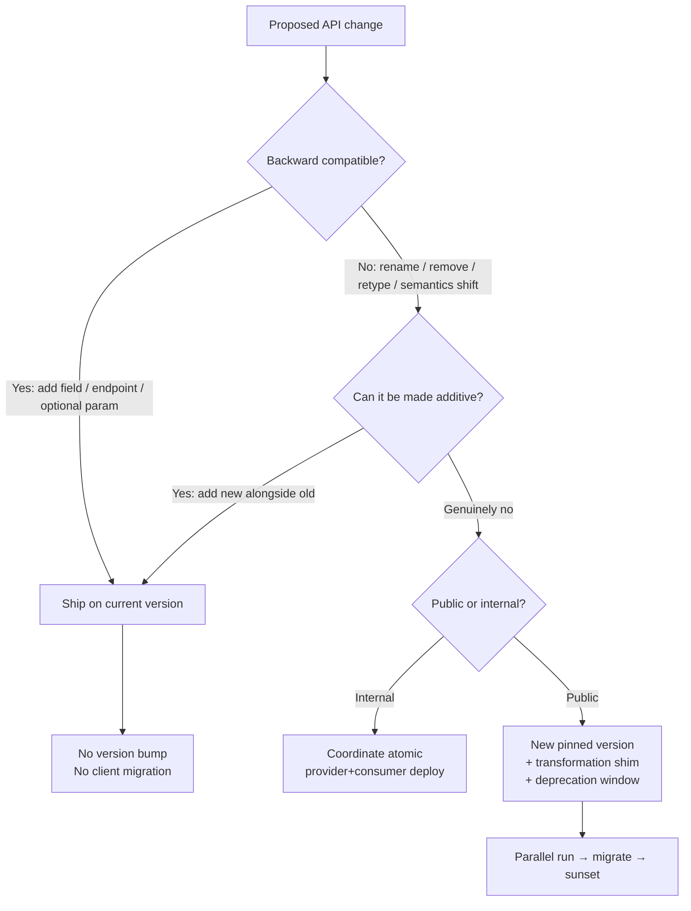
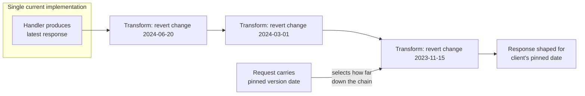

# Versioning and Deprecation — Senior

<!-- level-focus -->
At senior level, focus on this question:

> Which system invariant is affected by **Versioning and Deprecation** under failure, load, and change?

Use the smallest realistic scenario that exposes the decision and its failure behavior.
## 1. The central split: version vs never-break

Two philosophies dominate mature API design, and they are close to mutually exclusive as a default posture:

- **Explicit versioning.** Each incompatible generation of the API gets a label (`/v2`, `Accept: application/vnd.acme.v3+json`, a date). Clients opt into a version and stay there until they migrate. The provider runs multiple versions concurrently.
- **Never-break / additive-only evolution.** There is effectively one live version. You are *only ever allowed to make backward-compatible changes*: add fields, add endpoints, add optional parameters, add enum values (carefully). Anything that would break an existing client is forbidden by policy, not by process. Versions are avoided almost entirely.

The additive-only camp — Stripe, Google, GitHub's core resources — treats a breaking change as an organizational failure to be routed around, not a routine event to be managed with a version bump. The insight: **most "breaking" changes are actually optional if you constrain the design.** You rarely *need* to rename a field; you can add the new one and leave the old. The version-explosion tax (Section 4) is high enough that avoiding it reshapes how you design every endpoint.

The staged flow above is the actual decision most senior engineers make per change: *can I avoid a version, and if not, what does forcing a version obligate me to?*

---

## 2. The additive-only discipline (how Stripe/Google avoid versions)

Additive-only is a **set of rules enforced in review**, not a framework. The rules that keep a single version alive indefinitely:

- **Add, never remove.** New fields, endpoints, and parameters are free. Removing or renaming is banned.
- **New parameters must be optional** and default to the pre-existing behavior. An old client that omits them must get exactly what it got yesterday.
- **Never repurpose a field.** Changing the meaning or type of an existing field is a break even when the JSON shape looks identical (`amount` in dollars → cents silently corrupts every client).
- **Never tighten what you accept or loosen a documented guarantee.** Making a previously-optional response field disappear, or adding a new required request field, breaks clients.
- **Treat enums as open.** Clients must tolerate unknown enum values; that lets you add new statuses without a version.

Google's API design guidance and Stripe's engineering writing both codify essentially this list. The payoff is that the vast majority of product evolution ships with zero client action. The cost is discipline: you accumulate deprecated-but-live fields, and the schema grows barnacles over years. That is a real but *bounded* cost — one schema — versus the *unbounded* cost of many versions.

---

## 3. Tolerant reader and Postel's law in practice

Additive-only only works if clients are built to survive it. The **Tolerant Reader** pattern (Fowler) is the consumer-side contract that makes provider-side additive changes safe:

- **Ignore unknown fields** rather than failing deserialization. A strict schema validator that rejects extra properties turns every additive server change into a client break.
- **Bind to the minimum you need.** Extract only the fields you consume; don't round-trip the whole payload through a rigid model.
- **Tolerate unknown enum values** — map anything unrecognized to a safe default or an "unknown" bucket instead of throwing.
- **Don't assume field ordering, or that optional fields are present.**

This is Postel's law ("be conservative in what you send, liberal in what you accept") applied to APIs. The critical caveat: liberal-in-what-you-accept has security limits — you still validate and reject *malformed* or *unauthorized* input strictly. Tolerance is about *structural* forward-compatibility (extra/missing fields), not about relaxing validation. A provider that assumes tolerant readers but has strict, brittle clients gets the worst of both worlds: additive changes still break people, but there's no version to fall back on.

---

## 4. The version-explosion cost

The reason additive-only is worth its discipline is that explicit versioning has a cost that compounds:

- **Every live version is code you maintain forever** — bug fixes, security patches, and behavior parity across all of them.
- **Combinatorial testing.** N versions × M endpoints × integrations is a test matrix that grows faster than the team.
- **Cognitive load and docs.** Each version needs its own documentation, SDK generation, and support answers.
- **Data-model coupling.** A `/v1` and `/v3` that read the same database force translation layers on every write path.
- **Sunsetting is politically hard.** Once a version has paying customers, retiring it is a negotiation, not an engineering decision — so versions rarely actually die. "Temporary" v2 becomes permanent.

The trap is that each individual version bump looks cheap at the moment you make it. The cost is paid later and continuously by a different team. Senior judgment is pricing that *future stream of maintenance* into today's decision — which is exactly why big-scale APIs push so hard to stay additive.

---

## 5. Version-per-change vs date-based versions

When you *do* version, the granularity matters. Two dominant models:

| Dimension | Explicit URI/semantic version (`/v1`, `/v2`) | Date-based / pinned version (Stripe-style `2024-06-20`) |
|---|---|---|
| Unit of change | Whole API generation; bump is a big event | Fine-grained; each account pins the API as it was on a date |
| How many live at once | Few, coarse (`v1`, `v2`, `v3`) | Effectively many, but expressed as a continuum of dates |
| Client experience | Must opt into a whole new API surface | Stays on their pinned date; upgrades when ready |
| Where breaks are absorbed | Client rewrites for the new version | A **transformation shim** downgrades new responses to the old date |
| Provider code shape | Parallel implementations or big branches | One current implementation + ordered chain of small transforms |
| Blast radius of a break | Large (new version) | Small (one dated behavior change) |
| Best fit | Coarse redesigns, internal APIs, GraphQL evolution | High-scale public REST APIs with many long-lived integrations |

**Version-per-change / semantic** (`/v2`) is coarse: you batch breaks into a new major version. Simple to reason about, but each version is a heavy artifact, and clients face an all-or-nothing migration.

**Date-based** (Stripe) is the additive philosophy's escape hatch for the *rare* unavoidable break. Each account is pinned to the API version (a date) it first integrated against. New accounts get the latest. When a break ships, it's associated with a date; only clients that explicitly upgrade past that date experience it. Crucially, the provider still maintains **one** current codebase — old behavior is reconstructed by shims, not by parallel implementations (Section 6).

There's also **header/media-type versioning** (`Accept: application/vnd.acme.v2+json`) as an axis orthogonal to URI-vs-date — it keeps URLs stable and versions the representation, at the cost of being less visible/cacheable and harder to test in a browser.

---

## 6. Date-pinned versions + transformation shims

The mechanism that makes date-based versioning maintainable is a **chain of transformation functions**. You write today's response the modern way, then downgrade it through a stack of small, ordered transforms — one per historical breaking change — until it matches the shape the client's pinned date expects.

Key properties of this architecture:

- **One source of truth.** Business logic exists once, in the modern shape. Legacy behavior is *derived*, not duplicated.
- **Each transform is small, pure, and independently testable** — it reverts exactly one breaking change and nothing else.
- **The chain is applied by version position.** A client pinned to `2023-11-15` runs through every transform back to that date; a latest client runs through none.
- **Requests transform forward, responses transform backward** — an old-shaped request is upgraded to modern before hitting the handler, symmetric to the response path.

The limit of the shim approach: it works cleanly for **shape and semantic transforms that are pure functions of the payload**. Changes that require different *stored data* or different *side effects* (not just a different projection of the same data) can't always be shimmed and may still force a genuine version boundary. Senior work is spotting, at design time, which breaks are shimmable and which aren't.

---

## 7. Consumer-driven contracts to catch breaks early

Additive-only is a *policy*; you need a *mechanism* that fails the build when someone violates it. **Consumer-driven contract testing** (e.g. the Pact model) is that mechanism:

- Each consumer publishes a contract describing exactly the fields and shapes it depends on.
- The provider's CI verifies every published consumer contract against the current implementation.
- If a change would remove or alter a field some consumer relies on, the provider's build fails **before deploy**, not after an incident.

This inverts the usual risk: instead of hoping clients were tolerant, you have machine-checked proof of what each client actually consumes. It's especially powerful internally, where you can enumerate every consumer. For public APIs you can't enumerate consumers, so you supplement contracts with: schema-diff linters that reject non-additive changes in CI, replayed real traffic against the new build, and canary versions. Contract tests catch the *known* consumers; schema-compatibility gates catch the *unknown* ones by mechanically forbidding non-additive diffs.

---

## 8. When a breaking change is genuinely unavoidable

Sometimes additive-only can't save you: a security fix that must remove a leaking field, a legal requirement, a semantic change that can't coexist with the old meaning. The senior playbook for *forcing* a break with the least damage:

1. **Prove it's actually necessary.** Most "necessary" breaks are avoidable with a new field and a shim. Exhaust that first.
2. **Parallel run.** Ship the new behavior alongside the old (new endpoint, new field, or new pinned version). Both work simultaneously; no client is forced yet.
3. **Announce with a dated sunset.** Publish the deprecation and the exact retirement date up front. Use the `Deprecation` and `Sunset` HTTP response headers so the signal is machine-readable, and surface it in docs, changelog, and SDK warnings.
4. **Instrument the old path.** You cannot sunset what you can't see. Track per-client usage of the deprecated behavior so you know who's still on it and can contact them specifically.
5. **Actively migrate.** Reach out to the top consumers, provide migration guides and, where possible, automated tooling. Drive usage down deliberately rather than waiting.
6. **Brownout before blackout.** As the date nears, inject brief, scheduled failures on the old path to flush out clients whose owners ignored every notice — a controlled way to surface remaining dependencies before the hard cutoff.
7. **Sunset.** Retire on the announced date. If usage is still non-trivial from important clients, that's a signal your window or outreach failed — extend deliberately, don't just cave silently.

The window length scales with your audience: internal APIs can sunset in days; a large public API with enterprise contracts may need quarters or years, and the deprecation policy is often contractual.

---

## 9. Internal vs public version policy

The same API deserves very different policies depending on who's on the other side of it:

| Concern | Internal API | Public API |
|---|---|---|
| Who are the consumers? | Enumerable; you own or can contact them all | Unknown, unbounded, external |
| Can you force a migration? | Yes — atomic deploy of provider + consumers | No — you can only incentivize and sunset |
| Preferred break strategy | Coordinate + break; short window | Additive-only + shim; long window |
| Deprecation window | Days to weeks | Months to years, sometimes contractual |
| Contract enforcement | Consumer-driven contract tests (full coverage) | Schema linters + canaries + traffic replay |
| Versioning need | Often minimal — you can just change both sides | Real — clients can't be forced to move |

The core asymmetry: **internally you control both ends of the contract, so a breaking change can be an atomic, coordinated deploy** — you rarely need durable versions, just a synchronized rollout (often expand/migrate/contract). Publicly you control only one end, so you must either never break, or pay the full parallel-run-and-sunset cost. Applying the heavyweight public policy to internal calls is over-engineering; applying the casual internal policy to a public API is how you get an incident and an angry customer thread.

---

## 10. Backward AND forward compatibility

Most discussion stops at backward compatibility — *new server, old client still works*. Senior systems also need **forward compatibility** — *old server, new client still works*, and *old client survives new data it wasn't built for.* This matters because during any rollout the versions coexist, and in event/message systems producers and consumers deploy independently in unknown order.

- **Backward compatible:** a v2 server serves a v1 client correctly. Achieved by additive-only changes and shims.
- **Forward compatible:** a v1 reader survives a message written by a v2 writer — it ignores fields it doesn't understand and doesn't crash. Achieved by the tolerant-reader discipline (Section 3) and by never making a previously-optional field mandatory.

In practice you want **full compatibility** (both directions) for anything with independent deploy cadence — Protobuf/Avro schema-evolution rules exist precisely to enforce this: new fields must be optional with defaults, field numbers/tags are never reused, and readers skip unknown fields. The failure mode to design against is a rollout where the new writer emits data the not-yet-upgraded reader chokes on. If both directions hold, deploy order stops mattering — which is what lets you roll out gradually and roll back safely.

---

## 11. Decision checklist

Before choosing a versioning posture for a surface, answer:

- **Can this change be additive?** If yes, it should be — no version, no migration. This is the default.
- **Are my clients tolerant readers?** If not, additive changes still break them; fix the client contract or you have no safe evolution path.
- **How many consumers, and can I enumerate them?** Enumerable → coordinate and break. Unbounded → never-break or shim.
- **Is this break shimmable** (a pure transform of the same data) **or does it need different stored data/side effects?** The former is cheap; the latter may force a real version boundary.
- **What is the full lifetime cost of a new version** — maintenance, testing matrix, docs, and the eventual sunset fight? Price that in now.
- **Do I need forward compatibility too** (independent deploys, message streams)? If so, enforce reader tolerance and additive-only schema evolution, not just backward compatibility.

The senior default across high-scale APIs is clear: **avoid versions by staying additive, build clients that tolerate change, and reserve explicit versioning — ideally date-pinned with shims — for the genuinely unavoidable break, executed with a measured, instrumented sunset.**

*Next step:* [Versioning and Deprecation — Professional](professional.md)

---

## Apply it

1. State the system invariant that **Versioning and Deprecation** must protect.
2. Mark ownership, state, and failure propagation at each boundary.
3. Compare two designs under load, dependency failure, and future change.
4. Define recovery and compatibility behavior before implementation.
5. Test the riskiest assumption with a focused experiment.

## Verify your work

- The experiment supports the design with evidence, not preference.
- Failure injection shows the blast radius and recovery path.
- Compatibility checks cover old and new callers or data.
- Operational signals reveal invariant violations and recovery progress.

## Review questions

- Which invariant must remain true when Versioning and Deprecation fails?
- Where should recovery responsibility live, and why?
- Which assumption deserves an experiment before implementation?
- How can the design evolve without changing every consumer at once?
