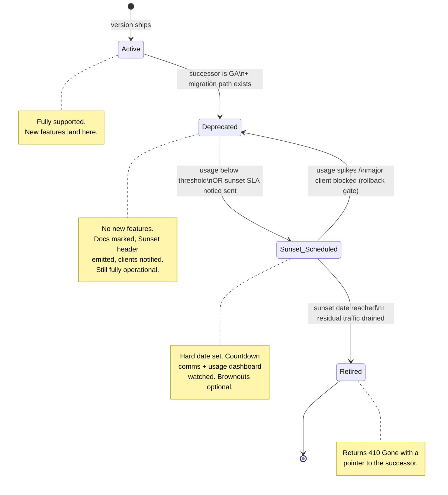
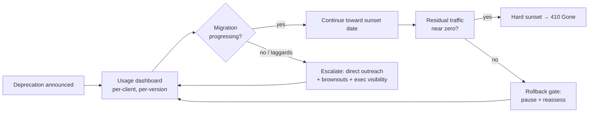

# Versioning and Deprecation — Staff

At the staff level, versioning stops being a technical decision about URL prefixes and header negotiation, and becomes a question of **organizational governance**: how does a company evolve its APIs across dozens of teams and thousands of external clients without (a) breaking the people who depend on it or (b) collapsing under the maintenance weight of every version it ever shipped? The technical mechanics — `/v2`, `Accept` headers, additive changes — are table stakes. The staff problem is the *policy* that governs when a breaking change is allowed, who pays for it, how long the old version lives, and how you communicate a sunset without torching customer trust.

This tier is about judgment and coordination, not deeper protocol knowledge. It covers the deprecation policy as a documented org contract, the economics of zombie versions versus aggressive sunsetting, the legal and SLA weight of public/partner contracts, driving an additive-first "never break userspace" culture, containing version sprawl across services, and framing all of this to leadership and customers.

---

## Contents

1. [The staff reframe: versioning is a coordination problem](#1-the-staff-reframe)
2. [The deprecation policy as an org contract](#2-the-deprecation-policy)
3. [The governance lifecycle](#3-the-governance-lifecycle)
4. [The economics of zombie versions](#4-the-economics-of-zombie-versions)
5. [Aggressive sunset vs long support: the core trade-off](#5-aggressive-vs-long-support)
6. [Public and partner contracts: legal and SLA weight](#6-public-and-partner-contracts)
7. [Driving an additive-first culture](#7-driving-additive-first-culture)
8. [Version sprawl governance across services](#8-version-sprawl-governance)
9. [Migration incentives: carrots and sticks](#9-migration-incentives)
10. [Framing deprecation risk to leadership and customers](#10-framing-risk)
11. [Anti-patterns](#11-anti-patterns)
12. [Staff judgment checklist](#12-staff-checklist)

---

## 1. The staff reframe: versioning is a coordination problem {#1-the-staff-reframe}

A junior engineer asks "URL versioning or header versioning?" A staff engineer asks a different set of questions:

- **Who is on the other end of this contract, and what does it cost them to change?** An internal caller you can page and coordinate with in a Slack channel is nothing like a fintech partner whose release cycle is quarterly and whose compliance team must re-audit every integration change.
- **What is the organization's standing capacity to maintain versions?** Every version you keep alive is a permanent line-item: on-call rotation, security patches, test surface, cognitive load for every new engineer reading the code.
- **What is the trust cost of the change, and who absorbs it?** A breaking change you force externally is a withdrawal from a trust account you spent years filling.

The failure mode at scale is not choosing the wrong versioning *scheme*. It's the absence of a *policy* — so every team invents its own deprecation timeline, every version lives forever because nobody owns sunsetting it, and the API surface becomes an unremovable geological record of every past decision. The staff deliverable is the policy and the culture that make evolution routine rather than heroic.

---

## 2. The deprecation policy as an org contract {#2-the-deprecation-policy}

A deprecation policy is a **written, published, and enforced** document. If it lives in someone's head, it does not exist. The minimum viable policy answers, unambiguously:

| Policy clause | What it must state | Why it matters |
|---|---|---|
| **Support window** | How long a version is supported after the next version ships (e.g. "12 months minimum for public APIs"). | Clients plan migrations against a number, not a vibe. |
| **Deprecation timeline** | The staged sequence: announce → deprecate → sunset, with dates for each gate. | Removes ambiguity about "how long do I have?" |
| **Sunset SLA** | The guaranteed minimum notice before shutdown (e.g. "90 days for internal, 6–12 months for public/partner"). | This is the contractual promise; breaking it is a trust default. |
| **Breaking-change definition** | What counts as breaking (removing a field, changing a type, tightening validation, changing error semantics). | Prevents "it's technically not breaking" arguments. |
| **Communication playbook** | Channels, cadence, and escalation path for reaching every affected client. | A sunset nobody heard about is an outage you scheduled. |
| **Exception process** | Who can grant a shorter window (e.g. an actively-exploited security hole) and how it's approved. | Policies without a safety valve get ignored. |

The policy's power is that it is decided *once, in the calm*, and applied uniformly — so no individual team is negotiating deprecation terms under pressure with an angry customer. It converts a recurring political fight into a lookup.

A useful distinction to bake in: **notice is a floor, not a target.** A 90-day sunset SLA means you *may not* give less than 90 days — it does not mean you should ship the notice on day 90 and shut down on day 0. Communication should be continuous across the window.

---

## 3. The governance lifecycle {#3-the-governance-lifecycle}

The policy comes alive as a lifecycle with gates. A version cannot advance to the next state until an SLA condition and a data condition are both satisfied. This is what separates a governed sunset from a hopeful one.

The three gates that require staff-level judgment:

- **Active → Deprecated** requires that the successor is *generally available* (not beta) and that a documented, tested migration path exists. Deprecating before the replacement is ready is how you strand clients.
- **Deprecated → Sunset Scheduled** should be driven by *data*: a usage dashboard showing traffic has fallen below a threshold, or the sunset SLA clock. You never guess who's still calling; you measure.
- **The rollback gate** (Sunset Scheduled → Deprecated) is the honesty valve. If usage spikes or a strategic client is blocked, a governed process pauses the sunset rather than proceeding on principle. Retiring a version that a top-10 customer still depends on to hit a self-imposed date is a self-inflicted wound.

Two operational levers worth naming: the **`Sunset` HTTP header** (RFC 8594) and **`Deprecation` header** let you machine-signal end-of-life so sophisticated clients can alert on it; and **brownouts** — deliberate short outages of the deprecated version before the hard date — surface silent dependencies that no dashboard caught and give laggards a visceral warning.

---

## 4. The economics of zombie versions {#4-the-economics-of-zombie-versions}

A **zombie version** is one that is deprecated in intent but never actually retired — kept alive because sunsetting it is unpleasant. The cost is invisible on any single day and enormous in aggregate. It is a **permanent maintenance tax**:

- **Security surface:** every version is code that must be patched when a CVE lands. Three live versions means triple the patch-and-verify work on every security fire drill.
- **Test and CI cost:** each version multiplies the integration test matrix and slows every pipeline.
- **Cognitive load:** every new engineer must understand why `v1`, `v2`, and `v3` all exist and which behaviors differ. This tax compounds with headcount growth.
- **Innovation drag:** an internal refactor or storage migration must preserve the behavior of *every* live version, so the oldest zombie dictates the ceiling on how much anything can improve.
- **Confidence erosion:** engineers stop touching code paths that serve old versions because they can't reason about who depends on them — a classic path to fear-driven, ossified systems.

The insidious part is that the cost of a zombie is paid by a *different* team, in a *different* quarter, than the team that declined to do the sunset. The person who ducks the hard deprecation conversation externalizes a permanent cost onto the future org. Staff engineers exist partly to make that externality visible and to insist someone owns retirement, not just launch.

**The counter-force is real:** aggressively retiring a version that clients still need is a *trust* cost, and trust is far more expensive to rebuild than a version is to maintain. The job is not "always sunset fast." It is to price both sides honestly and decide deliberately — which is exactly the trade-off in the next section.

---

## 5. Aggressive sunset vs long support: the core trade-off {#5-aggressive-vs-long-support}

There is no universally correct deprecation aggressiveness. It's a dial you set per audience, weighing maintenance tax against trust and switching cost.

| Dimension | Aggressive sunset (short windows) | Long support (generous windows) |
|---|---|---|
| **Maintenance tax** | Low — few live versions, small matrix | High — permanent multi-version upkeep |
| **Innovation velocity** | High — old constraints removed quickly | Low — oldest version gates all change |
| **Client trust** | At risk — clients feel churned, may distrust roadmap | High — clients feel safe building on you |
| **Switching / migration cost imposed on clients** | High and frequent | Low and rare |
| **Security posture** | Strong — small patch surface | Weaker — more code to keep patched |
| **Best fit** | Internal APIs; fast-moving startups; single-team clients | Public platforms; regulated partners; enterprise contracts |
| **Failure mode** | Customer churn, "they keep breaking us" reputation | Zombie sprawl, ossification, maintenance bankruptcy |

The staff move is to recognize this is **not one dial but several** — segment by audience:

- **Internal APIs:** aggressive is usually right. You control both ends, can coordinate migrations directly, and the maintenance tax hits the same org that benefits from the cleanup. Windows of weeks to a couple of months.
- **Public and partner APIs:** long support is usually right. You do not control the client's release cycle, switching cost may involve their compliance and legal review, and a broken integration is a headline. Windows of 6–24 months, often contractually fixed.

The internal-vs-public split is the single most important segmentation in a deprecation policy — a one-size timeline is either too slow for internal cleanup or too fast for external trust.

---

## 6. Public and partner contracts: legal and SLA weight {#6-public-and-partner-contracts}

Once an API is public — and especially once it's under a signed partner or enterprise agreement — a breaking change is not an engineering decision. It may be a **breach of contract**.

- **The API is part of the SLA.** Many enterprise contracts specify uptime and, increasingly, *stability* and *notice* guarantees for the API surface the customer integrated against. Retiring an endpoint they depend on with less than the contracted notice is a legal event, not a changelog line.
- **Deprecation notice periods are often contractual.** "We will provide no less than 12 months' notice of any breaking change" is a common clause. That clause makes the sunset SLA a legal floor, and it means your *policy* window must be at least as long as your *strictest contract* window — or your policy is quietly writing checks Legal can't cash.
- **Regulated clients change slowly by law.** A bank or healthcare integrator cannot ship a migration in a sprint; their change goes through audit and compliance review. Your timeline must be sized for *their* release reality, not yours.
- **Public commitments outlive their authors.** A stability promise made in a blog post or docs page is remembered by customers long after the engineer who wrote it left. Treat public API guarantees as durable obligations.

The staff practice here is to **loop in Legal and Partnerships before, not after** any breaking change to a public/partner surface, and to ensure the deprecation policy's numbers are reconciled against the actual contract portfolio. The most expensive versioning mistake is discovering, mid-sunset, that a signed contract forbids the timeline you already announced.

---

## 7. Driving an additive-first culture {#7-driving-additive-first-culture}

The cheapest breaking change is the one you never made. Linus Torvalds' "**we do not break userspace**" rule for the Linux kernel is the cultural north star: the burden of proof is on the change that breaks callers, and that burden is set deliberately high.

Additive-first means the default evolution strategy is *extend, don't replace*:

- **Add fields, never remove or repurpose them.** New optional fields don't break old clients. Removing or retyping a field does.
- **Add endpoints, don't change the semantics of existing ones.** Tightening validation, changing default behavior, or altering error codes on an existing endpoint is breaking even when the shape is unchanged.
- **Make new behavior opt-in.** Feature flags, new query parameters, and `Accept`-header negotiation let clients adopt on their own schedule.
- **Tolerant reading, conservative writing.** Clients ignore unknown fields; servers don't rely on clients sending fields they didn't before.

Driving this as *culture* — the staff job — means:

1. **Make additive the path of least resistance.** Provide schema-diff tooling in CI that flags breaking changes automatically, so "is this breaking?" is answered by a bot, not an argument. Contract tests (consumer-driven) fail the build when a change would break a known consumer.
2. **Make breaking changes require explicit sign-off.** A breaking change should be a reviewed, named decision with an owner — never something that slips through because nobody noticed.
3. **Reward the boring path.** Celebrate the migration that shipped invisibly, not just the flashy `v2` rewrite. A culture that only rewards big rewrites will manufacture breaking changes.

An org with a genuine additive-first culture needs new *major versions* rarely — because most evolution never requires one.

---

## 8. Version sprawl governance across services {#8-version-sprawl-governance}

In a microservices org, versioning failure metastasizes: every service invents its own scheme, its own timeline, its own header conventions, and the number of live (service × version) combinations explodes. This is version *sprawl*, and it's an org-level problem no single team can fix.

Governance levers:

- **A single org-wide versioning standard.** One scheme (e.g. semver semantics, one header convention, one URL pattern), documented centrally, adopted by all services. The value is not that any one scheme is optimal — it's that clients and engineers learn the rules *once*.
- **A version inventory / registry.** You cannot govern what you cannot see. A central catalog of every service, its live versions, their deprecation state, and each version's traffic makes sprawl measurable. Sunsetting is impossible without knowing who's still calling — and at org scale, "who's calling" spans dozens of internal teams.
- **A platform / API-gateway chokepoint.** Enforcing versioning conventions, emitting `Sunset` headers, and collecting per-version usage metrics at the gateway means the policy is applied by infrastructure, not by each team's diligence. Policy-as-infrastructure scales; policy-as-good-intentions does not.
- **Deprecation as a tracked funnel, not a one-off.** Treat "clients still on the old version" as a burndown the platform team owns and reports on, the same way you'd track a security-patch rollout.

The staff role is often to *establish* these — to be the person who says "we need a version registry and a gateway-enforced standard" before sprawl becomes unmanageable, and to build the coalition across teams to adopt it.

---

## 9. Migration incentives: carrots and sticks {#9-migration-incentives}

Announcing a deprecation does not move clients. Clients migrate when the pain of *not* migrating exceeds the effort of migrating. Staff engineers design that incentive gradient deliberately.

**Carrots (make the new version attractive and cheap to adopt):**

- New capabilities *only* on the new version — the migration buys something, it isn't pure tax.
- First-class migration guides, codemods, SDKs, and side-by-side examples that shrink the effort.
- Proactive outreach: identify the top callers of the old version from usage data and reach them directly — a named engineer, not a broadcast email.

**Sticks (make staying costly, escalating gently):**

- **Deprecation warnings** in responses (`Deprecation`/`Sunset` headers, warning fields, dashboard nags).
- **Usage dashboards** shared with leadership — surfacing which teams/customers are laggards creates healthy social pressure.
- **Brownouts** — brief, scheduled outages of the old version approaching the sunset date — the most effective tool for finding and motivating clients who ignored every softer signal.
- **Hard sunset** — the final, dated shutdown returning `410 Gone`.

The order matters: exhaust carrots and soft sticks before hard ones. The instrumentation that ties it together is the **usage dashboard** — you cannot run a data-driven migration without knowing, per version, who is calling and how much. Every gate in §3 and every incentive here depends on that telemetry existing first.

---

## 10. Framing deprecation risk to leadership and customers {#10-framing-risk}

The final staff skill is communication — translating an engineering deprecation into the language of business risk for two very different audiences.

**To leadership**, frame it as a **cost-versus-risk trade with an owner and a number**:

- Quantify the zombie tax: "Maintaining `v1` costs roughly N engineer-weeks per quarter in patching, testing, and blocked refactors." Make the invisible tax a budget line.
- Quantify the trust/revenue risk of the sunset: "M% of traffic on `v1` comes from these three enterprise accounts worth $X ARR; an aggressive sunset risks that revenue."
- Present it as a *decision*, not a request for permission to do engineering. Leadership decides trade-offs; they need both sides priced. Then recommend clearly.

**To customers/partners**, lead with **their** interests, not yours:

- **Never surprise them.** The first they hear of a sunset should never be an error. Early, repeated, multi-channel notice is the whole trust game.
- **Give them a path, not just a date.** "Here's the migration guide, here's who to contact, here's the extra help for large accounts." A deprecation with a clear path reads as maturity; one without reads as abandonment.
- **Be honest about the why.** "We're consolidating so we can ship security fixes faster" earns more goodwill than a vague "for improved experience."
- **Match the message to the account.** A strategic partner gets a call and a named contact; the long tail gets automated but generous comms. Segment the outreach the way you segment the policy.

The through-line: a well-governed deprecation, communicated early and generously, is evidence to customers that the platform is *actively maintained and trustworthy*. A botched one — silent, abrupt, or reneging on a stated window — spends trust you can't easily buy back. Deprecation done right is a trust *deposit*, not just a withdrawal.

---

## 11. Anti-patterns {#11-anti-patterns}

- **No written policy.** Every team improvises deprecation, so timelines are inconsistent and every sunset is a fresh political fight.
- **Deprecate-but-never-retire.** Versions are marked deprecated for years and never sunset; the maintenance tax compounds forever. Deprecation without a retirement gate is theater.
- **Silent sunset.** Shutting down a version whose only "notice" was a changelog nobody reads. This is a scheduled outage with a trust penalty attached.
- **Reneging on a stated window.** Announcing 12 months, then pulling the plug at 6 because internal priorities shifted. This is the single fastest way to make customers distrust every future commitment.
- **Sunsetting before the replacement is ready.** Deprecating `v1` when `v2` is still beta or lacks feature parity — stranding clients with nowhere to go.
- **One timeline for internal and public.** Either too slow for internal cleanup or dangerously fast for external partners; both audiences suffer.
- **Manufacturing breaking changes.** A culture that rewards big `v2` rewrites over invisible additive evolution creates unnecessary breakage to look ambitious.
- **Flying blind.** Running a migration without per-version usage telemetry — you cannot target laggards, cannot data-drive the sunset gate, and cannot know when it's safe to retire.

---

## 12. Staff judgment checklist {#12-staff-checklist}

- Is there a **written, published deprecation policy** with support windows, a staged timeline, and a sunset SLA?
- Does the policy **segment internal from public/partner** timelines?
- Is every live version's **usage measured**, per client, in a dashboard the org can see?
- Does every deprecated version have a **named retirement gate and owner** — not just a "deprecated" label?
- Are the policy's notice windows **reconciled against actual contracts** with Legal/Partnerships?
- Does CI **flag breaking changes automatically**, and do breaking changes require **explicit sign-off**?
- Is additive-first the **default and cheapest** path, culturally and in tooling?
- Is there an **org-wide versioning standard** and a **version registry** to contain sprawl?
- Are migration **incentives designed** (carrots + escalating sticks) rather than left to hope?
- Is there a **rollback gate** so a sunset can pause when a strategic client is still blocked?
- Can you **frame the trade-off to leadership** with the zombie tax on one side and trust/revenue risk on the other?
- Will affected customers **hear about a sunset from you, early — never from an error**?

---

*Next step:* [Versioning and Deprecation — Interview](interview.md)
