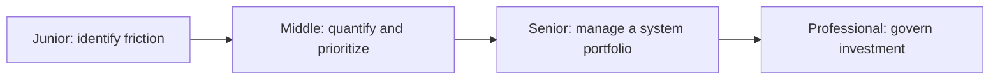
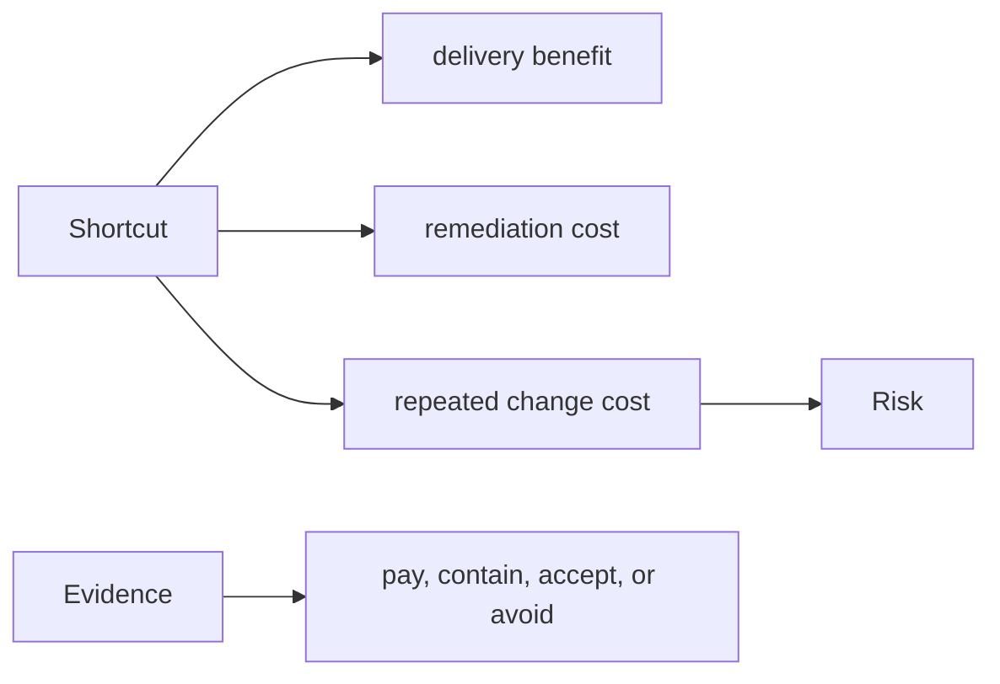

# Technical Debt

> Technical debt is a design or implementation choice that increases the expected cost or risk of future change.

| Level | Guide | You are done when |
|---|---|---|
| Junior | [Describe debt concretely](junior.md) | You can name affected changes, evidence, and a small improvement. |
| Middle | [Quantify and prioritize](middle.md) | You can compare debt work with product work using expected impact. |
| Senior | [Manage system debt](senior.md) | You can sequence remediation with migrations and reliability goals. |
| Professional | [Govern investment](professional.md) | You can allocate capacity and measure debt across a portfolio. |

## Practice rule

Never create a ticket named “clean up code.” Record the affected capability, recurring cost, risk, evidence, owner, and trigger for action.

## Related

- [Legacy Code](../legacy-code/README.md)
- [Anti-Patterns](../anti-patterns/README.md)
