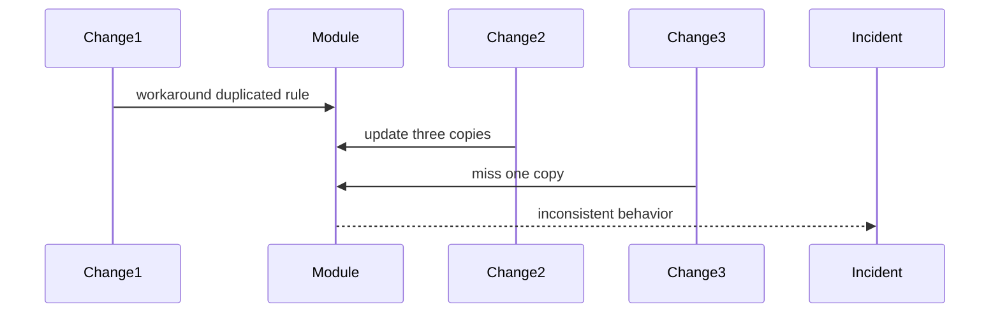

# Technical Debt — Junior

Debt is not simply ugly code. A workaround becomes debt when it repeatedly slows changes, creates defects, or raises operational risk.

Record location, symptom, affected work, evidence, consequence, and smallest safe improvement. Add tests and improve debt while touching the relevant area when the scope remains controlled.

## Test yourself

1. How does debt differ from code you merely dislike?
2. What evidence shows interest is being paid?
3. Which small improvement is safe during feature work?
4. When should debt remain untouched?

Continue to [`middle.md`](middle.md).
