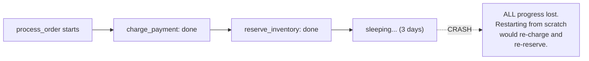

# Durable Execution — Junior

<!-- level-focus -->
At junior level, focus on this question:

> Why does a plain long-running script lose all its progress if the process
> crashes partway through, and why is that unacceptable for some workflows?

---

## A naive long-running workflow

```python
def process_order(order_id):
    charge_payment(order_id)      # step 1
    reserve_inventory(order_id)   # step 2
    time.sleep(3 * 24 * 3600)     # step 3: wait 3 days for a return window
    finalize_shipment(order_id)   # step 4
```

If the process running this function crashes **after** `reserve_inventory`
but **during** the 3-day sleep (a deploy, a server reboot, an out-of-memory
kill — all completely ordinary events over a 3-day window), the function's
entire execution state — which steps already ran, that it was mid-sleep,
everything — is **gone**. There's no way to "resume the function" from
where it left off; you'd have to restart it from the beginning, which would
**re-charge the payment and re-reserve inventory** it already did.



## Why this matters for real, long-running business processes

Many real workflows genuinely span minutes to weeks — an order fulfillment
process with a multi-day return window, a subscription billing cycle, a
human-approval step that might take days to complete. Building this
reliably by hand means manually persisting progress after every step (to a
database), manually checking on restart which steps already completed, and
manually re-implementing "resume from where I left off" logic for every
single such workflow — real, repetitive, error-prone engineering work that
has nothing to do with the actual business logic.

> 🎓 **Takeaway:** the problem isn't that long-running processes are rare —
> it's that making them **crash-resilient** by hand is a substantial,
> repeated engineering burden separate from the business logic itself.
> Durable execution platforms exist specifically to make this a property of
> the *platform*, so ordinary-looking code gets crash-resilience for free.

## Test yourself

1. Walk through exactly what state is lost when the crash happens during
   the 3-day sleep in the example above.
2. Why would manually persisting "which step did I complete" to a database
   after every step be a valid, if tedious, fix — and what would that code
   look like for just the `charge_payment` step?
3. Name a real business process (not from this page) that could span
   multiple days and would need this same crash-resilience.

Continue to [`middle.md`](middle.md).
