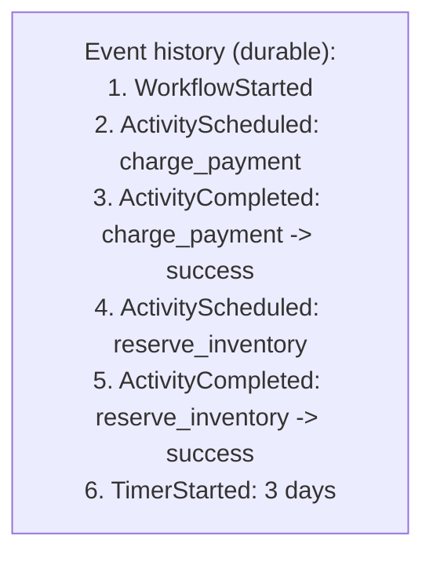
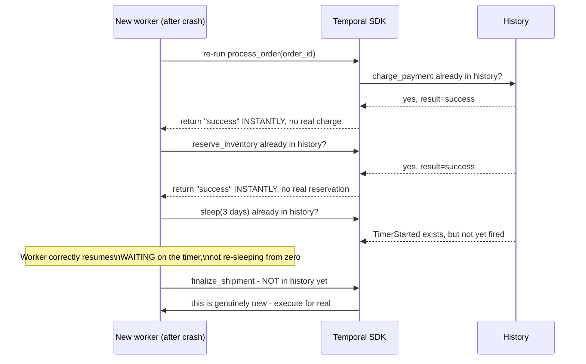

# Durable Execution — Middle

<!-- level-focus -->
At middle level, focus on this question:

> How does replaying a log of past events let a workflow resume exactly
> where it crashed, without re-running already-completed steps?

Prerequisite: [`junior.md`](junior.md).

---

## Event sourcing: record what happened, not just the current state

Every meaningful action a workflow takes (calling `charge_payment`,
starting a sleep, receiving its result) is recorded as an **event** in a
durable, append-only **history** — not just the final outcome, but the
entire sequence of steps taken and their results.



## Replay: reconstructing state by re-executing the workflow function against history

When a worker picks up a workflow (fresh, or after a crash), it
**re-executes the workflow's code from the beginning** — but instead of
actually re-calling `charge_payment` and `reserve_inventory` again, the
Temporal SDK intercepts each step, checks the history, and if that step
already has a recorded result, **returns the recorded result instantly**
without re-executing the real side effect. Only once replay reaches a point
**past** the end of the recorded history does it start doing real work
again.



```python
# This looks like ordinary code, but the Temporal SDK intercepts
# every call to a decorated "activity" and durably records its result
@workflow.defn
class OrderWorkflow:
    @workflow.run
    async def run(self, order_id: str):
        await workflow.execute_activity(charge_payment, order_id)
        await workflow.execute_activity(reserve_inventory, order_id)
        await workflow.sleep(timedelta(days=3))
        await workflow.execute_activity(finalize_shipment, order_id)
```

> 🎓 **Takeaway:** the workflow function's code is re-executed from the top
> on every resume, but **replay against the durable history** means every
> already-completed step returns its recorded result instantly instead of
> re-running the real side effect — this is precisely what makes ordinary-
> looking sequential code crash-resilient without any manual
> "check what I already did" logic in the business code itself.

## Test yourself

1. Why does the workflow function get **re-executed from the beginning**
   on every resume, rather than the platform somehow jumping directly to
   "line 4"?
2. Why does `charge_payment` not actually run a second time during replay,
   even though the code calls it again?
3. What would go wrong if the SDK didn't distinguish "this step is in the
   history, already completed" from "this step is new, actually execute
   it"?

Continue to [`senior.md`](senior.md).
