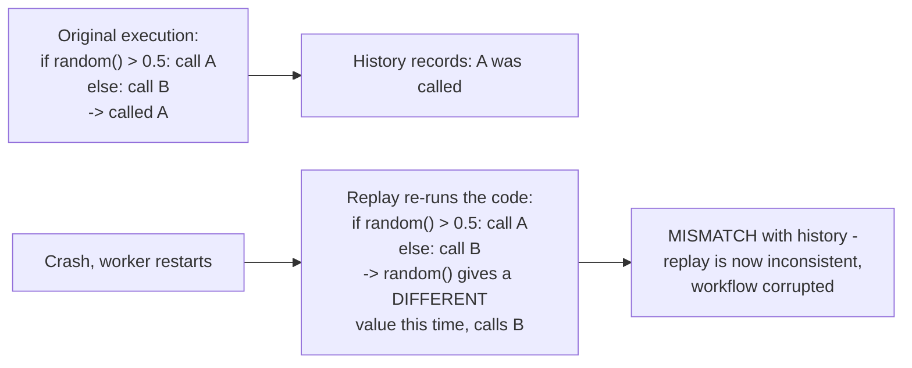
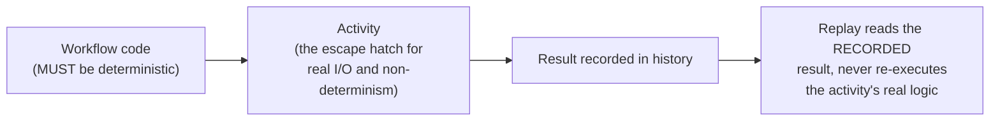

# Durable Execution — Senior

<!-- level-focus -->
At senior level, focus on this question:

> Why can't workflow code call `random()` or read the system clock
> directly, and what must you use instead?

Prerequisite: [`middle.md`](middle.md).

---

## Replay requires the workflow function to be deterministic

`middle.md`'s replay mechanism depends on a critical assumption: **given
the same history, re-executing the workflow function produces the exact
same sequence of steps.** If the workflow code contains anything
non-deterministic — a random number, the current wall-clock time, iterating
over a dictionary in an order that isn't guaranteed stable, a raw network
call not mediated by the SDK — replay can produce a **different** sequence
of steps than the original execution, corrupting the entire mechanism.

## The fix: move non-determinism into activities, or use SDK-provided primitives

- **Random numbers and current time**: use `workflow.random()` and
  `workflow.now()` (Temporal SDK-provided equivalents) — these generate the
  value **once**, during the original execution, and record it in the
  history, so replay reads the **recorded** value instead of generating a
  new one.
- **External calls / real side effects**: must happen inside an
  **activity**, not directly in workflow code — activities are exactly the
  "escape hatch" for non-deterministic, real-world interaction (an HTTP
  call, a database write), and their **result** (not the call itself) is
  what gets recorded in history and replayed.
- **Anything requiring genuine non-determinism during replay** (e.g. "check
  the current time to decide whether to send a reminder") must be
  structured so the decision was made and recorded **during the original
  execution**, not re-derived fresh on every replay.

## Why this constraint is the price of the guarantee

> 🎯 **Senior takeaway:** determinism isn't an arbitrary restriction —
> it's the specific, necessary condition for replay-based durable execution
> to work at all. Every "gotcha" a team discovers when adopting Temporal
> (can't use `random.random()`, can't use `datetime.now()`, can't spawn a
> raw thread, can't do a raw HTTP call in workflow code) traces back to
> this single root cause: **the workflow function must be a pure function of
> its history**, and anything that breaks that purity breaks the platform's
> ability to reconstruct state after a crash.

## Test yourself

1. Explain, step by step, why a workflow calling `datetime.now()` directly
   (instead of `workflow.now()`) can cause replay to diverge from the
   original execution.
2. Why must a real HTTP call happen inside an activity rather than directly
   in workflow code, even though "just call the API" looks like ordinary,
   harmless code?
3. A workflow needs to decide "send a reminder if it's currently after 5pm
   local time." How would you structure this so it's replay-safe?

Continue to [`professional.md`](professional.md) to see how Temporal's
production architecture (workers, server, task queues) implements this at
scale.
