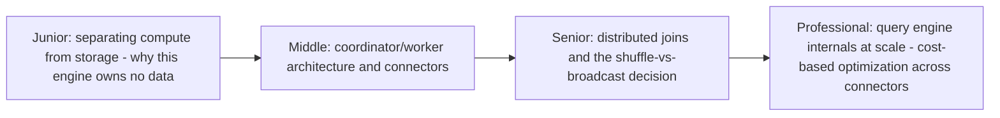
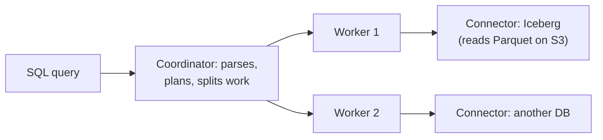

# Query Engine

> A distributed SQL engine (Trino, Presto, Dremio) that queries data
> directly where it lives — Parquet files on object storage, table
> formats like Iceberg/Delta/Hudi, even other databases — without ever
> owning or storing the data itself. This is the layer that ties every
> other topic in `storage-system` together into something you can `SELECT`
> from.

## Choose a level

| Level | Guide | You are done when |
|---|---|---|
| Junior | [Separating compute from storage](junior.md) | You can explain why a query engine that owns no data is a different architecture from a traditional database. |
| Middle | [Coordinator/worker and connectors](middle.md) | You can trace a query from submission through planning to distributed execution across connectors. |
| Senior | [Distributed joins](senior.md) | You can choose between a broadcast join and a shuffle (partitioned) join for a given table-size scenario. |
| Professional | [Cost-based optimization across connectors](professional.md) | You can explain how a query engine reasons about cost when joining data across fundamentally different storage systems. |

## Practice rule

Before running a cross-source query (joining a warehouse table with a
file on object storage and a row from an operational database), ask: "how
much of this query's filtering can actually be pushed down into each
source, versus how much has to happen inside the query engine itself
after pulling raw data across the network?" That answer predicts most of
the query's real-world performance.

## Related

- [File Format — professional](../file-format/professional.md)
- [Query Optimization](../../databases/performance/query-optimization/README.md)
- [Database Federation — professional](../../databases/scaling/database-federation/professional.md)
