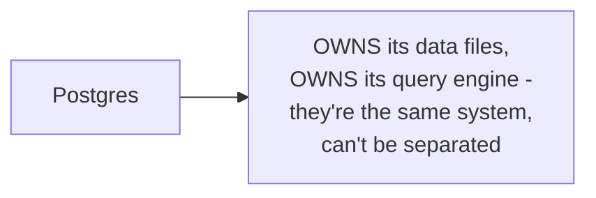
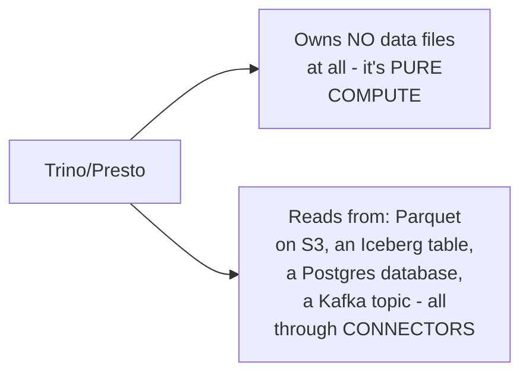

# Query Engine — Junior

<!-- level-focus -->
At junior level, focus on this question:

> Why is a query engine that owns no data of its own a fundamentally
> different kind of system from a traditional database?

---

## A traditional database: storage and query engine are one thing



Postgres, MySQL, and similar systems tightly couple **where the data
lives** with **how it's queried** — the storage engine and the query
engine are the same product, deployed together, and you can't point a
different query engine at Postgres's raw data files meaningfully.

## A query engine like Trino: pure compute, zero storage of its own



```sql
-- A single query can join data from TWO completely different systems
SELECT o.order_id, u.name
FROM iceberg.warehouse.orders o
JOIN postgres.public.users u ON o.user_id = u.user_id;
```

A query engine like Trino has **no storage layer of its own at all** —
every table it queries actually lives somewhere else (object storage, a
table format, another database entirely), accessed through a
**connector** specific to that source. This is the direct, deliberate
architectural separation of **compute** (the query engine) from
**storage** (wherever the data actually resides) — a fundamentally
different design than a traditional database's tightly coupled model.

> 🎓 **Takeaway:** because the query engine owns no data, you can scale
> compute (add more query engine workers) and storage (add more data to
> S3/Iceberg) **completely independently** — a direct architectural
> consequence of this separation, and the reason this pattern became
> dominant for large-scale analytical querying over data lakes.

## Test yourself

1. Why can't you point a different query engine at Postgres's own
   internal data files the way you can point Trino at an Iceberg table?
2. Why does separating compute from storage let you scale each
   independently, in a way a traditional database's coupled architecture
   doesn't?
3. What does a "connector" have to do, conceptually, for the query engine
   to be able to read from a brand-new type of data source?

Continue to [`middle.md`](middle.md).
