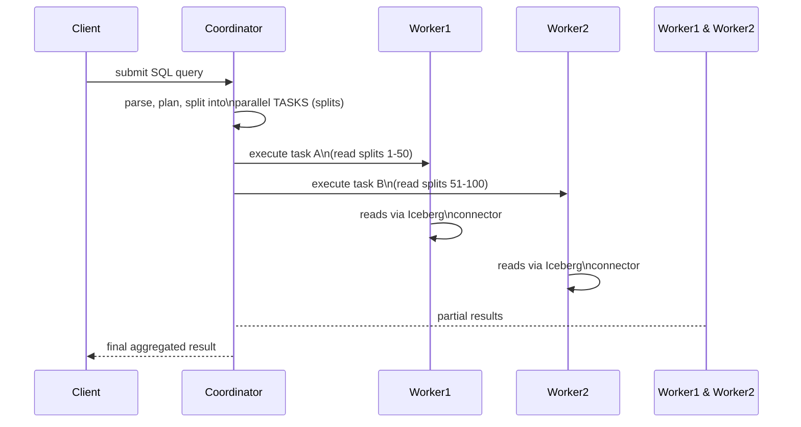

# Query Engine — Middle

<!-- level-focus -->
At middle level, focus on this question:

> How does a query actually flow from SQL text through the
> coordinator/worker architecture and out through connectors to real data?

Prerequisite: [`junior.md`](junior.md).

---

## Coordinator: planning; workers: execution



The **coordinator** parses and plans the query (the same query-planning
concepts from the Query Optimization professional page, applied to a
distributed engine instead of a single-node database), then splits the
work into parallel **tasks** distributed across **workers** — each worker
independently reads its assigned portion of data (its "splits") through
the appropriate **connector**, and results flow back to the coordinator
for final aggregation.

## Connectors: the pluggable interface to each storage system

```python
# Conceptual connector responsibilities (not real Trino API)
class Connector:
    def list_splits(self, table, filter):
        """Return the physical chunks of data to read, given a filter -
        this is where connector-specific PUSHDOWN happens."""

    def read_split(self, split):
        """Actually read one split's data."""
```

Each connector implements the specific logic to talk to its underlying
system — an Iceberg connector reads the manifest tree (per the Iceberg
professional page) to determine which Parquet files to read; a Postgres
connector issues actual SQL against Postgres, ideally pushing filters
down into that query (the exact predicate pushdown concept from the
Database Federation professional page's Trino discussion). Connector
quality directly determines how much work can be **pushed down** to the
source versus pulled raw into the query engine for local processing.

> 🎓 **Takeaway:** the coordinator/worker split provides the distributed
> execution parallelism; connectors provide the pluggable abstraction
> that lets the same distributed execution engine query wildly different
> underlying systems — and how much a specific connector can push down
> (filters, projections) directly determines that source's real query
> performance within the engine.

## Test yourself

1. Why does splitting work into parallel tasks across workers require the
   coordinator to first determine "splits" — what would go wrong without
   this planning step?
2. Why does a connector's ability to push filters down into the source
   system matter so much for query performance?
3. If a connector for some data source **cannot** push down any filters
   at all, what would that mean for a query filtering on a small subset
   of a huge table in that source?

Continue to [`senior.md`](senior.md).
