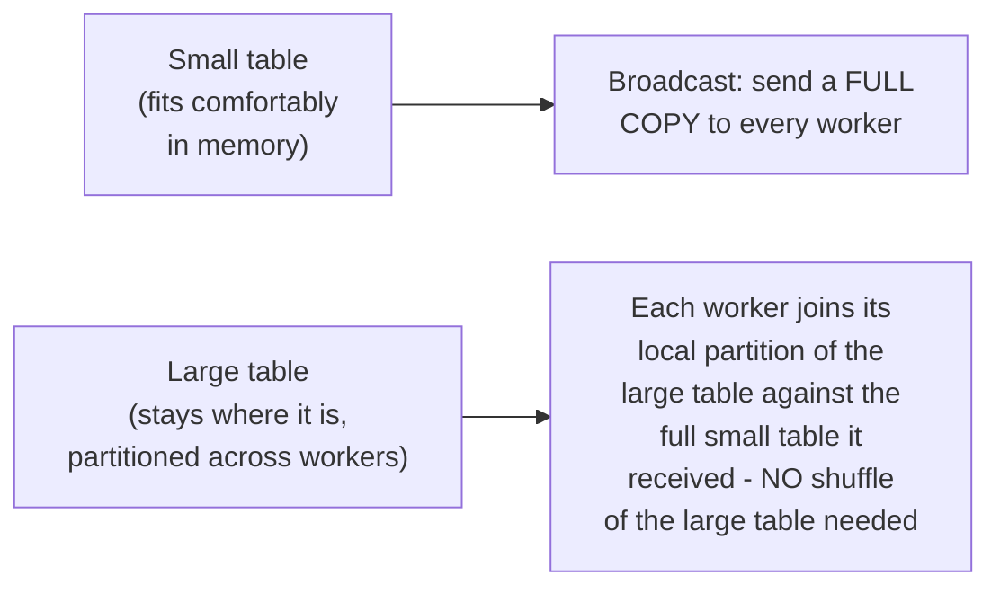
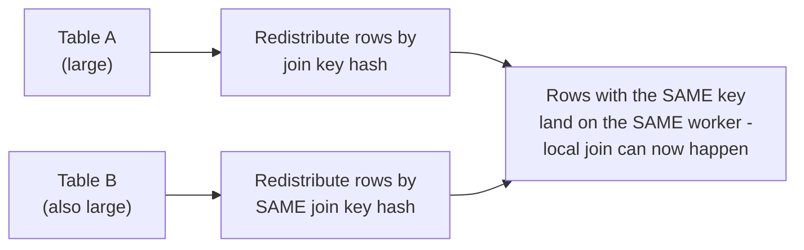
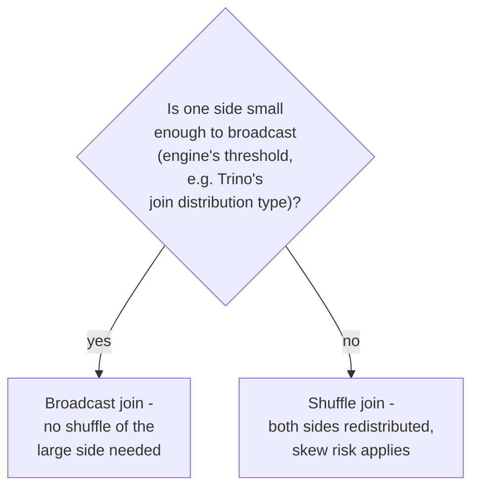

# Query Engine — Senior

<!-- level-focus -->
At senior level, focus on this question:

> How do you choose between a broadcast join and a shuffle (partitioned)
> join for two tables of very different sizes in a distributed query
> engine?

Prerequisite: [`middle.md`](middle.md).

---

## Broadcast join: send the small table to every worker

If one side of a join is small enough to fit comfortably in memory on
every worker, the engine can **broadcast** the entire small table to
every worker — avoiding the need to shuffle (redistribute) the large
table's rows across the network at all. This is exactly the same
broadcast join concept from the Spark professional page's data-skew
mitigation, applied here as a general distributed-query-engine technique.

## Shuffle join: redistribute both tables by join key

If **neither** table is small enough to broadcast, both sides must be
**shuffled** — redistributed across workers by join-key hash, so matching
rows end up co-located — the exact same shuffle mechanism from the Spark
professional/middle pages, and subject to the exact same **data skew**
risk (a hot join key overwhelming one partition/worker) covered there.

## The decision, and why it's often made automatically but should be verified

> 🎯 **Senior takeaway:** most query engines (Trino included) choose
> between broadcast and shuffle joins automatically, based on estimated
> table sizes from statistics — but this estimate can be **wrong**
> (stale statistics, per the Query Optimization professional page's
> cardinality-estimation discussion), causing the engine to attempt an
> expensive shuffle join when a broadcast would have been far cheaper, or
> vice versa. Explicit join-distribution hints exist in most engines
> specifically to override a bad automatic choice when you know better
> than the estimator.

## Test yourself

1. Why does a broadcast join avoid shuffling the large table entirely,
   and what does it cost instead (in terms of what's sent to every
   worker)?
2. Why is a shuffle join subject to the exact same data-skew risk as a
   Spark shuffle join?
3. A query engine chooses a shuffle join for two tables, but one of them
   turns out to be much smaller than its stale statistics suggested. What
   would you check, and what would you do about it?

Continue to [`professional.md`](professional.md) to see cost-based
optimization across genuinely different connector types at scale.
