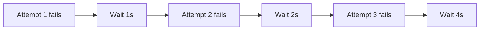
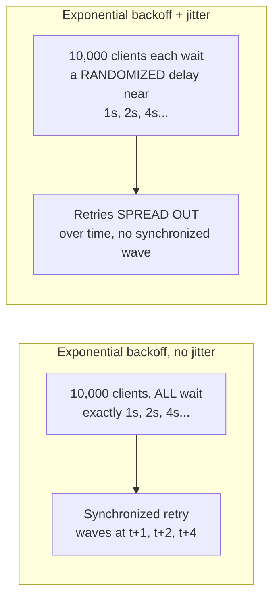

# Retries & Idempotency — Middle

<!-- level-focus -->
At middle level, focus on this question:

> Why does exponential backoff alone still leave a retry-storm risk, and
> why does jitter fix it?

Prerequisite: [`junior.md`](junior.md).

---

## Exponential backoff: growing delays between attempts

```python
import time

def retry_with_backoff(fn, max_attempts=5, base_delay=1):
    for attempt in range(max_attempts):
        try:
            return fn()
        except Exception:
            delay = base_delay * (2 ** attempt)  # 1s, 2s, 4s, 8s, 16s...
            time.sleep(delay)
    raise Exception("All attempts failed")
```



Each successive retry waits longer, giving a struggling downstream service
progressively more room to recover — a direct improvement over
`junior.md`'s fixed-delay retry.

## The problem jitter fixes: synchronized retries

If 10,000 clients all failed at the same instant (`junior.md`'s question 3)
and all use the *exact same* exponential backoff schedule, they all retry
at the exact same moments — `t+1s`, `t+2s`, `t+4s`, in perfect lockstep,
recreating the retry storm at each of those synchronized instants instead
of preventing it.



**Jitter** adds randomness to the delay so different clients' retries
naturally spread out instead of arriving in synchronized waves:

```python
import random

def retry_with_backoff_and_jitter(fn, max_attempts=5, base_delay=1):
    for attempt in range(max_attempts):
        try:
            return fn()
        except Exception:
            max_delay = base_delay * (2 ** attempt)
            delay = random.uniform(0, max_delay)  # "full jitter"
            time.sleep(delay)
    raise Exception("All attempts failed")
```

This "full jitter" approach (picking a random delay **up to** the
exponential ceiling, not just adding a small random offset around it) is
AWS's own documented recommendation, specifically because it spreads retry
timing across the widest possible window rather than a narrow band around
the exponential value.

> 🎓 **Takeaway:** exponential backoff addresses "give the service time to
> recover" (the `junior.md` fix, made smarter). Jitter addresses a
> completely separate problem: "many independent clients following the
> identical deterministic schedule recreate the storm at synchronized
> moments." You need both together — one without the other leaves a real
> gap.

## Test yourself

1. Why does pure exponential backoff (no jitter) fail to solve the
   synchronized-retry problem, even though each individual client's delay
   grows correctly?
2. Why does AWS recommend "full jitter" (random delay from 0 up to the
   exponential ceiling) rather than a small random offset around the
   exponential value?
3. Design the retry schedule (base delay, max attempts, jitter strategy)
   for a client calling a flaky third-party API with a known 30-second
   recovery time after an outage.

Continue to [`senior.md`](senior.md).
