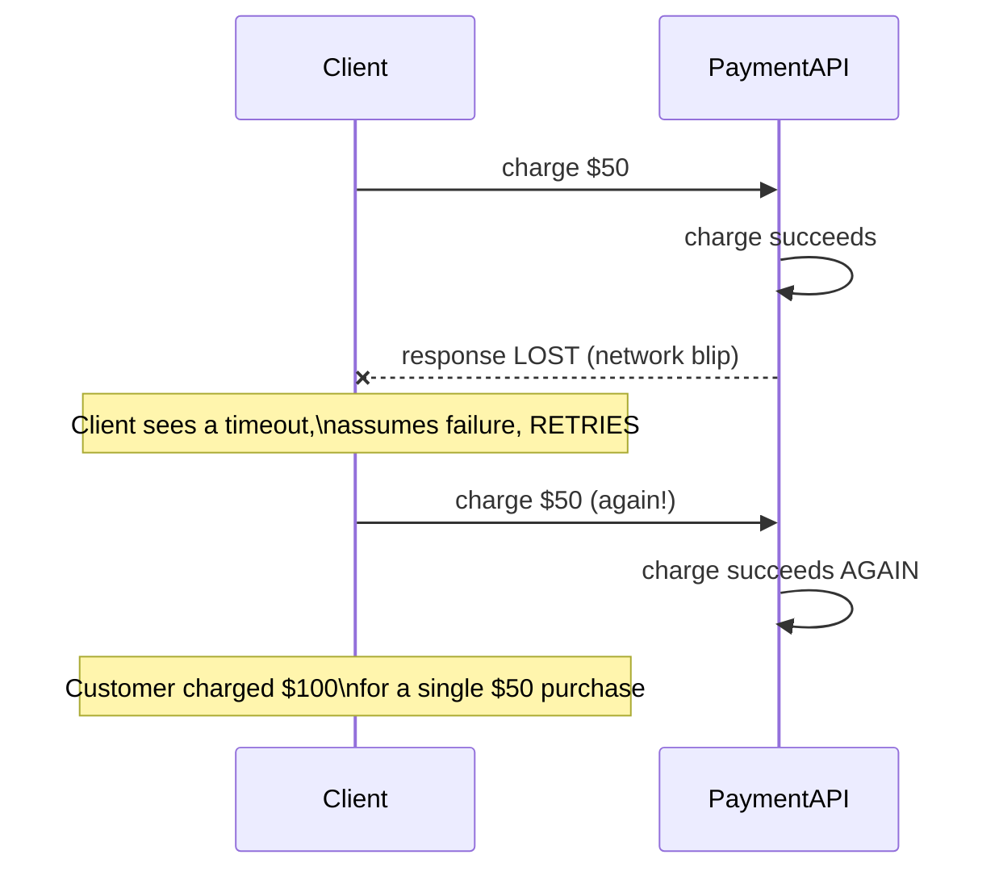
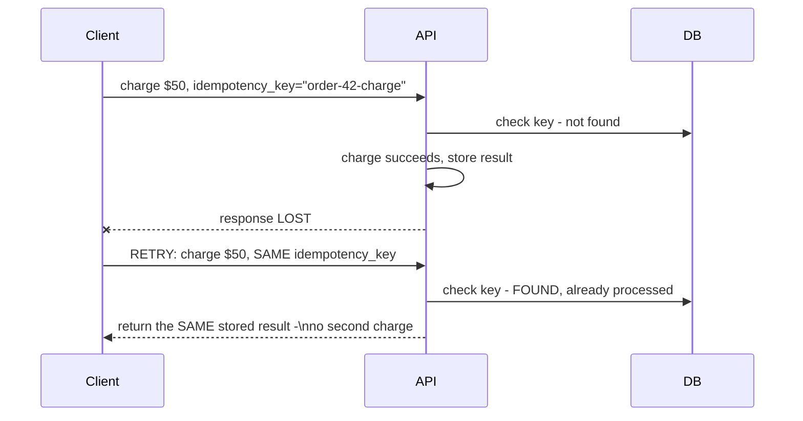

# Retries & Idempotency — Senior

<!-- level-focus -->
At senior level, focus on this question:

> How do you design an idempotency key so a retried job produces exactly
> one effect, not one per attempt?

Prerequisite: [`middle.md`](middle.md).

---

## Retries can duplicate side effects, not just waste effort

A retry isn't always "the first attempt did nothing, try again cleanly" —
the first attempt may have **partially succeeded** (e.g. charged a
customer's card) before failing at a later step (e.g. the response was
lost due to a network blip, even though the charge went through). A naive
retry then **duplicates** the already-successful side effect.



## Idempotency keys: making the operation safe to repeat

An **idempotency key** is a unique identifier for a *logical* operation
(not per attempt) that the receiving service uses to detect and safely
short-circuit a duplicate.

```python
def charge_card(idempotency_key, amount):
    existing = db.query(
        "SELECT result FROM processed_operations WHERE key = %s",
        idempotency_key
    )
    if existing:
        return existing.result  # already done - return the SAME result, no new charge

    result = payment_gateway.charge(amount)
    db.execute(
        "INSERT INTO processed_operations (key, result) VALUES (%s, %s)",
        idempotency_key, result
    )
    return result
```



**The key must be generated by the client, once, per logical operation**
(not regenerated on each retry attempt) — typically a UUID created when the
user clicks "pay" and reused across every retry of that same logical
payment attempt. The check-and-insert must be atomic (a unique constraint
on the key, exactly like the DAG-run-creation pattern from the
Schedule-Driven professional page) to prevent a race where two near-
simultaneous retries both pass the "not found" check before either inserts.

> 🎯 **Senior takeaway:** retries and idempotency are two separate concerns
> that must be designed together — retry policy decides *when* to try
> again; idempotency keys decide *what happens* if "again" turns out to be
> redundant. An operation without an idempotency key is not safe to retry
> if it has any side effect that shouldn't happen twice.

## Test yourself

1. Why must the idempotency key be generated once by the client and reused
   across retries, rather than generated fresh on each attempt?
2. Why does the check-and-insert in the idempotency table need to be
   atomic, and what race would occur if it weren't?
3. Design the idempotency key strategy for a background job that processes
   "user uploaded file X" — what should the key be based on, and why?

Continue to [`professional.md`](professional.md) to design retry budgets
that prevent cascading failure at scale.
