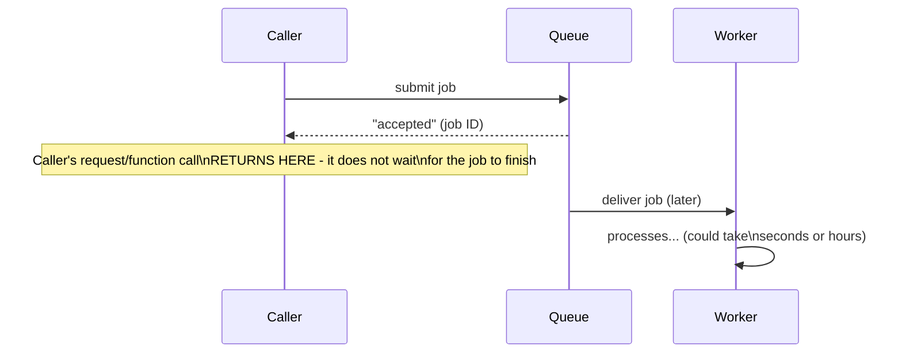
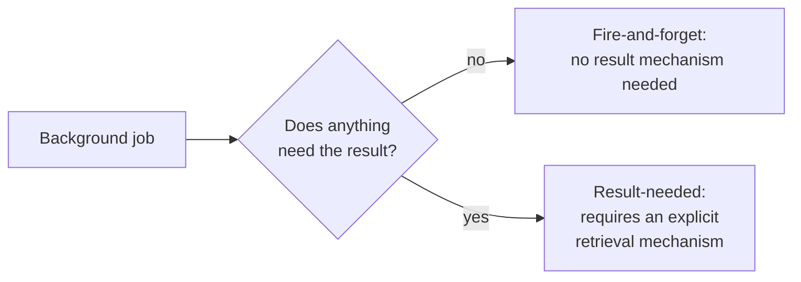

# Returning Results — Junior

<!-- level-focus -->
At junior level, focus on this question:

> Which background jobs actually need to report a result back, and which
> are genuinely "fire and forget"?

---

## The caller has already moved on

Unlike a normal function call (`result = do_something()`, which blocks
until `do_something` returns a value), submitting a background job returns
**immediately**, typically with just a job ID acknowledging it was
accepted — the actual processing, and any result it produces, happens
**later**, disconnected from the original call.

## Two categories

| Category | Example | Does the caller need the result? |
|---|---|---|
| **Fire-and-forget** | "Log this analytics event," "send this metric" | No — the job's side effect matters, but nothing waits on or reads a return value |
| **Result-needed** | "Generate this PDF report," "run this ML inference," "process this payment" | Yes — something (the user, another service) needs to know the outcome, and often the actual output data |

> 🎓 **Takeaway:** don't build result-retrieval infrastructure for jobs that
> don't need it — it's real, avoidable complexity and cost (storage,
> polling load, callback infrastructure). But for jobs where something
> genuinely needs the outcome, you must design an explicit mechanism,
> because there's no implicit "return value" the way a synchronous function
> call has.

## Test yourself

1. Classify these as fire-and-forget or result-needed: "send a welcome
   email," "generate a user's annual tax summary PDF," "increment a page
   view counter," "process a video upload into multiple resolutions."
2. Why is "the job ran, I assume it worked" an insufficient design for a
   result-needed job?
3. What real cost would you be adding unnecessarily if you built full
   result-polling infrastructure for a purely fire-and-forget job?

Continue to [`middle.md`](middle.md).
