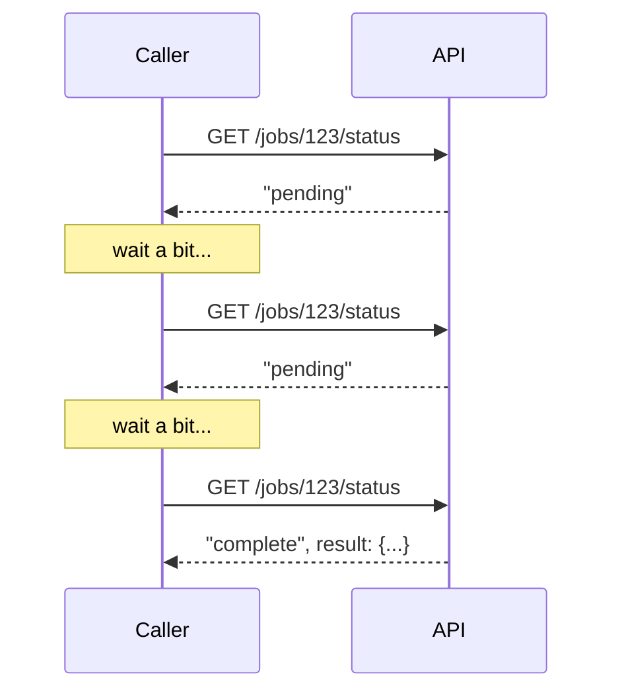
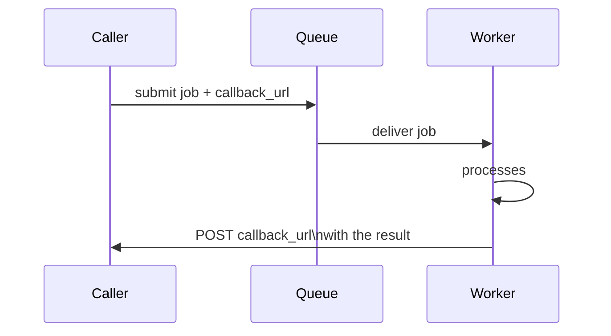

# Returning Results — Middle

<!-- level-focus -->
At middle level, focus on this question:

> When should you poll for a result, and when should you use a callback/
> webhook instead?

Prerequisite: [`junior.md`](junior.md).

---

## Polling: the caller checks repeatedly



```python
import time

def poll_for_result(job_id, interval=2, timeout=60):
    elapsed = 0
    while elapsed < timeout:
        status = api.get_job_status(job_id)
        if status.state == "complete":
            return status.result
        time.sleep(interval)
        elapsed += interval
    raise TimeoutError(f"Job {job_id} did not complete within {timeout}s")
```

Simple to implement on the caller's side, but wastes requests when the job
is still pending (every poll that returns "still pending" was a request
that did nothing useful), and introduces latency between "job actually
finished" and "caller finds out" bounded by the poll interval.

## Callbacks/webhooks: the job notifies the caller when done



The caller registers a URL (or an internal event) to be notified on
completion — no wasted polling requests, and the caller finds out
**immediately** when the job finishes, rather than waiting up to one poll
interval. The cost: the caller must expose a reachable endpoint (harder for
a client behind NAT, e.g. a mobile app, which typically falls back to
polling or a persistent connection like WebSockets instead), and the system
must handle callback delivery failures (the caller's endpoint being
temporarily down) with its own retry logic.

| | Polling | Callback/webhook |
|---|---|---|
| Caller must be reachable | No | Yes (needs an endpoint) |
| Wasted requests | Yes, while pending | No |
| Notification latency | Up to one poll interval | Near-immediate |
| Failure handling burden | On the caller (keep polling) | On the sender (retry the callback) |

> 🎓 **Takeaway:** polling is simpler and works for any caller (including
> ones that can't receive inbound connections); callbacks are more
> efficient and immediate but require the caller to be reachable and the
> sender to handle callback delivery failures. Many production systems
> offer both, and some fall back to polling if a callback delivery fails
> repeatedly.

## Test yourself

1. Why does polling waste more resources the shorter the poll interval is,
   and why does a longer interval trade away notification speed?
2. Why can't a mobile app behind a carrier NAT typically receive a webhook
   callback directly, and what alternative would it use instead?
3. Design a hybrid: a system that primarily uses callbacks but falls back
   to allowing the caller to poll if they want to check status manually.

Continue to [`senior.md`](senior.md).
