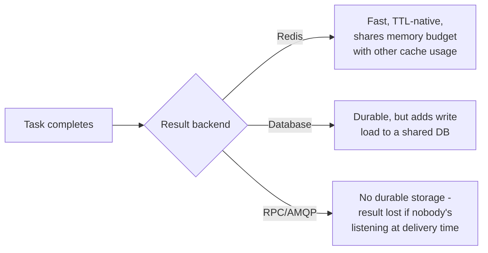
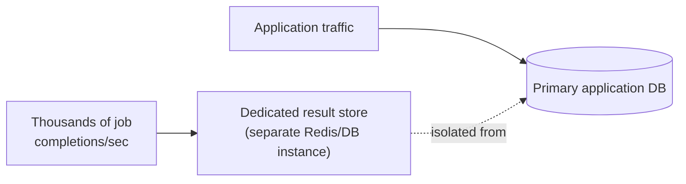

# Returning Results — Professional

<!-- level-focus -->
At professional level, focus on this question:

> How does a production result backend (Celery's, specifically) actually
> store and expire results at scale, and what does choosing the wrong
> backend technology cost you operationally?

Prerequisite: [`senior.md`](senior.md).

---

## Celery's result backend: a pluggable, genuinely different cost model per choice

Celery (the most widely deployed Python task queue) treats the result
backend as a **pluggable storage layer**, and the choice has real,
distinct operational consequences:

| Backend | Storage model | Operational characteristic |
|---|---|---|
| **Redis** | In-memory key-value, TTL-based expiry native | Fast reads/writes, but results compete with Redis's other memory usage (see the Cache-Aside professional page's memory-fragmentation discussion) — large result payloads at high job volume can meaningfully impact a shared Redis instance's memory budget. |
| **Database (Postgres/MySQL)** | A results table, queried by job ID | Durable, survives a cache flush, but write-heavy at high job volume adds load to a database that may also be serving your application's primary OLTP traffic — see the connection pooling and locking professional pages for the exact contention risks this creates. |
| **RPC (AMQP)** | Results sent as messages back through the broker, not stored durably at all — a "fire and consume once" model | Lowest storage overhead, but a result is lost forever if the consumer isn't listening at the moment it's delivered — fundamentally unsuitable for `middle.md`'s "caller checks later" pattern; only appropriate when the original caller is guaranteed to be actively listening. |



This is a direct, professional-level illustration of `senior.md`'s
retention trade-off made concrete: the backend choice **is** the retention
and durability policy, not an independent decision layered on top of one.

## The result-store contention problem at high job volume

At high task throughput (thousands of jobs/second, each producing a
result), a naive database-backed result store can itself become a
bottleneck — every task completion is a write, competing for the exact
same lock-manager and buffer-pool resources covered in the Locking &
Concurrency Control and MVCC professional pages, but now driven by job
throughput rather than application traffic. Production deployments at this
scale typically **separate the result store from the primary application
database entirely** (a dedicated Redis cluster, or a dedicated
results-only database), specifically to avoid job-completion write volume
degrading unrelated application query latency — the same "pipeline writer
vs. app writer" isolation principle from the Locking & Concurrency Control
professional page, applied to result storage specifically.



## Production checklist (staff-level)

1. **Choose your result backend based on the actual durability and
   retention requirement (`senior.md`), not on what's already deployed for
   another purpose** — an RPC/AMQP-only result mechanism is a correctness
   bug waiting to surface if any caller ever checks a result later than
   immediately.
2. **Isolate high-volume result storage from your primary application
   database** — job-completion write volume competing with application
   traffic for the same database's locks/buffer pool is a well-known,
   avoidable source of unrelated application latency degradation.
3. **Implement the tombstone/metadata-vs-full-result tiering from
   `senior.md` explicitly at the backend level** if your job volume and
   result payload sizes make long-full-retention impractical — most result
   backends require you to build this tiering yourself; it's rarely a
   built-in feature.
4. **Monitor result-store size/memory and write throughput as an
   independent capacity dimension** from your job-processing throughput
   itself — a system can be comfortably processing jobs while its result
   store quietly approaches a memory or storage ceiling.
5. **In a design review for a new high-volume background job system,
   require an explicit answer for "which result backend, and what's its
   retention/durability guarantee"** before approving the job-queue
   technology choice — this is frequently treated as an afterthought
   configuration detail when it's actually a core architectural decision.

## Cheat Sheet

```text
+------------------------------------------------------------------+
|          RETURNING RESULTS — INTERNALS & SCALE                      |
+------------------------------------------------------------------+
| Celery result backends, real trade-offs:                              |
|   Redis: fast, native TTL, shares memory budget with other cache use  |
|   Database: durable, but write-heavy at scale -> can contend with     |
|     application traffic on the same DB (lock/buffer-pool pressure)    |
|   RPC/AMQP: no durable storage - result LOST if nobody's listening    |
|     at delivery time - wrong choice for "check later" patterns         |
+------------------------------------------------------------------+
| At high job volume, ISOLATE the result store from the primary          |
| application database - job-completion writes competing for the        |
| same DB resources as app traffic is a well-known, avoidable            |
| source of unrelated latency degradation                                |
+------------------------------------------------------------------+
| Backend choice = your retention/durability policy, not a separate      |
| decision layered on top - pick it deliberately per senior.md's         |
| trade-off, not based on what's already deployed                        |
+------------------------------------------------------------------+
```

## Test yourself

1. Why is an RPC/AMQP-only result mechanism fundamentally incompatible with
   a caller that checks for results later, rather than staying actively
   connected?
2. A production system's application database starts showing elevated
   write latency correlated with background job volume. What architectural
   change from this page would you investigate?
3. Design the result-backend architecture (technology choice + isolation +
   tiering) for a system processing 5,000 jobs/second, each producing a
   small (under 1KB) JSON result that callers typically check within
   seconds but occasionally (1% of cases) check up to a week later.

## Further Reading

- Celery documentation — "Result Backends" (the specific trade-offs between
  Redis, database, and RPC backends).
- See also: [Locking & Concurrency Control — professional](../../../databases/transaction/locking-and-concurrency-control/professional.md),
  [Cache-Aside — professional](../../../databases/operation/caching/cache-aside/professional.md).
