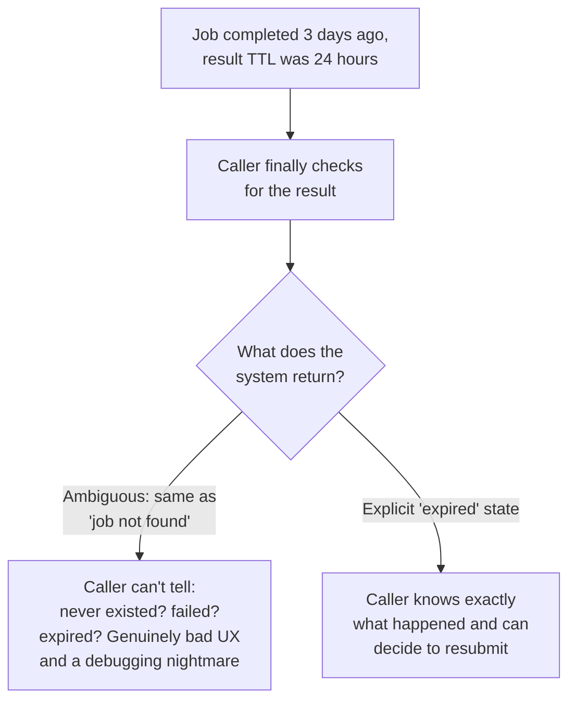

# Returning Results — Senior

<!-- level-focus -->
At senior level, focus on this question:

> What happens when a caller checks for a result after it's already
> expired or been evicted, and how do you design around that?

Prerequisite: [`middle.md`](middle.md).

---

## Results don't live forever

A result-storage backend (a database row, a cache entry, an object in
storage) almost always has a **retention policy** — indefinite storage of
every job's result forever is rarely practical at scale. If a caller
(especially one that was offline, crashed, or simply slow to check) polls
or looks up a result **after** it's been cleaned up, the system must give a
clear, unambiguous answer.

**The fix**: distinguish "job not found" (never existed, or a typo'd ID)
from "job existed and completed, but its result has since expired" as two
genuinely different states, not a single generic 404. This requires
retaining at least a **lightweight tombstone/metadata record** (job existed,
completed at time X, result now expired) even after the full result payload
itself has been cleaned up — a smaller, longer-retained record backing a
larger, shorter-retained one.

## Choosing a retention policy deliberately

| Retention choice | Trade-off |
|---|---|
| Short TTL (minutes-hours) | Minimizes storage cost; risks legitimate slow callers missing their result |
| Long TTL (days-weeks) | Safer for slow/unreliable callers; higher storage cost, especially for large result payloads |
| Tiered: full result short-TTL, metadata-only long-TTL | Balances both — full data available briefly, but "what happened to job X" remains answerable indefinitely |

> 🎯 **Senior takeaway:** result retention is a deliberate trade-off between
> storage cost and caller reliability assumptions — but regardless of where
> you set the TTL, the system must always be able to distinguish "never
> existed" from "existed and expired," because conflating them turns every
> legitimate expiry into an indistinguishable-from-a-bug support incident.

## Test yourself

1. Why is returning a generic 404 for both "job never existed" and "job
   expired" a worse design than distinguishing the two, even though both
   ultimately mean "no result available right now"?
2. Design a tiered retention policy for a video-processing job whose actual
   output (a large video file) is expensive to store long-term, but whose
   completion status should remain queryable for a month.
3. A caller was offline for 3 days due to a client-side bug and then asks
   "where's my result?" What information would a well-designed system give
   them, versus a poorly-designed one?

Continue to [`professional.md`](professional.md) to design a result-backend
system for a high-volume production job queue.
