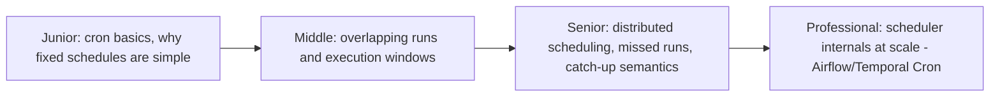
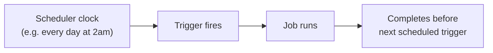

# Schedule-Driven Background Jobs

> Run work at a fixed point in time or interval, regardless of whether
> anything "happened" to trigger it. Cron jobs, nightly batch pipelines, and
> periodic reconciliation all live here — simple in concept, surprisingly
> easy to get wrong at scale.

## Choose a level

| Level | Guide | You are done when |
|---|---|---|
| Junior | [Cron basics](junior.md) | You can read a cron expression and explain what it means. |
| Middle | [Overlapping runs](middle.md) | You can explain what happens if a job takes longer than its own interval, and how to prevent overlap. |
| Senior | [Distributed scheduling and missed runs](senior.md) | You can explain why a single-node cron doesn't work for a distributed system, and what "catch-up" semantics mean. |
| Professional | [Scheduler internals at scale](professional.md) | You can explain how a production orchestrator (Airflow, Temporal) guarantees exactly-once triggering across a cluster. |

## Practice rule

For any scheduled job, ask: "if this run takes 3x longer than usual today,
what happens when the next scheduled trigger time arrives while the
previous run is still going?" If you don't have a concrete, tested answer,
you likely have an overlapping-run bug waiting to happen.

## Related

- [Event-Driven Background Jobs](../../event-streaming/events-driven/event-driven/README.md)
- [Leader Election](../../distributed-system/coordination/leader-election/README.md)
