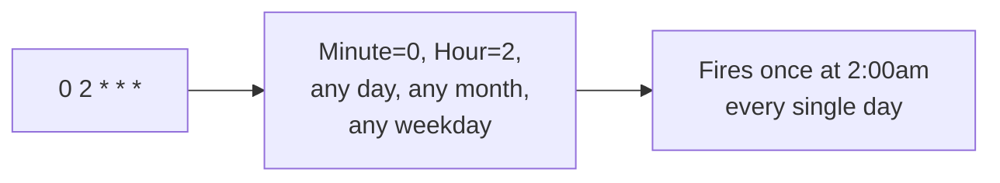
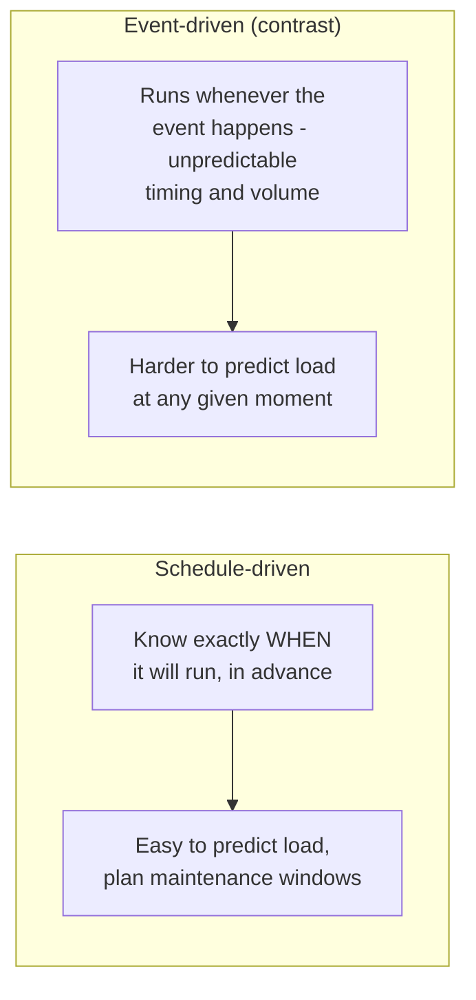

# Schedule-Driven Background Jobs — Junior

<!-- level-focus -->
At junior level, focus on this question:

> How does a cron expression describe a schedule, and why is fixed-schedule
> triggering simpler to reason about than event-driven triggering?

---

## Reading a cron expression

```
 ┌───────────── minute (0-59)
 │ ┌───────────── hour (0-23)
 │ │ ┌───────────── day of month (1-31)
 │ │ │ ┌───────────── month (1-12)
 │ │ │ │ ┌───────────── day of week (0-6, Sunday=0)
 │ │ │ │ │
 0 2 * * *   ->  "at 02:00, every day"
0 */6 * * *  ->  "every 6 hours, on the hour"
30 9 * * 1   ->  "at 09:30, every Monday"
```



## Why fixed schedules are simpler to reason about



A scheduled job's timing is **known in advance** — you can predict exactly
when load will occur, schedule it during low-traffic windows, and reason
about "did today's 2am job run" as a simple yes/no question against a known
expected time. This predictability is the main advantage over event-driven
triggering for work that's naturally periodic (a nightly report, a weekly
cleanup) rather than reactive to individual occurrences.

> 🎓 **Takeaway:** a schedule is just "run this at these known points in
> time." The complexity in this whole topic comes from making that promise
> hold reliably once you have more than one node that could run the job, or
> when a run takes longer than expected — `middle.md` and `senior.md`'s
> subjects.

## Test yourself

1. Write a cron expression for "every 15 minutes, only on weekdays."
2. Why is it easier to plan capacity/maintenance windows around scheduled
   jobs than around event-driven ones?
3. What's a real business process you'd choose to run on a fixed schedule
   rather than triggering it per-event, and why?

Continue to [`middle.md`](middle.md).
