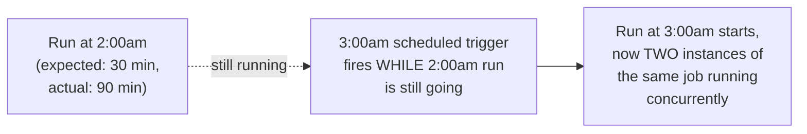
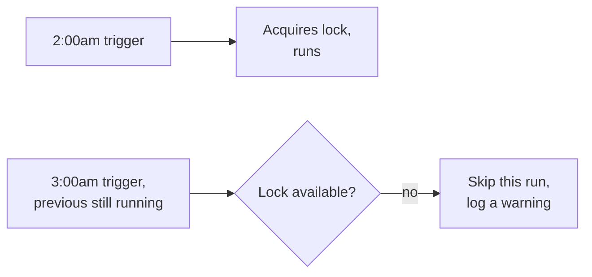

# Schedule-Driven Background Jobs — Middle

<!-- level-focus -->
At middle level, focus on this question:

> What happens if a job takes longer than its own scheduled interval, and
> how do you prevent overlapping runs?

Prerequisite: [`junior.md`](junior.md).

---

## The overlap problem



A schedule with a 1-hour interval assumes the job finishes well within that
hour. If it doesn't — a data volume spike, a slow downstream dependency, a
degraded database — the next scheduled trigger fires while the previous run
is still active. Depending on what the job does, this can mean: duplicated
work, two processes racing to write the same rows, or resource contention
that makes **both** runs slower, compounding the problem into a growing
backlog.

## Preventing overlap: a lock, not just hoping it finishes in time

```python
def scheduled_job():
    if not acquire_lock("nightly_report_job", ttl=3600):
        log.warning("Previous run still active - skipping this trigger")
        return
    try:
        run_report()
    finally:
        release_lock("nightly_report_job")
```

The lock (backed by a database row, Redis, or the scheduler's own
concurrency-control feature) ensures at most one instance runs at a time —
a skipped trigger due to an in-progress previous run is a **visible,
loggable event**, not a silent double-execution. Most production
schedulers (Airflow's `max_active_runs`, Kubernetes CronJob's
`concurrencyPolicy: Forbid`) expose this as a built-in configuration option
rather than requiring you to hand-roll the lock yourself.



> 🎓 **Takeaway:** "the job usually finishes in time" is not a concurrency
> control mechanism. Any scheduled job that writes shared state, or whose
> concurrent execution would produce wrong results, needs an explicit
> overlap-prevention mechanism — a lock, or your scheduler's built-in
> concurrency policy — not an assumption about typical run time.

## Test yourself

1. Why is "skip and log a warning" usually preferable to "let both runs
   proceed" for a job that writes to shared state?
2. What would you monitor to detect that overlap-prevention is triggering
   more often than expected (a sign the job's duration is creeping up)?
3. Give an example of a scheduled job where running two instances
   concurrently would actually be harmless — what property of the job makes
   that safe?

Continue to [`senior.md`](senior.md).
