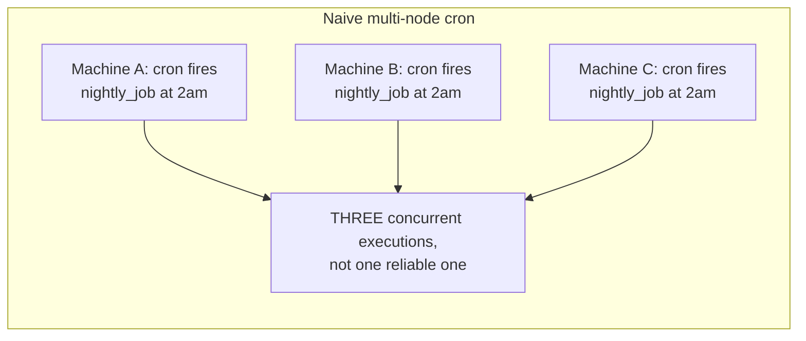
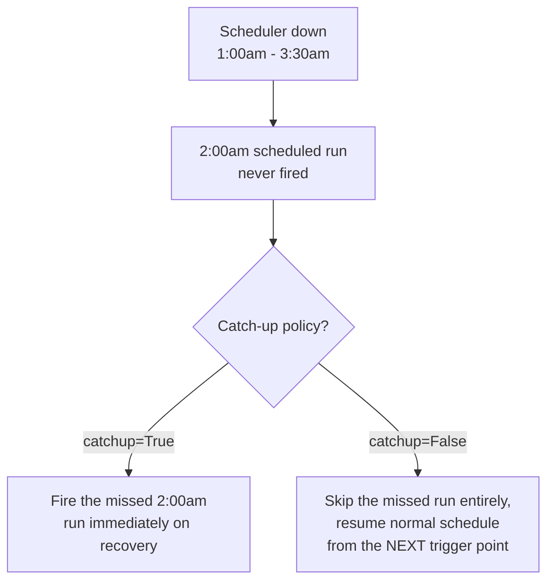

# Schedule-Driven Background Jobs — Senior

<!-- level-focus -->
At senior level, focus on this question:

> Why doesn't a single-node cron work for a distributed system, and what
> does "catch-up" mean when a scheduler itself has downtime?

Prerequisite: [`middle.md`](middle.md).

---

## Single-node cron doesn't survive node failure

A traditional Unix `cron` daemon runs on one machine. If that machine
crashes or is redeployed, every scheduled job silently stops firing until
someone notices — there's no redundancy, and worse, if you naively run the
**same** cron configuration on multiple machines "for redundancy," you get
the opposite problem: every machine fires the job at the scheduled time,
producing N duplicate concurrent executions instead of one reliable one.

This is exactly why distributed schedulers need [Leader Election](../../consensus/leader-election/README.md):
only the elected leader actually triggers scheduled jobs; every other node
stands by as a follower, ready to take over triggering duties if the leader
fails, without ever triggering redundantly while the leader is healthy.

## Catch-up semantics: what happens if the scheduler itself was down?

If the scheduling system (not just one job's execution, but the *scheduler
itself*) is down from 1:00am to 3:30am, and a job was scheduled to run at
2:00am, what should happen when the scheduler comes back?

Airflow makes this an **explicit, per-DAG configuration** (`catchup=True`
or `False`) specifically because there's no universally correct default —
a data pipeline that must process every day's data exactly once needs
`catchup=True` (backfill every missed interval); a "send a reminder if
it's currently after 2pm" style job needs `catchup=False` (a stale,
backfilled run of a time-sensitive check is meaningless or actively wrong).

> 🎯 **Senior takeaway:** "the schedule fired" and "the schedule was
> supposed to fire but the scheduler was down" are two different states a
> production system must handle explicitly. Choosing catch-up behavior is a
> business-logic decision (does a missed run's work still need to happen
> later, or is it meaningless once its window has passed), not a technical
> default to accept without thinking about it.

## Test yourself

1. Why does naively running the same cron config on multiple machines
   produce a worse outcome than running it on just one, despite adding
   "redundancy"?
2. For a job that computes "yesterday's total sales," would you choose
   `catchup=True` or `False` if the scheduler was down for a day? Why?
3. For a job that sends "your meeting starts in 5 minutes" notifications,
   would you choose `catchup=True` or `False`? Why is this the opposite
   answer from question 2, and what property of each job explains the
   difference?

Continue to [`professional.md`](professional.md) to see how production
schedulers guarantee exactly-once triggering across a cluster.
