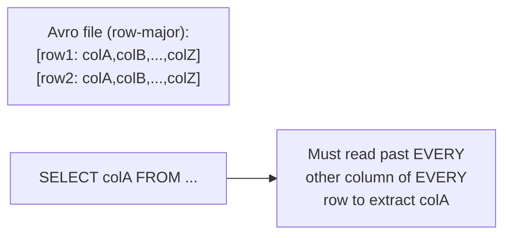
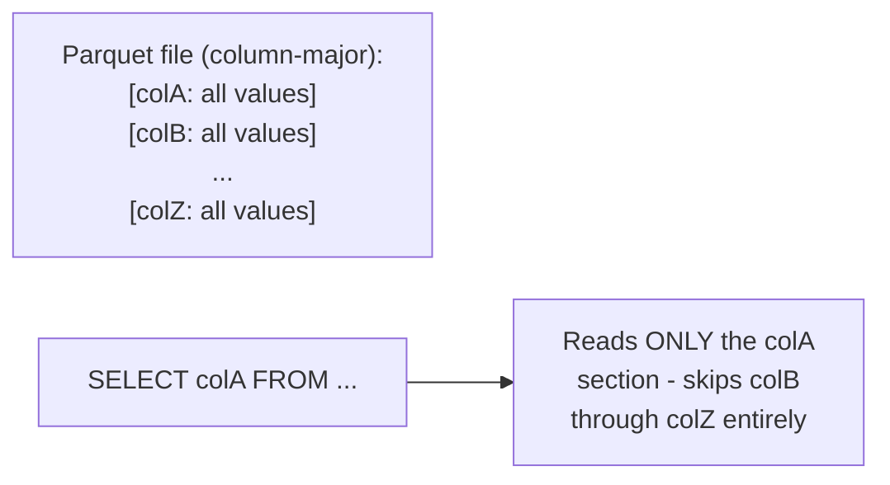

# File Format — Junior

<!-- level-focus -->
At junior level, focus on this question:

> Why is reading one column out of fifty cheap in a column-major file
> format but expensive in a row-major one?

---

## Row-major: all of one record's fields sit together

In a row-major format (Avro, CSV, JSON-lines), each record's fields are
stored contiguously — reading just one column still means physically
reading past (or at least seeking through) every other field of every
row, because the file's physical layout doesn't group values by column at
all.

## Column-major: one column's values sit together

In a column-major format (Parquet, ORC), values for the **same column**
are stored contiguously across all rows — a query needing only `colA` can
read exactly that section of the file and skip everything else, both
saving I/O and enabling much better compression (similar values grouped
together compress far better than a row's mixed-type fields — the same
principle from the OLTP vs OLAP professional page's compression
discussion).

> 🎓 **Takeaway:** the fundamental trade-off is: row-major is efficient
> for reading/writing **whole records** (a streaming event, an RPC
> payload); column-major is efficient for reading **specific columns
> across many records** (an analytical aggregation). This single physical
> layout decision is why Avro dominates streaming/RPC use cases while
> Parquet dominates analytical/warehouse use cases.

## Test yourself

1. Why does a column-major format make `SELECT colA FROM table` cheaper
   than a row-major format, specifically in terms of bytes read from
   disk?
2. Why would a row-major format be better suited for a Kafka message
   payload that's always read and processed as a whole record?
3. Would you expect `SELECT *` (reading every column) to have the same
   relative advantage for column-major formats as `SELECT colA`? Why or
   why not?

Continue to [`middle.md`](middle.md).
