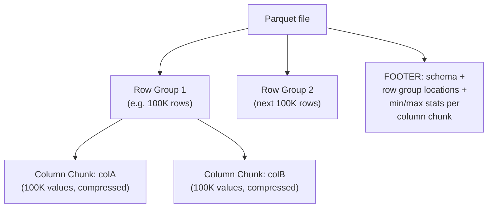
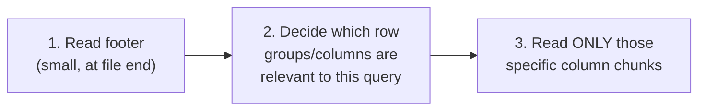

# File Format — Middle

<!-- level-focus -->
At middle level, focus on this question:

> How does Parquet actually organize row groups, column chunks, and a
> footer to deliver column-major reads with row-based parallelism?

Prerequisite: [`junior.md`](junior.md).

---

## The nested structure: row groups contain column chunks



A **row group** is a horizontal slice of the file (a batch of rows) —
within each row group, data is stored **column-major** (a column chunk
per column). This hybrid layout gives you both: column-major reads
**within** a row group (skip unneeded columns), and the ability to
process different row groups **in parallel** or skip entire row groups
based on statistics — exactly the mechanism enabling the predicate
pushdown covered in `professional.md`.

## The footer: metadata read first, data read selectively

```python
import pyarrow.parquet as pq

file = pq.ParquetFile("data.parquet")
print(file.metadata)          # schema, row group count, stats - read FIRST
print(file.metadata.row_group(0).column(0).statistics)  # min/max for pruning
```

Parquet readers read the **footer** first (located at the end of the
file, containing the schema and per-row-group, per-column statistics),
**before** touching any actual data — this lets a query engine decide
which row groups (and even which columns within them) are actually worth
reading, based on the query's filters, before paying any real I/O cost
for the bulk of the file.



> 🎓 **Takeaway:** Parquet's row-group-of-column-chunks structure, plus a
> footer holding statistics, is specifically designed so a reader can make
> intelligent "what do I actually need to read" decisions **before**
> touching the bulk of the file — this is the physical foundation that
> makes columnar analytical engines (per the OLTP vs OLAP professional
> page) fast.

## Test yourself

1. Why does organizing data as "row groups containing column chunks"
   (rather than one giant column-major file with no row groups at all)
   enable parallelism across row groups?
2. Why does a Parquet reader read the footer before any actual data,
   rather than starting from the beginning of the file?
3. What specific information in the footer would let a query engine skip
   an entire row group without reading any of its actual column data?

Continue to [`senior.md`](senior.md).
