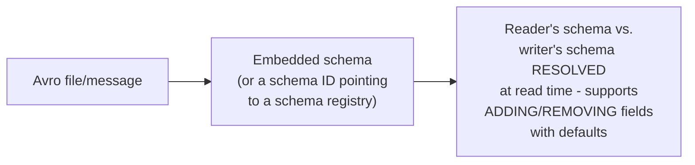
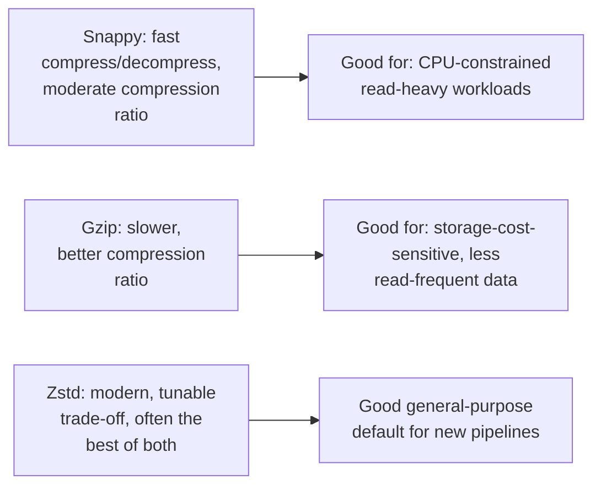

# File Format — Senior

<!-- level-focus -->
At senior level, focus on this question:

> How does Avro handle schema evolution differently from Parquet, and how
> does compression codec choice trade off CPU against storage/network?

Prerequisite: [`middle.md`](middle.md).

---

## Avro: schema travels with (or alongside) the data, by design

Avro was specifically designed for **schema evolution** in
streaming/RPC contexts (see
[Schema Registry & Evolution](../../events/schema-registry-and-evolution/README.md)) —
a reader with an older or newer schema than the writer can still correctly
deserialize data, as long as the evolution follows compatible rules
(adding a field with a default, removing a field that had a default).
This makes Avro a natural fit for Kafka message payloads, where producers
and consumers are deployed independently and asynchronously, and schema
changes must not require a synchronized "upgrade everyone at once" event.

## Parquet/ORC: schema evolution is more rigid, by design trade-off

Parquet's schema is embedded once, per file, in the footer — appending a
new column to an existing dataset means either rewriting old files or
accepting that older files simply don't have the new column (readers must
handle this explicitly, typically via "if column absent, treat as null").
This is an acceptable trade-off for Parquet's typical use case (batch-
written analytical datasets, where full rewrites during a schema change
are a normal, planned operation) but would be a poor fit for a
high-frequency streaming payload needing per-message schema flexibility.

## Compression codec choice: CPU vs. size, a real per-workload decision

> 🎯 **Senior takeaway:** choose Avro when independent, asynchronous
> schema evolution across producers/consumers is a real requirement
> (streaming); choose Parquet/ORC when you need the columnar read
> efficiency for analytics and can accept schema changes as planned,
> batch-time events. Compression codec is a separate, real trade-off
> between CPU cost and storage/network cost — measure it against your
> actual read frequency and storage budget rather than defaulting to
> whatever the tooling ships with.

## Test yourself

1. Why is Avro's schema-resolution-at-read-time approach specifically
   valuable for a Kafka topic where producers and consumers deploy
   independently?
2. Why is Parquet's more rigid, embedded-per-file schema an acceptable
   trade-off for its typical batch-analytical use case?
3. For a read-heavy analytical dataset stored for years with rare writes,
   would you prioritize a fast or a high-ratio compression codec? Why?

Continue to [`professional.md`](professional.md) to see predicate
pushdown and dictionary encoding internals at scale.
