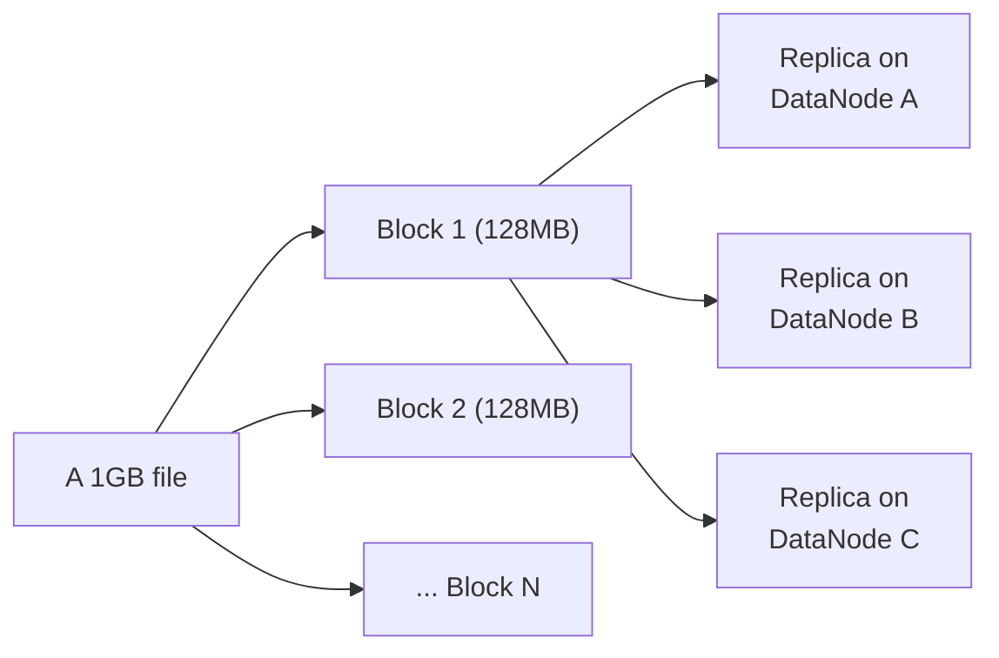

# File System

> The layer between "bytes I want to store" and "physical blocks on a
> disk" — a distributed file system (HDFS) extends this abstraction across
> many machines, and understanding its block/replica model explains both
> why Hadoop-era big data tooling works the way it does and why object
> storage eventually displaced it for most new systems.

## Choose a level

| Level | Guide | You are done when |
|---|---|---|
| Junior | [Files, blocks, and splitting](junior.md) | You can explain why a distributed file system splits large files into fixed-size blocks. |
| Middle | [NameNode/DataNode architecture](middle.md) | You can trace a file read through HDFS's metadata and data planes. |
| Senior | [The small-files problem](senior.md) | You can explain why millions of tiny files degrade a NameNode's performance. |
| Professional | [Why object storage displaced HDFS](professional.md) | You can articulate the architectural trade-offs that led most new systems toward S3-style object storage. |

## Practice rule

Before writing a pipeline that produces many small output files, ask:
"how many files will this generate per day, and does whatever's storing
them (HDFS NameNode, or an object store) handle that volume well?" Small-
file proliferation is one of the most common, avoidable big-data
performance problems.

## Related

- [Object Storage](../object-storage/README.md)
- [B+Tree — professional](../../databases/performance/indexing/b+tree/professional.md)
