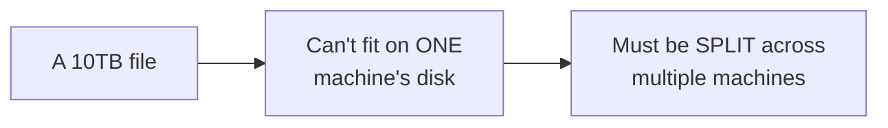
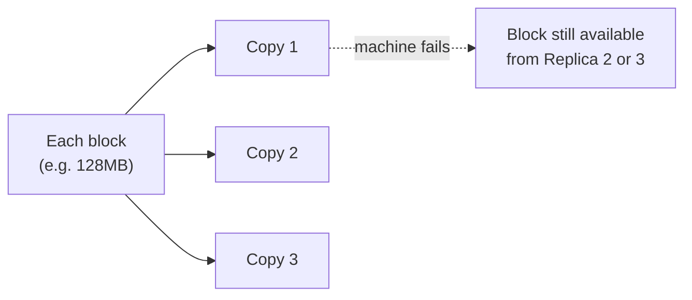

# File System — Junior

<!-- level-focus -->
At junior level, focus on this question:

> Why does a distributed file system split a large file into fixed-size
> blocks rather than storing it as one contiguous unit?

---

## The problem: a file too big for one disk, or one machine

A file large enough to matter in a big-data context (gigabytes to
terabytes) simply cannot live on a single disk, let alone be processed
by a single machine in reasonable time. A distributed file system splits
it into fixed-size **blocks** (HDFS's default is 128MB, historically
64MB) distributed across many machines.

## Why fixed-size blocks, and why replicated

Fixed-size blocks make placement and load-balancing simpler (any machine
can hold any block, and blocks are roughly uniform in size for capacity
planning) and enable **parallel processing** — a MapReduce/Spark job can
process different blocks of the same file on different machines
simultaneously. Each block is **replicated** (typically 3x) across
different machines, so a single machine failure doesn't lose any data —
the same replication-for-availability principle from the Replication
professional page, applied at the block level instead of the whole-
database level.

> 🎓 **Takeaway:** splitting into fixed-size blocks enables both
> distribution (spread a huge file across many machines) and parallelism
> (process different blocks simultaneously); replication provides
> availability despite individual machine failures — two separate,
> complementary reasons for this design, not one.

## Test yourself

1. Why does splitting a file into blocks enable parallel processing in a
   way that storing it as one contiguous file wouldn't?
2. Why does block replication protect against machine failure specifically,
   as opposed to protecting against, say, data corruption from a bad
   write?
3. Why might block size (128MB rather than, say, 4KB) matter for how
   efficiently a big-data processing job scans through a file?

Continue to [`middle.md`](middle.md).
