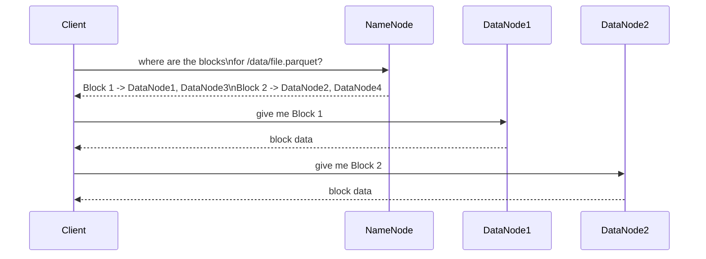

# File System — Middle

<!-- level-focus -->
At middle level, focus on this question:

> How does HDFS's separation of NameNode (metadata) and DataNode (actual
> data) let a client find and read a file's blocks?

Prerequisite: [`junior.md`](junior.md).

---

## NameNode: metadata only; DataNode: actual block storage



The **NameNode** holds the entire filesystem's metadata — directory
structure, file-to-block mapping, block-to-DataNode-location mapping —
entirely **in memory** for fast lookups. **DataNodes** just store the
actual block bytes on their local disks and serve them directly to
clients once the NameNode tells the client where to look. Critically,
**data never flows through the NameNode** — it only answers "where is
this data," and the client then talks to DataNodes directly for the
actual bytes, avoiding a NameNode bottleneck on data transfer volume.

## Why this separation matters

```mermaid
flowchart LR
    NameNode["NameNode:\nmetadata operations only\n(fast, in-memory)"] 
    DataNode["DataNodes:\nactual bytes,\nmany machines,\nscales with data volume"]
    NameNode -.-.- DataNode
    Note["Metadata load and data\ntransfer load scale\nINDEPENDENTLY of each other"]
```

This is the same metadata/data-plane separation seen in the Message
Queues professional page's AMQP model (exchange for routing metadata,
queue for storage) — separating "where is it" from "here it is" lets each
concern scale on its own axis: adding more DataNodes scales storage
capacity and read/write throughput; the NameNode's load scales with the
**number of files/blocks** (metadata operations), not the actual data
volume.

> 🎓 **Takeaway:** HDFS's NameNode/DataNode split cleanly separates
> metadata management (must be fast, benefits from being centralized and
> in-memory) from actual data storage/transfer (must scale horizontally
> across many machines) — this architectural choice directly explains
> both HDFS's strengths and, per `senior.md`, its most famous operational
> weakness.

## Test yourself

1. Why does keeping data transfer entirely between the client and
   DataNodes (bypassing the NameNode) prevent the NameNode from becoming
   a data-transfer bottleneck?
2. Why does the NameNode need its metadata to fit in memory for fast
   lookups, and what does that imply about what kind of load actually
   stresses the NameNode?
3. If you added 100 more DataNodes to a cluster, would that help NameNode
   performance directly? Why or why not?

Continue to [`senior.md`](senior.md).
