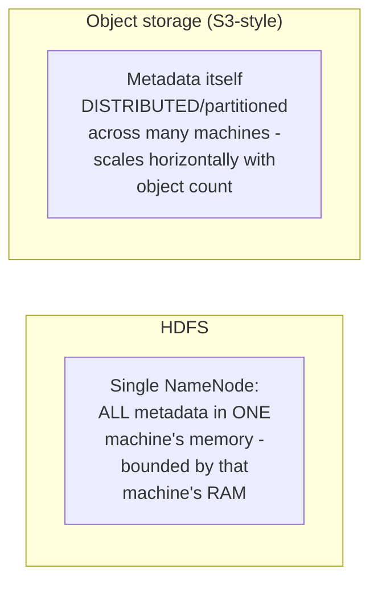
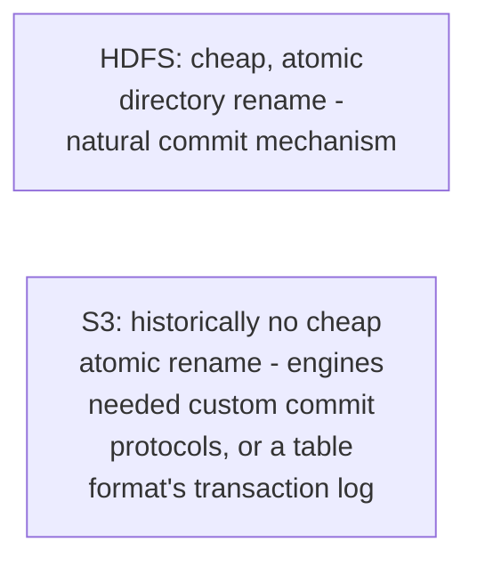

# File System — Professional

<!-- level-focus -->
At professional level, focus on this question:

> What architectural difference let object storage (S3) sidestep HDFS's
> centralized-metadata bottleneck, and why did most new systems move
> toward it rather than operating their own HDFS clusters?

Prerequisite: [`senior.md`](senior.md).

---

## No single, centralized, in-memory metadata service

Object storage systems (S3, and similar) don't have a NameNode-equivalent
single point holding all metadata in memory — object metadata (key names,
sizes, versions) is itself stored and indexed in a **distributed,
partitioned** key-value system internally (S3's internal architecture is
not fully public, but is understood to be built on distributed,
horizontally-scalable metadata services, not a single in-memory master).
This directly avoids `senior.md`'s specific failure mode: the metadata
layer itself scales horizontally along with the object count, rather than
being bounded by one machine's memory.



## Trading POSIX semantics for horizontal scalability

The professional-level trade-off object storage makes: it gives up
POSIX-style file system semantics (directory rename as an atomic O(1)
metadata operation, append-in-place writes, strong read-after-write
consistency historically in some object stores) in exchange for
horizontal metadata scalability and operational simplicity (no cluster of
machines to run yourself; S3 is a managed service). This is precisely why
big-data engines (Spark, Presto/Trino) had to adapt their HDFS-era
assumptions (e.g. the "rename the temp output directory to the final
location" commit pattern, which is atomic and cheap on HDFS but was
historically slow/non-atomic on S3, requiring engine-level "commit
protocol" workarounds) when migrating from HDFS to S3-backed storage —
and it's also exactly the gap that modern table formats (Delta Lake,
Iceberg, Hudi — see the sibling Table Format topics) exist specifically
to close, by implementing transactional guarantees **on top of** object
storage's weaker native semantics.



## Production checklist (staff-level)

1. **Understand that migrating from HDFS to object storage requires
   re-examining any pipeline logic relying on cheap, atomic rename-based
   commits** — this historical HDFS assumption doesn't transfer directly
   to S3-style storage without a table format or engine-specific commit
   protocol handling it.
2. **Adopt a transactional table format (Delta Lake, Iceberg, Hudi)** for
   any analytical dataset on object storage requiring atomic multi-file
   writes and consistent reads — don't rely on ad hoc, engine-specific
   commit workarounds when a purpose-built format solves this generally.
3. **Recognize that object storage's small-object-count scaling is
   fundamentally different from HDFS's NameNode-bounded scaling** — the
   small-files problem doesn't disappear entirely (many tiny objects still
   cost more per-request overhead and list-operation latency), but the
   specific centralized-in-memory-metadata bottleneck from `senior.md`
   does not apply the same way.
4. **Evaluate the operational cost of running your own HDFS cluster
   against a managed object storage service explicitly** — for most new
   systems, the managed-service model (no cluster to operate, patch, or
   scale yourself) is a significant, often decisive operational advantage
   over self-managed HDFS.
5. **In an architecture review choosing between HDFS and object storage
   for a new big-data platform, require an explicit answer for commit
   semantics (how are atomic multi-file writes achieved) and metadata
   scaling** — these are the two areas where the architectural difference
   has the most real, practical consequence.

## Cheat Sheet

```text
+------------------------------------------------------------------+
|                  FILE SYSTEM — INTERNALS & SCALE                    |
+------------------------------------------------------------------+
| HDFS: single NameNode holds ALL metadata in memory - bounded by ONE   |
| machine's RAM. Millions of small files = disproportionate metadata     |
| pressure, degrades performance CLUSTER-WIDE (senior.md)                |
+------------------------------------------------------------------+
| Object storage (S3): metadata itself DISTRIBUTED/partitioned across    |
| many machines - scales horizontally with object count, no single      |
| in-memory bottleneck. Trade-off: gives up POSIX semantics (cheap       |
| atomic rename, strong consistency historically) for this scalability  |
+------------------------------------------------------------------+
| Consequence: HDFS-era commit patterns (rename temp dir to final,       |
| atomic and cheap) don't transfer to S3 directly - need a TABLE          |
| FORMAT (Delta Lake/Iceberg/Hudi) or engine-specific commit protocol    |
| to restore atomic multi-file write guarantees on object storage        |
+------------------------------------------------------------------+
```

## Test yourself

1. Why does object storage's distributed metadata architecture avoid
   HDFS's single-NameNode-memory bottleneck?
2. Why did migrating big-data engines from HDFS to S3 require rethinking
   the "rename temp output to final location" commit pattern?
3. Why do modern table formats (Delta Lake, Iceberg, Hudi) exist
   specifically because of object storage's weaker native consistency/
   atomicity guarantees compared to HDFS?

## Further Reading

- Shvachko et al. — "The Hadoop Distributed File System" (the original
  HDFS paper, NameNode/DataNode architecture).
- Amazon S3 documentation — "Data Consistency Model" (historical and
  current consistency guarantees).
- See also: [Object Storage — professional](../object-storage/professional.md),
  [Delta Lake — professional](../table-format/delta-lake/professional.md).
