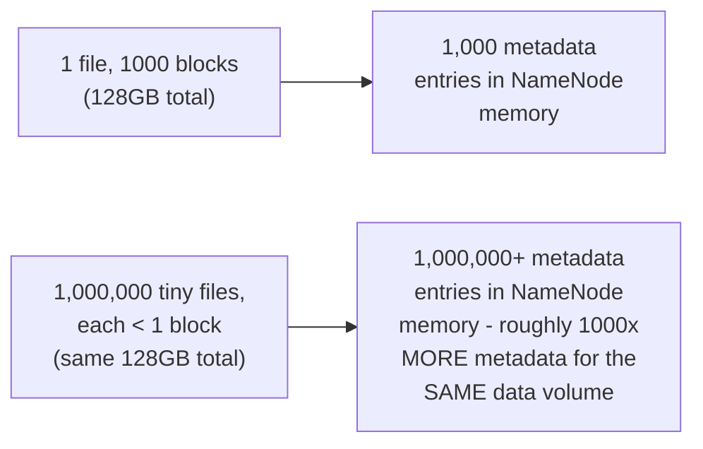
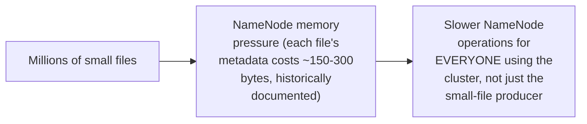

# File System — Senior

<!-- level-focus -->
At senior level, focus on this question:

> Why do millions of small files degrade a NameNode's performance far
> more than the equivalent data volume stored as fewer, larger files?

Prerequisite: [`middle.md`](middle.md).

---

## Every file and block is an in-memory metadata object

Per `middle.md`, the NameNode's load scales with **number of files/blocks**,
not data volume — a workload producing millions of small files (a common
big-data anti-pattern: many small Spark output partitions, or a streaming
pipeline writing one file per micro-batch) generates a hugely
disproportionate amount of metadata relative to its actual data size,
because each tiny file still needs its own full metadata entry
(inode-equivalent information, block mapping) regardless of how little
data it contains.

## The consequences: NameNode memory pressure and slow operations

This is a well-documented, historically significant HDFS operational
problem — an unbounded-growing small-file count doesn't just cost extra
storage overhead; it degrades NameNode responsiveness for **every**
job/user sharing the cluster's NameNode, echoing the "one workload's
problem becomes everyone's problem" theme from the Bulkhead professional
page, just for HDFS metadata specifically. Common mitigations: **compaction
jobs** that periodically merge many small files into fewer, larger ones
(the same principle as LSM-tree compaction, applied to file storage
instead of key-value data), and designing pipeline output partitioning
to avoid producing excessive small files in the first place (tuning
Spark's output partition count against expected data volume per
partition, not leaving it at a default that produces thousands of
tiny files for a small dataset).

> 🎯 **Senior takeaway:** in an HDFS-based (or similarly metadata-
> centralized) system, "how many files" is a distinct, first-class
> capacity concern from "how much data" — a pipeline design that ignores
> output file count in favor of only considering total data volume is a
> common, well-documented source of cluster-wide performance degradation.

## Test yourself

1. Why does 1,000,000 tiny files put roughly 1,000x more pressure on
   NameNode memory than 1,000 large files storing the same total data
   volume?
2. Why does one team's small-file-producing pipeline degrade performance
   for other, unrelated teams sharing the same HDFS cluster?
3. Design a compaction strategy for a streaming pipeline that currently
   writes one small file per 10-second micro-batch to HDFS.

Continue to [`professional.md`](professional.md) to see why object
storage architecturally sidesteps this problem for most new systems.
