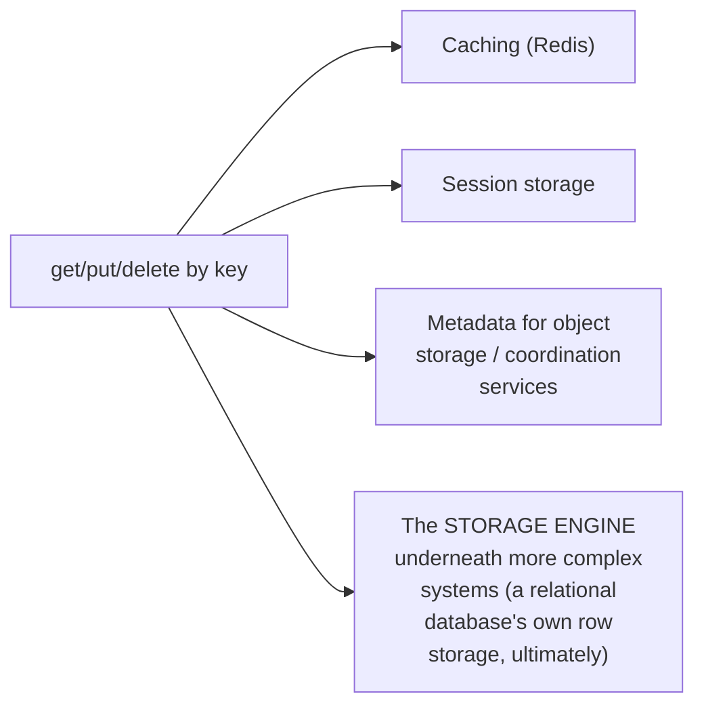

# KV Store — Junior

<!-- level-focus -->
At junior level, focus on this question:

> Why is such a minimal interface (get, put, delete by key) general enough
> to serve as the foundation for so many other systems?

---

## The interface, in full

```python
store.put("user:42", {"name": "Alice", "email": "alice@x.com"})
value = store.get("user:42")     # {"name": "Alice", ...} or None
store.delete("user:42")
```

That's the **entire** interface — no joins, no range queries (in the most
basic form), no schema. Every value is opaque to the store itself; it
doesn't know or care what's inside — just that a given key maps to some
blob of bytes.

## Why this minimal interface is so widely useful



Because the interface makes no assumptions about what's stored or how it
will be queried, it's flexible enough to serve as the literal storage
engine underneath far more complex systems — a relational database's
actual on-disk row storage is, at some level, a keyed lookup structure
(a B+Tree, per that professional page); a coordination service's
key-value store (etcd, per the Coordination Services professional page)
is exactly this interface, just with additional consistency/watch
semantics layered on top.

> 🎓 **Takeaway:** the get/put/delete interface is deliberately minimal —
> that minimalism is precisely what makes it a universal building block
> rather than a limitation. Every richer query capability (joins, range
> scans, secondary indexes) is something built **on top of** this base
> case, not a replacement for it.

## Test yourself

1. Why does a KV store's lack of assumptions about value structure make
   it more broadly reusable than a system with a fixed schema?
2. Name two systems covered elsewhere in this tree that are, underneath,
   essentially a KV store with additional features layered on top.
3. What would you have to add to a plain KV store to support "find all
   users whose email domain is x.com" — is that query even expressible
   with just get/put/delete?

Continue to [`middle.md`](middle.md).
