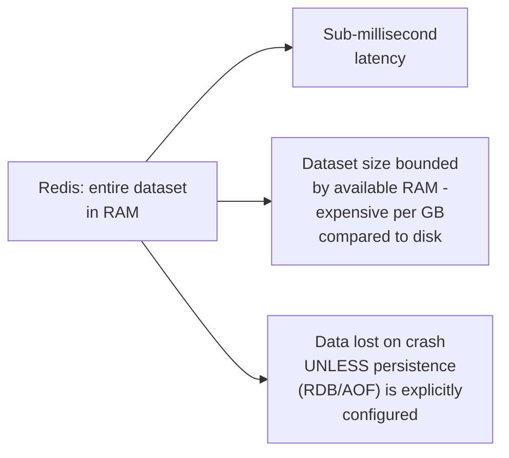
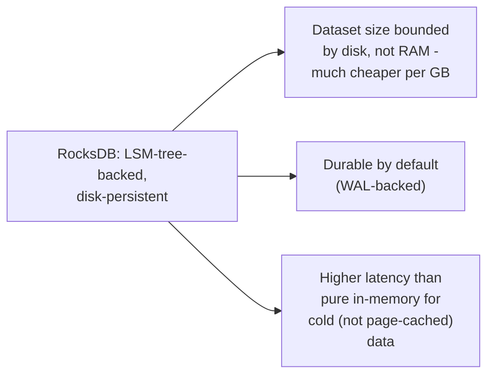

# KV Store — Middle

<!-- level-focus -->
At middle level, focus on this question:

> When should you choose an in-memory KV store (Redis) versus a
> persistent, disk-backed one (RocksDB)?

Prerequisite: [`junior.md`](junior.md).

---

## In-memory: fastest, but bounded by RAM and volatile

Redis (per the Cache-Aside professional page's internals discussion)
keeps the entire dataset in memory — extremely fast, but memory is
expensive relative to disk, bounding practical dataset size, and data is
volatile unless you explicitly configure persistence (snapshotting or an
append-only log, each with its own durability/performance trade-off,
echoing the Transactions & ACID professional page's WAL discussion).

## Persistent, disk-backed: larger datasets, durable by default

RocksDB (an embedded, LSM-tree-based KV store — see the LSM-Tree
professional page for its internals) persists to disk by default, scales
to much larger datasets far more cheaply than RAM would allow, and
survives a crash without needing careful persistence configuration — at
the cost of higher latency for data that isn't currently resident in the
OS page cache.

| | In-memory (Redis) | Persistent (RocksDB) |
|---|---|---|
| Latency | Fastest (sub-ms) | Fast for cached/hot data, slower for cold |
| Dataset size | Bounded by RAM, expensive | Bounded by disk, cheap |
| Durability | Requires explicit configuration | Durable by default |
| Typical use | Caching, session state, real-time counters | Embedded storage engine for a larger system (many databases use RocksDB internally) |

> 🎓 **Takeaway:** choose in-memory when your dataset comfortably fits in
> RAM and raw speed matters most (often as a cache, per
> [Cache-Aside](../../databases/operation/caching/cache-aside/README.md));
> choose persistent, disk-backed KV storage when dataset size exceeds
> practical RAM budgets or durability-by-default matters more than
> shaving off the last bit of latency.

## Test yourself

1. Why is Redis's dataset size fundamentally bounded by RAM, while
   RocksDB's is bounded by disk?
2. Why does Redis require explicit configuration for durability, while
   RocksDB is durable by default?
3. Name a real system (from elsewhere in this tree) that uses RocksDB (or
   a similar embedded KV store) as its internal storage engine.

Continue to [`senior.md`](senior.md).
