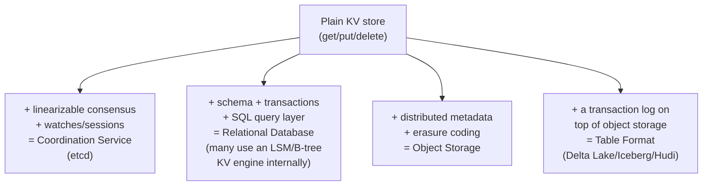

# KV Store — Professional

<!-- level-focus -->
At professional level, focus on this question:

> How are higher-level systems throughout this entire knowledge tree
> actually built as layers on top of a plain KV store primitive, and what
> does recognizing this pattern buy you as an architect?

Prerequisite: [`senior.md`](senior.md).

---

## The recurring pattern: KV store + a layer of additional semantics



- **etcd** (Coordination Services professional page) is, at its storage
  core, a KV store (backed by boltdb, a B+Tree — per that page's
  internals) with Raft consensus and a watch/lease API layered on top.
- **RocksDB** underlies not just standalone use but is the actual storage
  engine inside CockroachDB, TiKV, and many other "database" products —
  the SQL layer, transactions, and distributed consensus are all built
  **on top of** a KV store interface, not implemented as some entirely
  separate storage mechanism.
- **Cassandra**'s storage engine is fundamentally an LSM-tree-backed KV
  store (per the LSM-Tree professional page), with CQL's tabular query
  model layered on top as an abstraction.
- **Table formats** (Delta Lake, Iceberg, Hudi — the sibling topics) add
  a transaction log and schema layer on top of **object storage**, which
  itself has an internal KV-store-like metadata layer (per the Object
  Storage professional page).

## Why recognizing this pattern matters architecturally

> 🎯 **Professional-level insight:** when evaluating a new "database" or
> storage product, ask "what is this system's actual underlying storage
> primitive, and what specific semantics has it layered on top?" This
> reframes evaluating a complex system into evaluating **two** separate,
> more tractable questions: (1) does the underlying KV engine's data
> structure (hash/LSM/B-tree, per `senior.md`) fit my access pattern, and
> (2) does the layered semantics (consensus, transactions, SQL, schema)
> actually solve my problem, or am I paying for capability I don't need?
> This decomposition is often more illuminating than evaluating a
> product's marketing description as an indivisible whole.

## Production checklist (staff-level)

1. **When evaluating a new storage product, identify its underlying KV
   engine and the specific layer of semantics added on top** — this
   decomposition reveals real trade-offs (per `senior.md`'s RUM
   conjecture) that a product's high-level feature list often obscures.
2. **Consider a plain, well-chosen KV store directly** for problems that
   genuinely don't need the additional layered semantics (SQL, distributed
   consensus, transactions) — the simplicity and performance benefit of
   using the base primitive directly is real, per `junior.md`'s "don't
   reach for more machinery than needed" principle.
3. **Recognize that a "database" choice is really two choices**: the
   underlying storage engine (hash/LSM/B-tree — often not directly
   exposed or tunable, but worth understanding) and the layered query/
   consistency model — evaluate both dimensions explicitly in a database
   selection process.
4. **Understand that layered semantics (consensus, transactions) are
   themselves engineering built on the same KV primitives covered
   throughout this tree** — a "distributed SQL database" isn't a
   fundamentally different kind of system from a KV store; it's a KV
   store plus the exact consensus/transaction machinery covered in the
   Raft, Paxos, and Transactions & ACID professional pages.
5. **In an architecture review for a new storage system choice, ask "what
   would we lose by using a plain KV store directly, and is that loss
   actually relevant to our problem?"** — this question often surfaces
   unnecessary complexity in a proposed solution.

## Cheat Sheet

```text
+------------------------------------------------------------------+
|                    KV STORE — INTERNALS & SCALE                     |
+------------------------------------------------------------------+
| RECURRING PATTERN across this entire knowledge tree:                  |
|   KV store (get/put/delete) + linearizable consensus + watches         |
|     = Coordination Service (etcd)                                     |
|   KV store + schema + SQL + transactions = Relational/Distributed DB  |
|     (CockroachDB/TiKV literally embed RocksDB as their storage engine) |
|   KV store-like metadata + erasure coding = Object Storage             |
|   Object storage + a transaction log = Table Format (Delta/Iceberg/Hudi)|
+------------------------------------------------------------------+
| Evaluating a "database" = evaluating TWO separate questions:          |
|   1. Does the underlying storage engine's structure                    |
|      (hash/LSM/B-tree) fit my access pattern? (senior.md)              |
|   2. Does the LAYERED semantics (SQL, consensus, transactions)          |
|      actually solve my problem, or am I paying for unneeded capability?|
+------------------------------------------------------------------+
```

## Test yourself

1. Explain how etcd, at its storage core, is "just" a KV store with
   additional layers — what are those layers specifically?
2. Why does recognizing "CockroachDB uses RocksDB internally" change how
   you'd evaluate CockroachDB's performance characteristics for a
   specific workload?
3. Give an example of a real problem where using a plain KV store
   directly would be preferable to reaching for a full distributed SQL
   database, and explain why the extra layered semantics would be wasted
   complexity there.

## Further Reading

- CockroachDB architecture documentation — how its distributed SQL layer
  is built on top of a RocksDB/Pebble-based KV storage layer.
- etcd documentation — architecture overview (boltdb storage + Raft +
  watch API layers).
- See also: [LSM-Tree — professional](../../databases/performance/14-indexing%20%26%20filtering/lsm-tree/professional.md),
  [Coordination Services — professional](../../distributed-system/18-concurrency-coordination/coordination-services/professional.md).
