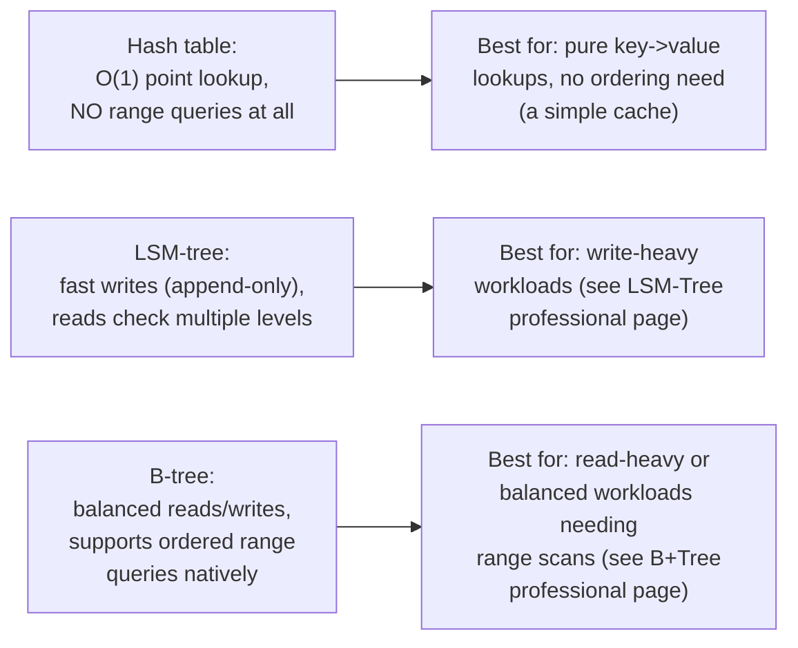
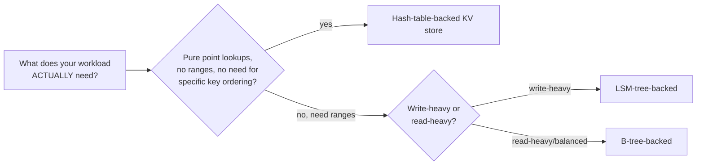

# KV Store — Senior

<!-- level-focus -->
At senior level, focus on this question:

> How do you choose between a hash table, an LSM-tree, and a B-tree as a
> KV store's underlying data structure, based on your actual access
> pattern?

Prerequisite: [`middle.md`](middle.md).

---

## Three structures, three access-pattern bets

This is a direct application of the trade-offs already covered in depth
elsewhere in this tree: a **hash table** (used by some simple in-memory
KV stores) gives the fastest possible point lookups but cannot support
range queries (`GET keys BETWEEN a AND b`) at all — there's no ordering
in a hash table's layout. An **LSM-tree** (RocksDB, Cassandra's storage
engine) optimizes for write throughput at the cost of read amplification
(see the LSM-Tree professional page's RUM-conjecture discussion). A
**B-tree** (traditional databases, some embedded KV stores like LMDB)
balances read and write performance while natively supporting ordered
range scans.

## Applying the RUM conjecture to KV store selection

> 🎯 **Senior takeaway:** choosing a KV store's underlying data structure
> is precisely the RUM conjecture (read/update/memory amplification
> trade-off) from the LSM-Tree professional page, applied at the point of
> selecting or configuring a KV store — the same underlying trade-off
> shows up again here, because it's a fundamental property of storage
> engine design, not something specific to any one system covered
> elsewhere in this tree.

## Test yourself

1. Why can't a pure hash table support `GET keys BETWEEN a AND b`, while a
   B-tree can?
2. Why would you choose an LSM-tree-backed KV store for a high-throughput
   event-ingestion use case over a B-tree-backed one?
3. For a KV store backing a session cache with pure key-based lookups and
   no range query needs at all, which underlying structure would you
   choose, and why is the others' additional capability wasted overhead
   here?

Continue to [`professional.md`](professional.md) to see how higher-level
systems throughout this tree are themselves built on KV store primitives.
