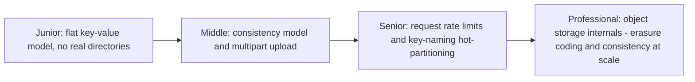
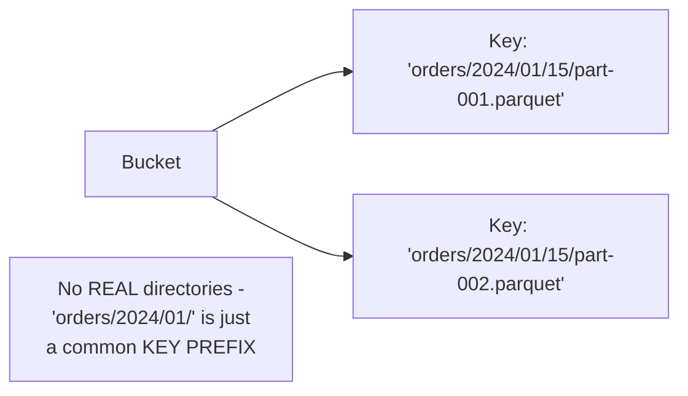

# Object Storage

> Flat, key-value storage for arbitrarily large blobs — no directories, no
> in-place edits, no POSIX semantics. S3 (and its many equivalents) became
> the default storage substrate for big data specifically by trading those
> familiar file-system guarantees for near-infinite horizontal scalability.

## Choose a level

| Level | Guide | You are done when |
|---|---|---|
| Junior | [Flat key-value model](junior.md) | You can explain why "directories" in object storage are just a naming convention, not a real structure. |
| Middle | [Consistency model and multipart upload](middle.md) | You can explain how large objects are uploaded reliably and what consistency guarantees you actually get. |
| Senior | [Request rate limits and hot partitioning](senior.md) | You can design a key-naming scheme that avoids request-rate throttling on sequential keys. |
| Professional | [Erasure coding and consistency at scale](professional.md) | You can explain how object storage achieves durability without simple 3x replication, and what changed with strong consistency. |

## Practice rule

Before choosing a key-naming scheme for high-throughput object storage
writes, ask: "if I sort all my keys, do writes cluster into a narrow,
sequential range (like a timestamp prefix), or are they naturally
spread out?" A narrow, sequential range risks the exact hot-partitioning
problem covered in `senior.md`.

## Related

- [File System](../file-system/README.md)
- [NoSQL Modeling — senior](../../databases/data-modeling/nosql-modeling/senior.md)
