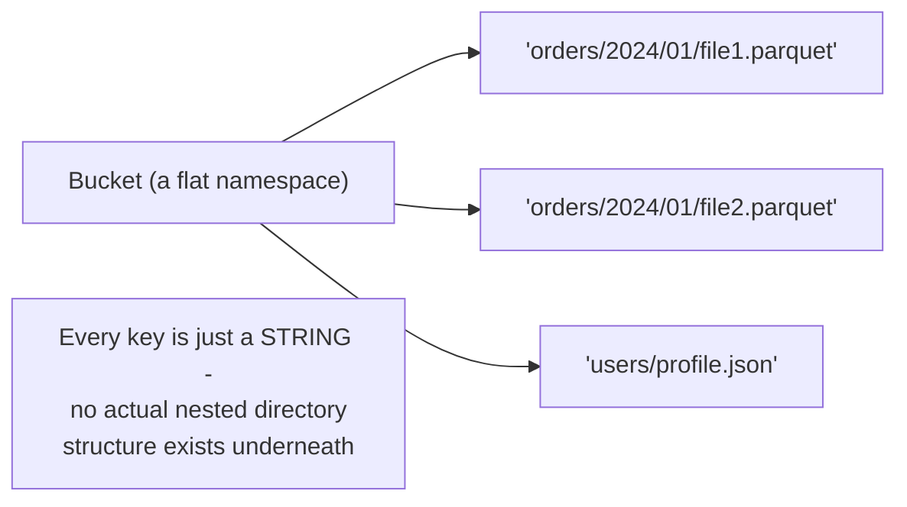
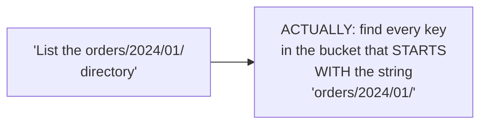

# Object Storage — Junior

<!-- level-focus -->
At junior level, focus on this question:

> Why are "directories" in object storage just a naming convention, not a
> real structural feature?

---

## A flat namespace: every object is a key-value pair



Object storage has **no real directory hierarchy** at all — every object
is stored under a single, flat namespace (a bucket), identified by a
**key** that's just a string. The `/` characters in
`orders/2024/01/file1.parquet` look like a directory path, but they're
purely a **naming convention** — there's no actual nested folder
structure being traversed; it's one flat key-value lookup.

## Why "listing a directory" is actually a prefix query

```python
# "Listing" the "orders/2024/01/" directory is actually:
s3_client.list_objects_v2(Bucket="my-bucket", Prefix="orders/2024/01/")
# Under the hood: find all keys STARTING WITH this string prefix
```



This has real consequences: renaming a "directory" (changing a common
prefix for many objects) is **not** a single, cheap, atomic operation the
way it is on a real file system — it requires individually copying and
deleting every object matching the old prefix, one at a time, which is
exactly the "no cheap atomic rename" gap from the File System
professional page's discussion of why table formats exist.

> 🎓 **Takeaway:** never assume object storage "directories" behave like
> real file system directories — every path-like operation (listing,
> "renaming") is actually a string-prefix operation on a flat key space,
> with very different performance and atomicity characteristics than a
> POSIX file system provides.

## Test yourself

1. Why is `list_objects_v2(Prefix="orders/2024/01/")` actually a string
   match operation, not a directory traversal?
2. Why can't you "rename" a folder full of 10,000 objects in one cheap,
   atomic operation, the way you could rename a directory on a local
   disk?
3. What real consequence does this flat-namespace design have for a
   pipeline that needs to atomically "replace" an entire dataset's worth
   of files?

Continue to [`middle.md`](middle.md).
