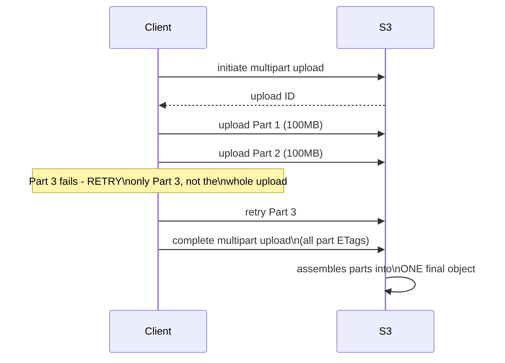
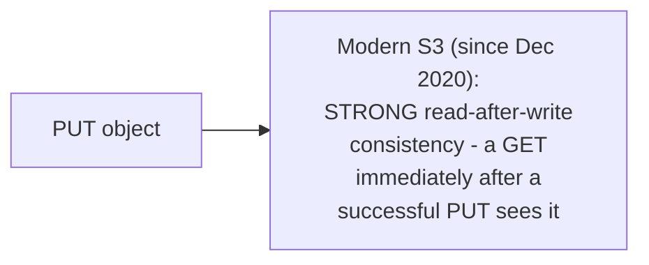

# Object Storage — Middle

<!-- level-focus -->
At middle level, focus on this question:

> How does multipart upload make uploading huge objects reliable, and what
> consistency guarantee do you actually get after a write?

Prerequisite: [`junior.md`](junior.md).

---

## Multipart upload: splitting a huge upload into independently-retryable parts

For large objects (recommended above ~100MB, required above 5GB on S3),
**multipart upload** splits the object into independently-uploadable
parts — if one part's upload fails partway through the network, only
that **specific part** needs retrying, not the entire multi-gigabyte
object. This directly avoids the "restart from zero on any failure"
problem a naive single-request upload of a huge object would have.

## Consistency: read-after-write, and what changed

Object storage's consistency model has historically been a real,
important caveat (older S3 documentation described **eventual**
consistency for overwrite `PUT`s and `DELETE`s) — modern S3 (since a 2020
announcement) provides **strong read-after-write consistency** for all
operations, a significant architectural improvement that removed a
historically common class of "I just wrote this and immediately couldn't
read it back correctly" bugs in data pipelines. This is worth verifying
explicitly for **any** object storage provider you use (not every
S3-compatible/alternative object store necessarily provides the same
guarantee), rather than assuming it based on S3's current behavior.

> 🎓 **Takeaway:** multipart upload makes large-object uploads reliably
> retryable at the part level rather than the whole-object level; modern
> S3's strong read-after-write consistency removed a historically
> significant caveat, but this guarantee should be explicitly verified
> for any specific object storage provider, not assumed universally.

## Test yourself

1. Why does multipart upload's per-part retry granularity matter
   specifically for very large objects over an unreliable network?
2. Why would eventual (rather than strong) read-after-write consistency
   have historically caused subtle data pipeline bugs?
3. What would you check before assuming a specific S3-compatible storage
   provider (not AWS S3 itself) provides strong read-after-write
   consistency?

Continue to [`senior.md`](senior.md).
