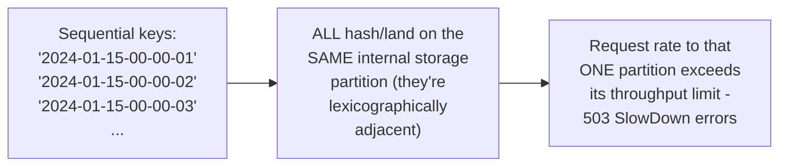
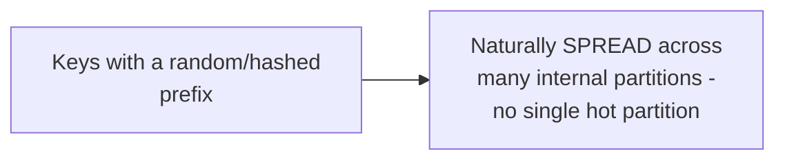

# Object Storage — Senior

<!-- level-focus -->
At senior level, focus on this question:

> Why can a naming scheme with a sequential prefix (like a timestamp) cause
> request throttling, even though object storage is supposed to scale
> horizontally?

Prerequisite: [`middle.md`](middle.md).

---

## Object storage partitions internally by key range (historically)



Object storage internally partitions its key space (conceptually similar
to the consistent-hashing/range-partitioning discussion from the
Partitioning & Sharding professional page) — historically, S3's
partitioning was based on **key prefix**, meaning a high-throughput
workload writing keys with a shared, sequentially-increasing prefix (a
timestamp-first naming scheme, a common and intuitive-seeming choice) can
concentrate an enormous number of requests onto a **single** internal
partition, triggering request-rate throttling (`503 SlowDown` errors) —
the exact hot-partition problem from the NoSQL Modeling professional page,
applied to object storage's own internal key-range partitioning.

## The fix: prefix randomization

```python
import hashlib

def key_with_hash_prefix(timestamp, filename):
    hash_prefix = hashlib.md5(f"{timestamp}{filename}".encode()).hexdigest()[:4]
    return f"{hash_prefix}/{timestamp}/{filename}"
    # e.g. "a3f2/2024-01-15-00-00-01/data.parquet"
```



Adding a random or hashed prefix before the timestamp spreads
lexicographically-adjacent writes across many different internal
partitions, directly avoiding the concentration that causes throttling —
this is the object-storage-specific instance of the same "salt the hot
key" technique from the Cache Stampede professional page's hot-key
sharding discussion.

> 🎯 **Senior takeaway:** modern S3 has significantly improved automatic
> partition management (much of this historical guidance matters less
> than it used to for AWS S3 specifically), but the underlying principle —
> "don't naively assume a naming scheme is free of hot-partitioning risk
> just because the storage system 'scales horizontally'" — remains
> relevant for high-throughput workloads and especially for
> non-AWS/self-hosted object storage systems that may not have the same
> automatic partition-splitting sophistication.

## Test yourself

1. Why does a timestamp-first key-naming scheme risk concentrating writes
   onto a single internal partition, even in a system designed to scale
   horizontally?
2. How does adding a random/hashed prefix to keys fix this, and what does
   it cost you (hint: think about what "listing objects in order" now
   requires)?
3. Design a key-naming scheme for a high-throughput IoT sensor pipeline
   writing millions of timestamped readings per day, balancing both
   write-throughput safety and the ability to efficiently list/query by
   date range.

Continue to [`professional.md`](professional.md) to see object storage's
internal durability mechanisms at scale.
