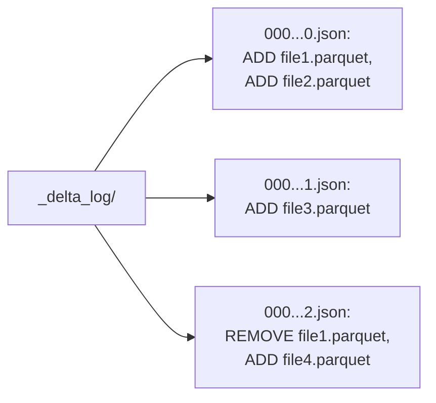
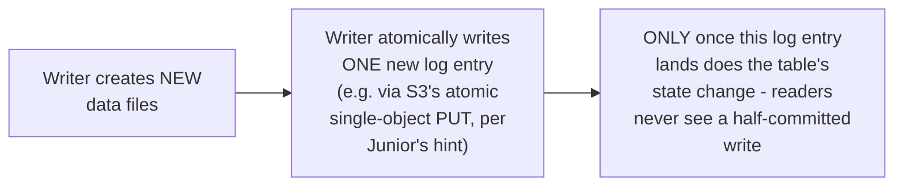

# Delta Lake — Middle

<!-- level-focus -->
At middle level, focus on this question:

> How does the `_delta_log` directory determine exactly which files are
> currently part of the table?

Prerequisite: [`junior.md`](junior.md).

---

## The log: a sequence of JSON commit files



```json
// 000...2.json (a commit)
{"remove": {"path": "file1.parquet", "dataChange": true}}
{"add": {"path": "file4.parquet", "size": 12345, "dataChange": true}}
```

Every write to a Delta table appends a new numbered JSON file to
`_delta_log/`, recording exactly which data files were **added** and
which were **removed** in that commit. A reader determines the table's
**current** state by reading every commit file **in order** and replaying
the add/remove operations — the table's current file set is simply "every
file ever added, minus every file that was later removed."

## Atomicity via a single, atomically-written log entry



The key insight: while writing multiple data files isn't atomic
(`junior.md`'s problem), the **commit itself** — appending one new log
entry that references the already-fully-written data files — **is**
atomic (a single object write, or a conditional put ensuring only one
writer can claim a given log sequence number). A reader only considers a
write "done" once its commit entry appears in the log — any data files
written but not yet referenced by a committed log entry are simply
invisible to readers, solving `junior.md`'s partial-write visibility
problem entirely.

> 🎓 **Takeaway:** Delta Lake's core mechanism is remarkably simple: an
> append-only, ordered log of add/remove operations, where the atomicity
> of "did this write happen" is reduced to "did this one new log entry
> get committed" — sidestepping the need for multi-file atomicity
> entirely by making the log entry itself the single point of truth.

## Test yourself

1. Why does replaying every commit file in order (adds and removes) give
   you the table's exact current file set?
2. Why does making only the LOG COMMIT atomic (not the data file writes
   themselves) solve the partial-write visibility problem from `junior.md`?
3. If a writer crashes after writing new data files but before committing
   the log entry, what happens to those orphaned data files — are they
   ever visible to a reader?

Continue to [`senior.md`](senior.md).
