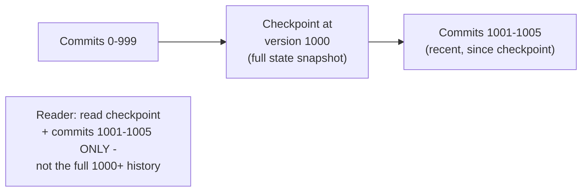
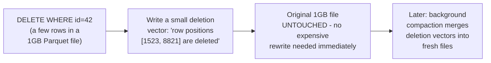

# Delta Lake — Professional

<!-- level-focus -->
At professional level, focus on this question:

> Why does the transaction log need periodic checkpointing, and how do
> deletion vectors avoid rewriting entire Parquet files for a small
> update or delete?

Prerequisite: [`senior.md`](senior.md).

---

## Checkpointing: the same log-compaction problem as Raft

Recall `middle.md`: determining the table's current state means replaying
**every** commit file from the beginning. For a table with millions of
commits (a frequently-updated production table), this replay cost grows
unboundedly — precisely the same problem, and the same solution, as the
Raft professional page's log snapshotting: Delta Lake periodically writes
a **checkpoint** (a Parquet file summarizing the full current state as of
that point), so a reader only needs to read the latest checkpoint plus any
commits **after** it, rather than the entire history from version 0.



## Deletion vectors: avoiding full-file rewrites for row-level changes

Naively, deleting or updating a **few rows** within a Parquet file (which
is immutable once written) requires rewriting the **entire** file with
those rows removed/changed — expensive for a large file when only a
handful of rows actually changed. **Deletion vectors** (a newer Delta Lake
feature) instead record, in a small side-file, which specific row
positions within an existing Parquet file are now considered deleted —
readers consult the deletion vector alongside the data file and skip the
marked rows, **without** the underlying Parquet file needing to be
rewritten at all for the delete. A background compaction process can
later merge deletion vectors into fresh, fully-rewritten files during a
maintenance window, decoupling the (cheap, immediate) logical delete from
the (expensive, deferred) physical file rewrite.



This is directly analogous to the LSM-tree's tombstone mechanism (per the
LSM-Tree professional page) — mark as deleted cheaply now, physically
reclaim the space later during compaction, rather than paying the full
cost of physical deletion at the moment of the logical delete.

## Production checklist (staff-level)

1. **Monitor and tune checkpoint frequency** (`checkpointInterval`) against
   your table's actual commit rate — a table with very frequent commits
   and infrequent checkpoints will show growing query-planning latency as
   readers replay an ever-larger tail of uncompacted commits.
2. **Enable deletion vectors for tables with frequent row-level
   updates/deletes** on large files — this converts an expensive
   immediate file rewrite into a cheap, deferred one, directly improving
   write-path latency for update-heavy workloads.
3. **Schedule regular compaction (OPTIMIZE) jobs** to merge deletion
   vectors and small files into properly-sized, fully-materialized
   Parquet files during low-traffic windows — deferring the cost doesn't
   eliminate it; it must still be paid eventually, deliberately.
4. **Treat log retention (`VACUUM`) as a distinct operational concern**
   from checkpointing — old, unreferenced data files (superseded by later
   commits) must be periodically cleaned up, but only after confirming no
   active reader (including a time-travel query) still needs them.
5. **In a design review for a high-write-frequency Delta table, require
   an explicit checkpoint interval and compaction schedule**, rather than
   leaving these as unexamined defaults — this is a real, measurable
   capacity-planning decision analogous to LSM-tree compaction strategy
   selection.

## Cheat Sheet

```text
+------------------------------------------------------------------+
|                  DELTA LAKE — INTERNALS & SCALE                     |
+------------------------------------------------------------------+
| _delta_log: ordered JSON commit files (add/remove file operations).   |
| Commit atomicity via object storage's conditional/atomic write -       |
| this is the SINGLE point of truth for "did this write happen"          |
+------------------------------------------------------------------+
| Optimistic concurrency: writers claim the next version number          |
| atomically; losers retry. NOT every concurrent write conflicts -       |
| only writes touching the SAME underlying files genuinely conflict      |
+------------------------------------------------------------------+
| CHECKPOINTING: same log-compaction problem as Raft - periodic full-    |
| state snapshot so readers don't replay the entire commit history        |
| DELETION VECTORS: mark rows deleted in a small side-file, defer the     |
| expensive full-file rewrite to a later compaction (same tombstone       |
| principle as LSM-trees)                                                |
+------------------------------------------------------------------+
```

## Test yourself

1. Why does Delta Lake's checkpointing solve the exact same problem as
   Raft's log snapshotting, just applied to a table's commit history
   instead of a consensus log?
2. Why do deletion vectors let a delete operation avoid rewriting a large
   Parquet file immediately, and what defers the actual cost, to where?
3. Design the checkpoint interval and compaction schedule for a table
   receiving 10,000 small update commits per day.

## Further Reading

- Armbrust et al. — "Delta Lake: High-Performance ACID Table Storage over
  Cloud Object Stores" (the original Delta Lake paper).
- Delta Lake documentation — "Table protocol" (`_delta_log` format),
  "Deletion Vectors," and "Optimize and Compaction."
- See also: [Raft — professional](../../../distributed-system/consensus/raft/professional.md)
  (checkpointing/snapshotting), [LSM-Tree — professional](../../../databases/performance/14-indexing%20%26%20filtering/lsm-tree/professional.md)
  (tombstones/compaction).
