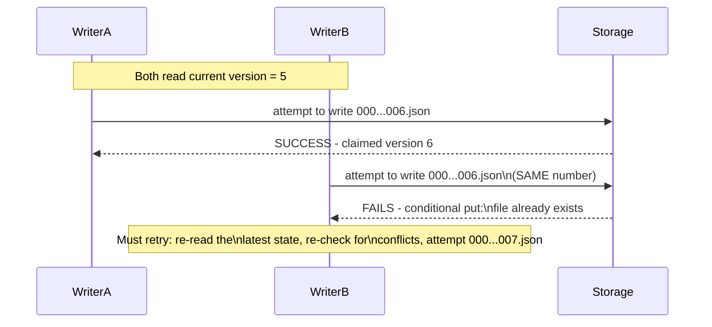
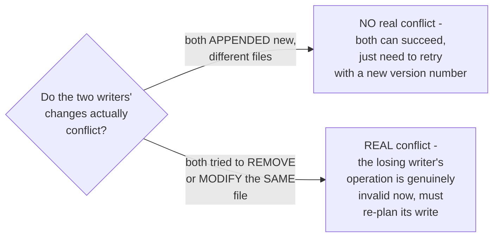

# Delta Lake — Senior

<!-- level-focus -->
At senior level, focus on this question:

> What happens when two writers try to commit to the same Delta table at
> the same time, and how is the conflict resolved?

Prerequisite: [`middle.md`](middle.md).

---

## Optimistic concurrency: claim the next log entry number, atomically

Both writers read the table at version 5 and prepare their commits
independently. Only one can successfully create the log file for version
6 (using object storage's conditional-write/"if not exists" semantics —
exactly the same atomic-claim mechanism from the Idempotency Keys
professional page, applied to a version number instead of a request ID).
The losing writer must **retry**: re-read the table's now-updated state,
re-verify its intended write doesn't conflict with what the winner just
committed, and attempt the next version number.

## What counts as a conflict, precisely

Delta Lake's conflict detection is more nuanced than "whoever commits
second always fails" — many concurrent writes (two independent appends of
new files, for instance) don't actually conflict with each other at all;
only writes that touch the **same underlying files** in incompatible ways
(e.g. both trying to remove the same file, as in a concurrent compaction
and a concurrent delete) represent a genuine conflict requiring the loser
to actually redo work, not just retry the same operation with a new
version number.

> 🎯 **Senior takeaway:** this is the exact same optimistic concurrency
> control pattern from the Locking & Concurrency Control professional
> page (a version check, retry on conflict) applied to a table's entire
> file set instead of a single database row — and just as with that
> pattern, distinguishing "genuine conflict requiring real rework" from
> "just needs a version-number bump" is what keeps concurrent writers from
> unnecessarily failing each other under normal, non-overlapping write
> patterns.

## Test yourself

1. Why does claiming a log entry number use the same atomic-conditional-
   write mechanism as the Idempotency Keys professional page's key-claiming
   pattern?
2. Why don't two independent, non-overlapping append operations actually
   conflict with each other, even though both are trying to write "the
   next version"?
3. Design a scenario where two concurrent writers' operations DO
   genuinely conflict (beyond just racing for the same version number),
   requiring the losing writer to redo real work.

Continue to [`professional.md`](professional.md) to see checkpointing and
deletion vectors at production scale.
