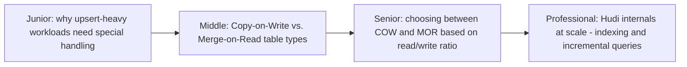
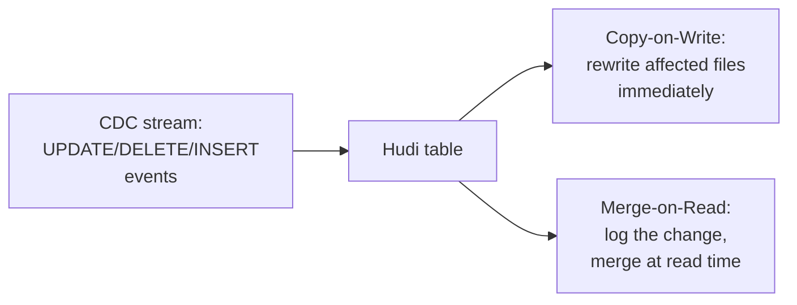

# Hudi

> The table format built from the ground up around one central use case:
> incremental, upsert-heavy pipelines (CDC ingestion, slowly changing
> dimensions) — where Delta Lake and Iceberg treat upserts as one feature
> among many, Hudi treats fast, efficient upserts as its core design
> constraint.

## Choose a level

| Level | Guide | You are done when |
|---|---|---|
| Junior | [Why upserts need special handling](junior.md) | You can explain why "just append the new version" doesn't work for an upsert-heavy CDC pipeline the way it does for append-only data. |
| Middle | [Copy-on-Write vs. Merge-on-Read](middle.md) | You can trace what happens to a file when an update arrives, under each table type. |
| Senior | [Choosing COW vs. MOR](senior.md) | You can choose the right table type based on your workload's read/write ratio. |
| Professional | [Indexing and incremental queries at scale](professional.md) | You can explain how Hudi locates which file to update for a given key efficiently, and how incremental queries avoid full-table scans. |

## Practice rule

Before choosing a table format for a CDC-ingestion pipeline specifically,
ask: "what fraction of my incoming events are updates/deletes versus pure
inserts, and how quickly do downstream consumers need to see each
change?" Hudi's COW/MOR choice (and the format choice itself, versus
Delta Lake/Iceberg) should be driven directly by these two numbers.

## Related

- [Delta Lake](../delta-lake/README.md)
- [Iceberg](../iceberge/README.md)
- [CDC Pipeline (Debezium)](../../../event-streaming/events-driven/cdc-pipeline/README.md)
