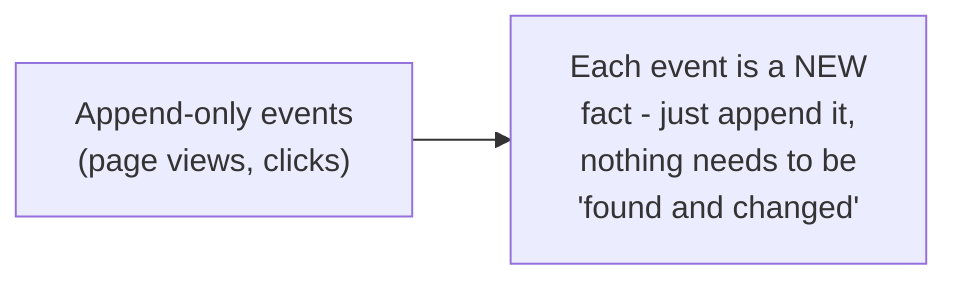
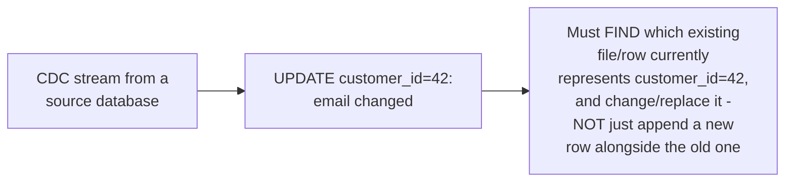

# Hudi — Junior

<!-- level-focus -->
At junior level, focus on this question:

> Why doesn't "just append the new version" work well for a CDC pipeline
> with lots of updates, the way it works for append-only event data?

---

## Append-only data: every new event is genuinely new

For genuinely append-only data (a clickstream, an immutable event log),
every incoming record is simply new — there's no concept of "the same
row, but updated," so writing is always "add this new file/record,"
never "find and modify an existing one."

## CDC data: most events are updates to an EXISTING row

A change-data-capture stream (per
[CDC Pipeline (Debezium)](../../../event-streaming/events/01-cdc-pipeline-debezium/README.md))
constantly emits **updates** and **deletes** to existing rows, not just
new inserts — if you naively just appended every CDC event as a new row,
your table would end up with **multiple, conflicting versions** of the
same logical entity (customer 42's old email AND new email both present
as separate rows), which is wrong for anyone querying "give me customer
42's current state."

> 🎓 **Takeaway:** upsert-heavy workloads (CDC, slowly changing
> dimensions) fundamentally need the storage layer to support "find the
> existing record for this key and update/replace it," not just "append."
> Hudi was designed from its earliest versions specifically around making
> this operation efficient at scale, rather than treating it as an
> afterthought feature.

## Test yourself

1. Why does naively appending every CDC event as a new row produce a
   table with multiple conflicting versions of the same entity?
2. Why is "find the existing record for this key" a fundamentally
   different, harder operation than "append a new record," at scale?
3. Give an example of a non-CDC use case that's still genuinely
   upsert-heavy (hint: think about slowly changing dimensions from the
   Kimball Modeling topic).

Continue to [`middle.md`](middle.md).
