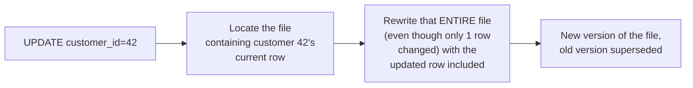
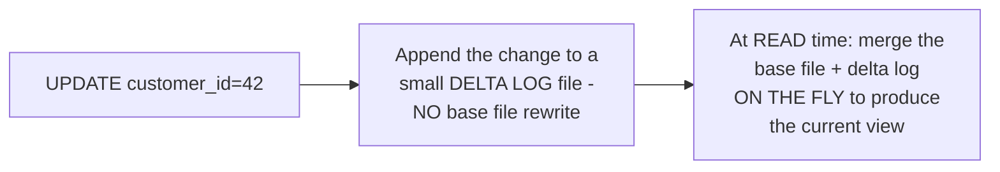

# Hudi — Middle

<!-- level-focus -->
At middle level, focus on this question:

> When an update arrives, what actually happens to the underlying files
> under Copy-on-Write versus Merge-on-Read?

Prerequisite: [`junior.md`](junior.md).

---

## Copy-on-Write (COW): rewrite the affected file immediately

Under COW, every update triggers a **full rewrite** of whichever data
file contains the affected row(s) — even if only one row out of 100,000
in that file changed, the entire file is rewritten. Reads are simple and
fast (just read the current files directly, no merge logic needed at read
time), but writes are expensive under high update volume, since each
update potentially rewrites a large file.

## Merge-on-Read (MOR): log the change, merge lazily at read time

Under MOR, an update is appended cheaply to a small delta/log file
(structurally similar to the LSM-tree's memtable-then-flush pattern from
the LSM-Tree professional page) — the expensive base-file rewrite is
**deferred**, happening only during periodic **compaction**. Reads must
merge the base file with any pending delta log entries on the fly, which
costs extra read-time work, but writes are dramatically cheaper for
high-update-volume workloads.

| | Copy-on-Write | Merge-on-Read |
|---|---|---|
| Write cost | High (full file rewrite per update) | Low (cheap log append) |
| Read cost | Low (direct file read) | Higher (merge base + log at read time) |
| Fits | Read-heavy, moderate update volume | Write-heavy, high update volume |

> 🎓 **Takeaway:** COW and MOR are the exact same "pay now vs. pay later"
> trade-off as the LSM-tree's compaction-strategy choice and Delta Lake's
> deletion-vector-versus-immediate-rewrite decision — Hudi just makes this
> a first-class, explicit **table type** choice rather than an
> implementation detail.

## Test yourself

1. Why does COW's write cost scale with file size, even for a single-row
   update?
2. Why does MOR's read cost include merge work that COW's read path
   doesn't need at all?
3. For a table receiving 100,000 small updates per hour, which table type
   would you choose, and why?

Continue to [`senior.md`](senior.md).
