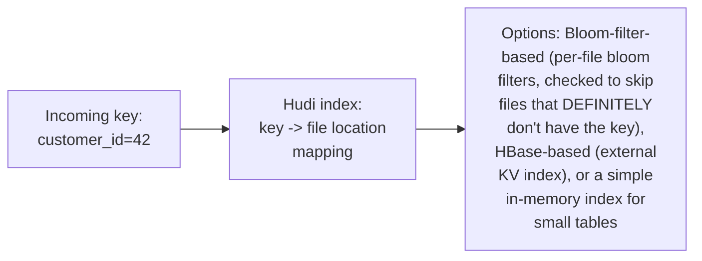
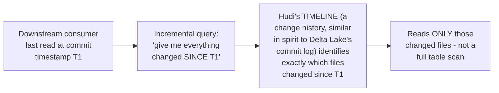

# Hudi — Professional

<!-- level-focus -->
At professional level, focus on this question:

> How does Hudi efficiently locate which file contains a given key for an
> upsert (without a full table scan), and how do incremental queries
> avoid re-scanning unchanged data?

Prerequisite: [`senior.md`](senior.md).

---

## Indexing: the key-to-file-location lookup problem

`junior.md` established that an upsert requires **finding** the existing
file containing a given key — at scale (millions to billions of keys),
doing this via a linear scan of every file's contents is completely
impractical. Hudi implements this as an explicit **index** —
conceptually the exact same "given a key, find its location" problem
covered throughout the databases section of this tree (a B+Tree index,
per that professional page, or a bloom-filter-based index, per that
professional page), just applied to "which file contains this record" as
the value being looked up, instead of "which row."



Hudi's **Bloom filter index** (the most common default) attaches a bloom
filter (per the Bloom Filter professional page) to each data file,
summarizing which keys it contains — an upsert first checks each
candidate file's bloom filter, and only files that return "maybe
contains this key" (never a false negative, per the Bloom Filter
professional page's core guarantee) are actually opened and checked
precisely — directly reusing the same probabilistic-filter mechanism
covered in that professional page, applied here specifically to solve
the upsert file-location problem instead of an LSM-tree's SSTable-lookup
problem.

## Incremental queries: reading only what changed since a checkpoint



Hudi maintains a **timeline** of commits (structurally similar to Delta
Lake's `_delta_log`, per that professional page's discussion), and an
**incremental query** uses this timeline to identify exactly which files
were touched between two commit points — letting a downstream consumer
(another pipeline stage, an analytics job) read only the **incremental
change set** since its last checkpoint, rather than re-scanning the
entire table on every run. This is the table-format-level realization of
the same "only process what changed" principle from the Views
professional page's incremental materialized view discussion, applied to
a whole table's downstream consumption pattern.

## Production checklist (staff-level)

1. **Choose an index type (Bloom-filter-based, HBase-based, or
   in-memory) based on your table's key cardinality and update
   locality** — a Bloom-filter index's effectiveness depends on how
   often updates hit keys already known to be absent from most files
   (the exact scan-resistance discussion from the Bloom Filter
   professional page, applied here to upsert routing).
2. **Use incremental queries for any downstream pipeline stage consuming
   from a Hudi table**, rather than re-scanning the full table on every
   run — this is a direct, often dramatic performance and cost win for
   any repeatedly-run downstream job.
3. **Tune compaction frequency (`senior.md`) jointly with index rebuild
   cost** — some index types require rebuilding/updating alongside
   compaction, adding another dimension to the compaction-scheduling
   decision beyond just delta-log size.
4. **Monitor bloom filter false-positive rate for the upsert index** as
   an operational metric — a rising false-positive rate (from key-count
   growth exceeding the filter's sizing assumptions, per the Bloom
   Filter professional page's sizing formula) directly degrades upsert
   performance by forcing more unnecessary file opens.
5. **In a design review for a new CDC-ingestion pipeline landing in
   Hudi, require an explicit answer for table type (COW/MOR), index
   choice, and downstream consumption pattern (full scan vs.
   incremental query)** — these three decisions together determine the
   pipeline's real-world performance characteristics far more than the
   choice of Hudi itself.

## Cheat Sheet

```text
+------------------------------------------------------------------+
|                      HUDI — INTERNALS & SCALE                       |
+------------------------------------------------------------------+
| Indexing solves "given a key, which file has it" for upserts at        |
| scale - Bloom-filter-based index (per-file bloom filters, same         |
| never-false-negative guarantee from the Bloom Filter professional      |
| page) is the common default, reusing that exact mechanism here          |
+------------------------------------------------------------------+
| Incremental queries: Hudi's TIMELINE (commit history, like Delta       |
| Lake's _delta_log) identifies exactly which files changed since a      |
| checkpoint - downstream consumers read ONLY the incremental change     |
| set, not a full table re-scan every run                                |
+------------------------------------------------------------------+
| COW/MOR + compaction frequency (senior.md) + index choice together     |
| determine real-world upsert/read performance - all three should be     |
| explicit design decisions, not defaults                                 |
+------------------------------------------------------------------+
```

## Test yourself

1. Why does a Bloom filter's never-false-negative guarantee make it safe
   to use for "which files might contain this key" upsert routing?
2. Why do incremental queries avoid a full table re-scan, and what
   metadata structure makes this possible?
3. Design the indexing strategy for a Hudi table with 500 million unique
   customer keys, receiving CDC updates concentrated on a small, hot
   subset of recently-active customers.

## Further Reading

- Apache Hudi documentation — "Table & Query Types" (COW/MOR), "Indexing,"
  and "Incremental Queries."
- Vinoth Chandar et al. — "Uber Engineering: Introducing Hudi" (the
  original engineering motivation, published when Hudi was created at
  Uber for exactly the upsert-heavy CDC use case).
- See also: [Delta Lake — professional](../delta-lake/professional.md),
  [Bloom Filter — professional](../../../databases/performance/14-indexing%20%26%20filtering/bloom-filter/professional.md),
  [LSM-Tree — professional](../../../databases/performance/14-indexing%20%26%20filtering/lsm-tree/professional.md).
