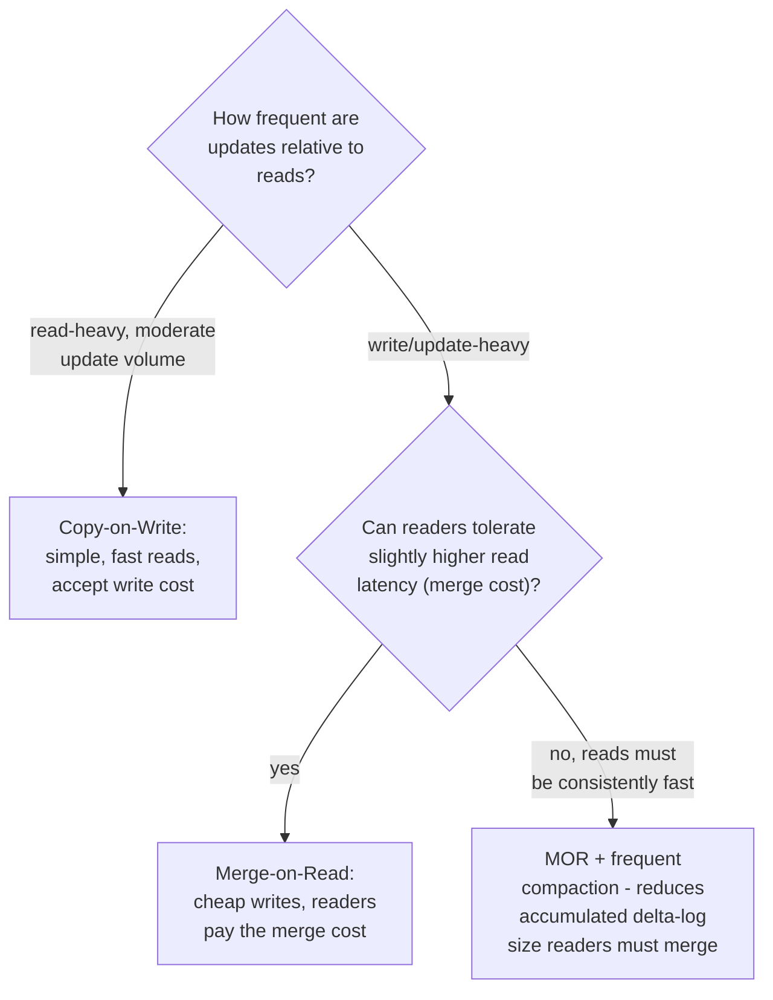
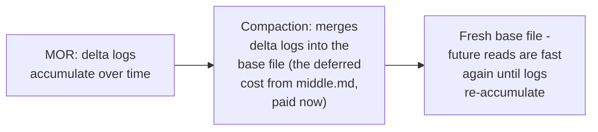

# Hudi — Senior

<!-- level-focus -->
At senior level, focus on this question:

> How do you choose between Copy-on-Write and Merge-on-Read based on your
> workload's actual read/write ratio and latency requirements?

Prerequisite: [`middle.md`](middle.md).

---

## The decision framework

| Signal | Favor |
|---|---|
| Read-heavy dashboards, BI queries, moderate update rate | COW |
| High-frequency CDC ingestion, willing to trade some read latency | MOR |
| High-frequency CDC ingestion, but reads need consistent low latency | MOR + aggressive/frequent compaction |

## Compaction as the tuning lever for MOR

For MOR tables, **compaction frequency** is the direct dial controlling
the read-cost/write-cost trade-off: frequent compaction keeps delta logs
small (cheap merge-at-read-time cost) at the price of more frequent
expensive rewrites; infrequent compaction defers rewrite cost longer but
lets read-time merge cost grow as delta logs accumulate — this is
precisely the same LSM-tree compaction-strategy trade-off (STCS vs. LCS,
per the LSM-Tree professional page) reappearing in Hudi's specific
context.

> 🎯 **Senior takeaway:** the COW/MOR choice, and the compaction frequency
> tuning within MOR, is a direct application of the RUM conjecture
> (read/update/memory amplification trade-off) from the LSM-Tree
> professional page — you cannot minimize both read cost and write cost
> simultaneously; choose based on which one your actual workload can
> better afford to pay.

## Test yourself

1. Why does more frequent compaction reduce read-time merge cost for MOR
   tables, and what does it cost in exchange?
2. For a CDC pipeline where downstream analysts need near-real-time
   ingestion (updates visible within seconds) but also run frequent
   dashboard queries needing consistent low latency, what would you
   recommend, and why is this genuinely a trade-off rather than a free
   choice?
3. Why is this the same trade-off already covered for LSM-trees, just in
   a different system's specific terminology?

Continue to [`professional.md`](professional.md) to see Hudi's indexing
and incremental query mechanisms at scale.
