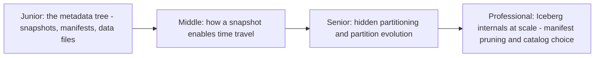
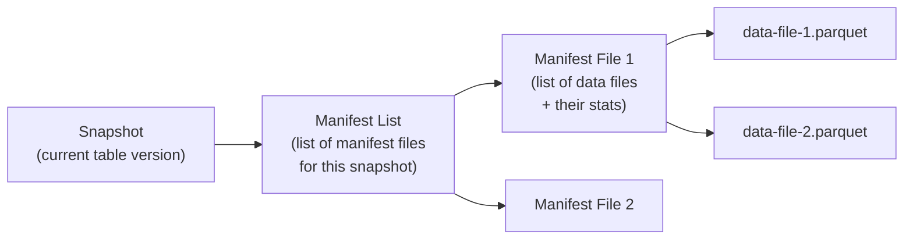

# Iceberg

> A table format built around a different core idea than Delta Lake's
> linear log: a tree of metadata files (snapshots → manifest lists →
> manifests → data files), designed from the start for multi-engine
> interoperability and extremely large tables with millions of files.

## Choose a level

| Level | Guide | You are done when |
|---|---|---|
| Junior | [The metadata tree](junior.md) | You can name and order the four levels: snapshot, manifest list, manifest, data file. |
| Middle | [How a snapshot enables time travel](middle.md) | You can explain how querying an old snapshot reconstructs a past table state without reading current data. |
| Senior | [Hidden partitioning and partition evolution](senior.md) | You can explain why Iceberg lets you change a table's partitioning scheme without rewriting existing data. |
| Professional | [Manifest pruning and catalog choice at scale](professional.md) | You can explain how the manifest tree structure enables pruning at massive table scale, and how to choose a catalog implementation. |

## Practice rule

Before choosing between Iceberg and Delta Lake for a new table format
adoption, ask: "do multiple different query engines (not just Spark) need
to read/write this table, and will this table grow to an extremely large
number of files/partitions?" Iceberg's engine-agnostic spec and tree-based
metadata (versus Delta's linear log) were designed with exactly these two
concerns as first priorities.

## Related

- [Delta Lake](../delta-lake/README.md)
- [Partitioning & Sharding](../../../databases/scaling/partitioning-and-sharding/README.md)
